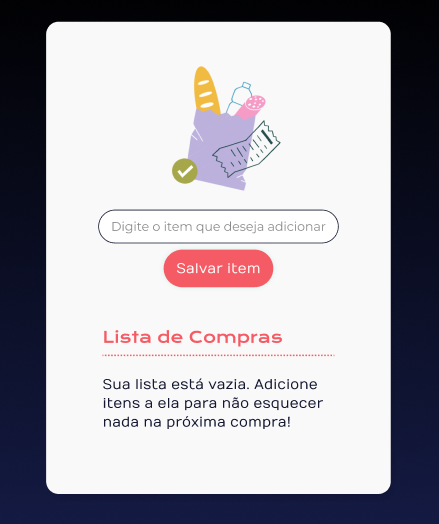

# Curso Alura: JavaScript construindo páginas dinâmicas

## Aula 1 - Integrando JavaScript ao projeto

### Aula 1 - Apresentação - Vídeo 1

Transcrição  
Olá, estudante! Boas-vindas a este curso de JavaScript. A instrutora Monica Hillman irá te guiar durante toda essa jornada de aprendizado.

Audiodescrição: Monica Hillman se descreve como uma mulher branca. Tem olhos castanhos e cabelos loiros longos. Usa óculos de grau e camiseta azul. Ao fundo, parede lisa sem decorações com iluminação gradiente do rosa para o azul.

O que vamos desenvolver?
Durante o curso, nós iremos construir uma aplicação de lista de compras com diversas funcionalidades.



Interface de aplicativo para lista de compras com fundo branco. No topo, há uma ilustração de uma lista de compras e uma sacola com itens de comida. Abaixo, campo de texto com a inscrição em cinza 'Digite o item que deseja adicionar' e um botão rosa com o texto 'Salvar item'. Na parte inferior, título 'Lista de Compras' em rosa, o texto em preto: 'Sua lista está vazia. Adicione itens a ela para não esquecer nada na próxima compra!'
Teremos o monitoramento para verificar se a lista de compras está vazia ou não. Se estiver vazia, será exibido um texto indicando que não há nenhum item na lista no momento.

Além disso, podemos digitar qualquer item no campo de entrada e clicar no botão "Salvar item". No momento em que um item é salvo na lista, a mensagem de lista vazia desaparece e o item inserido é exibido, consistindo no texto que foi colocado no campo de entrada e a data em que o item foi inserido.

Também há um checkbox interativo à esquerda do item. Ao marcá-lo, o item ficará riscado, ou seja, haverá um feedback visual para indicar que o item já foi comprado.

Para construir este projeto, focaremos em diversos conceitos de JavaScript. Por isso, você receberá o HTML pronto. Nós vamos construir, dentro de um arquivo index.js, a funcionalidade de ouvir o clique do botão da pessoa usuária após inserir o texto do item na lista com o addEventListener().

Também praticaremos bastante a manipulação do DOM (Document Object Model) para construir esse novo item na lista. Ademais, utilizaremos alguns métodos do JavaScript, como o new Date(), que permite a formatação de datas. Além disso, aprenderemos sobre import e export, permitindo a modularização do código.

O que você precisa saber antes de começar?
É importante que você já tenha conhecimento básico de JavaScript, como a criação de funções e variáveis, pois nos aprofundaremos na manipulação do DOM. Também é importante ter conhecimento de HTML e CSS, pois, embora não sejam abordados nesta aplicação, são fundamentais no contexto do front-end.

Por que é importante aprender tudo isso? Porque, como pessoa desenvolvedora front-end, não há como fugir da manipulação do DOM. Esses conceitos são essenciais para transformar as telas em dinâmicas e para a modularização do código, que melhora a experiência de outras pessoas desenvolvedoras que irão colaborar no seu trabalho.

Se você se interessou por tudo isso, não deixe de se matricular no curso. Nos encontramos no próximo vídeo. Até lá!

### Aula 1 - Preparando o ambiente

Olá, estudante! Desejamos boas-vindas ao curso JavaScript: construindo páginas dinâmicas.

No curso, usaremos o editor de código chamado [VSCode](https://code.visualstudio.com/) e iremos construir o projeto “Lista de Compras”. Você pode visualizar o layout do projeto acessando o [Figma](https://www.figma.com/design/QtW96TPE97jTKiTbl2ZNcD/Checklist---Desenvolva-aplica%C3%A7%C3%B5es-web-com-JavaScript?node-id=1035-1070&t=DZ1XSDNgvWOz5uKd-0).

Para baixar os “arquivos base” desse projeto você pode acessar o [repositório do github](https://github.com/alura-cursos/4299-javascript) ou clicar [aqui para baixar](https://github.com/alura-cursos/4299-javascript/archive/refs/heads/projeto-base.zip).

Por fim, para iniciar a execução do seu projeto, use a extensão [Live Server](https://marketplace.visualstudio.com/items?itemName=ritwickdey.LiveServer) dentro do editor de código VSCode.

Caso tenha dúvidas durante a instalação ou no decorrer do curso, pode contar conosco criando um tópico no fórum ou interagindo no nosso servidor do Discord. Também não deixe de ajudar outros colegas. Vamos construir juntos essa grande comunidade da Alura? :)

### Aula 1 - JavaScript na Web - Vídeo 2

Transcrição  
Se você chegou até aqui, provavelmente tem alguma noção de como construir telas visuais para aplicações web utilizando HTML e CSS. Por que enfatizamos o aspecto visual? Porque o HTML é uma tecnologia que permite a construção de elementos na tela, enquanto o CSS possibilita a estilização desses elementos, como a troca de cor, cor de fundo, fonte do texto, entre outras funcionalidades. As possibilidades com essas duas tecnologias são inúmeras.

Conhecendo a aplicação  
Para ilustrar, utilizamos uma aplicação pronta de lista de compras, disponível para download na atividade "Preparando o Ambiente". Podemos conferir esse código HTML e CSS no Visual Studio Code.

Para visualizar o resultado da aplicação, podemos ativar a extensão Live Server clicando no botão "Go Live" no canto inferior direito. Com isso, uma janela é aberta no navegador com a aplicação.

A aplicação de lista de compras já possui uma imagem decorativa, um campo de digitação, um botão para salvar item, além da lista de compras e seus itens.

Por exemplo, adicionamos o item "ração de gato" na segunda-feira, 31 de dezembro de 2022, às oito e meia. A única interação na tela é o botão de checkbox, que podemos clicar para selecionar ou desselecionar o item, gerando uma alteração visual padrão desse tipo de input.

Entendendo JavaScript na web  
Já temos duas tecnologias no nosso cinto de utilidades dev. Sabemos construir uma tela, mas ela não é dinâmica. Por isso, precisamos aprimorar essa aplicação existente. Por exemplo, a data não corresponde à data atual. Além disso, se tentarmos inserir o item "suco de laranja" e clicar em "Salvar item", nada acontece.

É nesse momento que o JavaScript entra em nossa aplicação. O JavaScript permite a interação entre pessoa usuária e navegador, gerando efeitos através dessa interação.

Um comportamento comum de um campo de digitação é validar o dado e informar à pessoa usuária se o que foi digitado não vai de acordo com os requisitos necessários.

Por exemplo, normalmente uma senha deve ter 8 caracteres e pelo menos um carácter especial, um número e uma letra maiúscula. Se digitamos "12345", o site nos avisará que a senha não é forte o suficiente. Isso demonstra a interação da máquina conosco.

O mesmo ocorre ao clicar em um botão, seja para criar uma conta ou fazer uma postagem. Essas ações podem gerar novos elementos na tela ou algum efeito.

Executando JavaScript no navegador  
Já entendemos que o JavaScript transforma a tela em dinâmica, mas onde ele roda? Como funciona? Onde colocamos o JavaScript? Por padrão, essa linguagem é executada nos navegadores em geral - inclusive em celulares - ao acessar um site.

Para demonstrar o JavaScript rodando no navegador, podemos abrir as ferramentas do desenvolvedor, clicando com o botão direito do mouse no navegador e selecionando a opção "Inspecionar elemento" (ou pressionando a tecla "F12" ou atalho "Ctrl + Shift + C").

Feito isso, uma janela é aberta na lateral direita do navegador, com algumas abas. A primeira aba é a dos elementos, onde podemos visualizador todos os elementos HTML e CSS. Essas áreas estão empilhadas uma em cima da outra.

No topo, vamos entrar na aba "Console". Geralmente, podemos encontrar um ícone de engrenagem ativo no canto superior direito, que exibe algumas opções de configurações do console. Não manipularemos essas opções, então clicamos novamente na engrenagem para colapsá-las.

O console conta com uma interface semelhante a um bloco de notas, mas é um mini editor de código embutido no navegador. Nele, podemos interagir com o JavaScript diretamente no navegador.

Por exemplo, podemos usar console.log() e passar o texto "Olá mundo!", entre aspas.

> console.log("Olá, mundo!")  
> Olá, mundo!

Quando apertamos "Enter", a frase é impressa no console. Isso porque com console.log() conseguimos imprimir informações no console.

Também podemos realizar cálculos matemáticos, como console.log() de 2 + 2, que retornará 4.

> console.log(2 + 2)  
> 4

Também é retornado um "undefined" porque não estamos construindo uma função que retorne algo, apenas exibindo um valor no console.

Podemos também trabalhar com variáveis. Para exemplificar, criamos uma const chamada meuNome que recebe "Mônica", entre aspas.

> const meuNome = "Monica"

Com isso, é retornado apenas "undefined", já que não construímos uma função que retorne algo. Apenas criamos uma variável.

Após criar e executar a variável, ela está salva na aplicação e podemos utilizá-la. Por exemplo, console.log() concatenando o texto "Meu nome é " e a variável meuNome.

> console.log("Meu nome é " + meuNome)  
> Meu nome é Monica

Apesar de utilizar uma variável, conseguimos a frase completa "Meu nome é Monica". Com isso, concluímos que o JavaScript é uma linguagem de programação que permite imprimir texto, realizar cálculos matemáticos, criar e utilizar variáveis.

Próximos passos  
Este é apenas o início do que aprenderemos sobre JavaScript como uma pessoa desenvolvedora. Agora, queremos implementar tudo isso em nossa aplicação para integrar com HTML e CSS. Até o próximo vídeo!

### Aula 1 - Para saber mais: diferentes métodos de integração de JavaScript

Quando estamos desenvolvendo um site ou uma aplicação web, muitas vezes precisamos usar JavaScript para adicionar interatividade e funcionalidades dinâmicas. Existem diferentes maneiras de integrar JavaScript em nossos projetos, e cada uma delas tem suas próprias características e implicações de desempenho. Vamos explorar os três métodos principais: inline, interno e externo.

1. JavaScript Inline

O que é?  
O JavaScript inline é quando você escreve o código JavaScript diretamente dentro de um elemento HTML. Isso é feito usando o atributo onclick, onmouseover, ou outros eventos HTML.

Exemplo:  
> `<button onclick="alert('Olá, mundo!')">Clique aqui</button>`

Vantagens:

- Simplicidade: É fácil de adicionar e entender para pequenos trechos de código.
- Rápido para protótipos: Útil para testes rápidos ou protótipos.

Desvantagens:

- Manutenção difícil: O código fica espalhado pelo HTML, tornando difícil a manutenção e a leitura.
- Reutilização limitada: Não é fácil reutilizar o código em diferentes partes do projeto.
- Desempenho: Pode afetar o desempenho, pois o navegador precisa processar o JavaScript sempre que encontra um elemento com código inline.

2. JavaScript Interno

O que é?  
O JavaScript interno é quando você escreve o código JavaScript dentro de uma tag `<script>` no próprio arquivo HTML.

Exemplo:

```html
<!DOCTYPE html>
<html lang="pt-BR">
<head>
    <meta charset="UTF-8">
    <title>Exemplo de JavaScript Interno</title>
    <script>
        function mostrarMensagem() {
            alert('Olá, mundo!');
        }
    </script>
</head>
<body>
    <button onclick="mostrarMensagem()">Clique aqui</button>
</body>
</html>
```

Vantagens:

- Organização: O código JavaScript está separado do HTML, mas ainda no mesmo arquivo.
- Facilidade de uso: Mais fácil de gerenciar do que o JavaScript inline para projetos pequenos.

Desvantagens:

- Desempenho: O arquivo HTML pode ficar grande, o que pode afetar o tempo de carregamento.
- Reutilização: O código ainda está preso ao arquivo HTML específico.

3. JavaScript Externo

O que é?  
O JavaScript externo é quando você escreve o código JavaScript em um arquivo separado com a extensão .js e o inclui no HTML usando a tag `<script>` com o atributo src.

Exemplo:

Arquivo HTML:

```html
<!DOCTYPE html>
<html lang="pt-BR">
<head>
    <meta charset="UTF-8">
    <title>Exemplo de JavaScript Externo</title>
    <script src="script.js"></script>
</head>
<body>
    <button onclick="mostrarMensagem()">Clique aqui</button>
</body>
</html>
```

Arquivo script.js:

```JavaScript
function mostrarMensagem() {
    alert('Olá, mundo!');
}
```

Vantagens:

- Manutenção: O código está separado, facilitando a manutenção e a leitura.
- Reutilização: O mesmo arquivo JavaScript pode ser usado em várias páginas.
- Desempenho: O navegador pode armazenar em cache o arquivo JavaScript, melhorando o tempo de carregamento em visitas subsequentes.

Desvantagens:

- Configuração inicial: Requer mais configuração inicial, pois você precisa gerenciar arquivos separados.
- Dependência de rede: Se o arquivo JavaScript não estiver disponível (por exemplo, devido a problemas de rede), a funcionalidade pode ser afetada.

### Aula 1 - Document Object Model - Vídeo 3

Transcrição  
Já conseguimos ter noção de que o JavaScript roda dentro do navegador. Nós testamos um pouco de código dentro do console, mas o interessante seria colocar esse código dentro do projeto, para que, além de interagir com a aplicação, isso fique salvo.

Se recarregamos a página do navegador, os códigos que estavam no console não aparecem mais. Podemos até tentar imprimir novamente a variável meuNome que havíamos construímos, utilizando o console.log():

> console.log(meuNome)  
> Uncaught ReferenceError: meu nome is not defined

O JavaScript retorna que meuNome não está definido. Portanto, aquela variável que construímos não existe mais.

Criando arquivo index.js  
Para trazer esse código para o nosso projeto, precisamos construir um novo arquivo. No painel do explorador de arquivos do Visual Studio Code, na lateral esquerda da tela, há algumas opções. Vamos clicar na primeira delas, um ícone chamada "New file" (novo arquivo).

Em seguida, precisamos definir o nome desse novo arquivo. Nesse caso, vamos colocar index.js. O nome é um padrão, mas o mais importante é utilizar a extensão .js no final para informar que se trata de um arquivo JavaScript. Se não colocarmos isso, a IDE vai interpretá-lo como um arquivo de texto.

Agora, podemos inserir um console.log() com o texto "Olá, mundo!" e salvar o arquivo.

index.js:

> console.log("Olá, mundo!")

Atualizar a aplicação no navegador, mas não acontece nada.

Integrando JavaScript com HTML  
Isso porque apenas construímos o arquivo, mas ele não está integrado com o HTML, que é o que está sendo renderizado na tela. Para visualizar esse "Olá, mundo!" dentro do navegador, precisamos integrar o index.js com o index.html.

Para fazer isso, utilizamos a tag `<script>`. Segundo a documentação do MDN Web Docs sobre a tag `<script>`, essa tag está disponível para uma variedade de navegadores, como Chrome, Edge, Firefox e Opera.

A documentação do MDN Web Docs é bastante completa e possui versão em português. Basta selecionar a opção "Português (do Brasil)" no dropdown na parte superior.

O elemento HTML `<script>` é usado para incluir ou referenciar um script executável.

A documentação também explica alguns atributos que podemos colocar nessa tag. No final da página, encontramos um exemplo prático mostra como usar essa tag tanto no HTML4 quanto no HTML5, que é o mais moderno:

Exemplo da documentação:

<!-- HTML4 and (x)HTML -->
`<script type="text/javascript" src="javascript.js"></script>`

<!-- HTML5 -->
`<script src="javascript.js"></script>`

Vamos aplicar isso no projeto no Visual Studio Code. No explorador de arquivo, acessar o arquivo index.html.

Um fator importante é que, geralmente, colocamos o `<script>` no final do HTML para carregar o JavaScript apenas depois que a tela foi totalmente carregada.

Na linha 43, depois da tag `<main>` e antes do fechamento da tag `<body>`, vamos abrir a tag `<script>` e acrescentar o atributo src igual a "index.js". Lembrando de fechar a tag `<script>`.

index.html:

```html
<body>
    <main>
    <!-- Código omitido -->
    </main>
    <script src="index.js"></script>
</body>
```

Depois de ativar a extensão do Live Server, podemos atualizar a aplicação no navegador. Vamos abrir o inspecionar elemento para conferir o console.

Olá, mundo!

Já está sendo impresso o log de "Olá, mundo!". Isso significa que já está ocorrendo uma integração.

Na documentação, há uma opção de um atributo chamado defer. Esse é um atributo booleano para indicar ao navegador que o script deve ser executado depois que o documento tenha sido parseado.

Quando colocamos o atributo defer na tag `<script>`, podemos colocar essa tag em qualquer lugar do código, pois informamos que a integração com o index.js deve ocorrer após o carregamento completo da tela.

> `<script defer src="index.js"></script>`

Temos essas duas opções: colocar `<script>` com defer em qualquer lugar; ou não precisamos dele, mas é necessário colocar a tag no final, antes do fechamento do `<body>`.

Resgatando o valor do input  
Agora podemos começar a construir o JavaScript dentro da nossa aplicação. Vamos remover o console.log("Olá, mundo!"), pois não precisamos mais dele.

Iremos começar com a funcionalidade mais importante dessa aplicação. Precisamos resgatar o que está escrito dentro do campo de digitação. O primeiro passo é selecionar aquele elemento.

Para isso, vamos construir uma variável chamada inputItem, que representa o item do input dentro da aplicação, ou seja, o campo de digitação. Para selecionar o input, precisamos acessar o documento HTML, usando o document. E, a partir desse acesso, podemos procurar algo que torne esse elemento único para identificá-lo.

Nesse caso, podemos utilizar getElementById. Ao escrever getElement, a IDE nos oferece várias opções: getElementById, getElementsByClassName, getElementsByName, getElementsByTagName, entre outras.

Como vamos buscar pelo ID, precisamos colocar, entre aspas, o ID que queremos selecionar. No index.html, podemos conferir qual é o ID do `<input>`. Na linha 22, conferimos que o atributo id é igual a input-item.

index.html:

```html
<input
    class="input-item"
    id="input-item"
    type="text"
    placeholder="Digite o item que deseja adicionar"
/>
```

Portanto, no index.js, colocamos input-item, entre aspas, no getElementById.

Na próxima linha, podemos acrescentar um console.log() de inputItem para visualizar o retorno da nossa pesquisa dentro do documento.

index.js:

> const inputItem = document.getElementById("input-item")  
> console.log(inputItem);

Atualizamos a tela do live server no navegador. Dessa forma, conseguimos visualizar o `<input>` no console:

Console:

```JavaScript
<input class="input-item" id="input-item" type="text" placeholder="Digite o item que deseja adicionar">
    #shadow-root (user-agent)
        <div pseudo="-webkit-input-placeholder" id="placeholder" style="display: block !important;">
            Digite o item que deseja adicionar
        </div>
        <div></div>
</input>
```

Ele tem todas as informações: classe, ID, tipo, placeholder. Se clicamos na seta para expandir o elemento, conseguimos conferir o que há dentro dele. Nesse caso, é apenas o placeholder, que tem alguns estilos padrões do HTML e CSS.

Buscando elementos no DOM  
Mas, para que serve aquele documento que colocamos no código para encontrar o elemento? Quando utilizamos document.método, estamos pesquisando dentro do DOM.

DOM significa Document Object Model (Modelo de Objeto de Documento), que é uma representação da estrutura dos elementos na tela.

Diagrama de árvore que representa a estrutura de um documento HTML. No topo da imagem está a palavra 'Document', seguida por 'Root Element: `<html>`' abaixo. A estrutura se divide em dois ramos. Primeiro ramo, à esquerda, sai de elemento 'head' que leva a elemento 'title' com o texto 'My Title'. Segundo ramo, à direita, sai de elemento 'body', que se divide em dois elementos subordinados: elemento 'a' com o atributo 'href' e o texto 'My link'; e elemento 'h1' com o texto 'My header'. Os elementos e textos estão contidos em caixas com bordas e fundos azul-claros, e as linhas que conectam as caixas são brancas.  
Funciona como uma árvore, pois possui ramificações. Também podemos comparar com uma árvore genealógica. No topo da árvore, temos o document, que é o documento inteiro do HTML.

Dentro dele, temos uma raiz, o root element, que é o HTML. Todos os elementos visíveis dentro desse documento estão dentro da tag `<html>` na estrutura padrão de um projeto.

Essa raiz é separada em duas partes. Primeira parte, é o `<head>`, onde colocamos informações não necessariamente visuais na tela, como o `<title>` que, por sua vez, pode conter um texto.

A segunda parte da raiz é o elemento `<body>`, que é filho do `<html>`. Dentro do `<body>`, podemos ter vários elementos, como `<a>, <h1>, , <input>,` entre outros. Cada um deles também tem seu próprio filho, como um conteúdo textual ou outros elementos.

Com isso, percebemos que existem elementos-pai e elementos-filho. Por exemplo, quando expandimos o `<input>` no console, encontramos o texto placeholder, que é filho do input, mas não precisa ser incluído manualmente no código do HTML. O próprio DOM já o interpreta como um filho do `<input>`.

Próximos passos  
Podemos, inclusive, visualizar qual o valor que está sendo digitado dentro desse campo de digitação. No index.js, dentro do console.log(), basta colocar inputItem.value.

> console.log(inputItem.value);

O inputItem.value vai retornar vazio no console, pois não há nada escrito no campo de digitação. Se digitarmos algo atualmente, também não mostrará nada no console.

Porque, do jeito que está desenvolvida a aplicação, ao digitar ou fazer qualquer ação, esse JavaScript já foi renderizado e executado. No momento em que a tela atualizou e mostrou todos os itens, o JavaScript pegou o elemento do inputItem, colocou na variável e já imprimiu - independente do que fizermos depois.

Precisamos colocar algumas informações a mais dentro dessa aplicação para monitorar eventos que acontecem após a execução do JavaScript e do HTML. No próximo vídeo, vamos conhecer o ouvinte de eventos para interpretar quando algo está sendo digitado ou quando o botão está sendo clicado.

### Aula 1 - Explorando o DOM

Você está desenvolvendo uma página web para uma lista de compras. Até agora, você usou HTML e CSS para estruturar e estilizar a página. Agora, deseja adicionar interatividade para que a página responda a ações do usuário, como a inserção de itens na lista. Você aprendeu que o JavaScript pode ser integrado ao HTML para manipular elementos da página. Como você pode usar o JavaScript para capturar o valor de um campo de input e exibi-lo no Console do navegador?

Resposta:

```JavaScript
const item = document.getElementById("input-item").value;
console.log(item);
```

> Esta alternativa captura diretamente o valor do campo de input e o armazena na variável item, exibindo-o no Console.

### Aula 1 - Faça como eu fiz: selecionando elemento pelo ID

Chegou o momento de colocar em prática o que aprendemos! Nesta atividade, você vai criar um arquivo JavaScript e integrá-lo à sua página HTML. O objetivo é selecionar um elemento pelo ID, neste caso, um campo de input, e acessar o valor inserido nele.

Bora lá? Abaixo em “opinião da instrutora” deixarei a resolução, caso queira acompanhar.

Opinião do instrutor

Insira o script no HTML utilizando a tag `<script>` com o atributo defer para garantir que ele será executado no momento certo.

> `<script defer src="index.js"></script>`

No arquivo JavaScript, use o método getElementById para capturar o input pelo ID.

> const inputItem = document.getElementById("input-item");

Use o código para exibir no console o valor contido no campo de input.

> console.log(inputItem.value);

Certifique-se de que o arquivo index.js está no mesmo diretório que o HTML ou ajuste o caminho no atributo src da tag `<script>`.
Boa sorte e divirta-se codificando!

### Aula 1 - Lista de exercícios

Chegou o seu momento de praticar tudo que você viu nesta aula com a lista de exercícios abaixo!

O que é:

Boas-vindas à nossa lista de exercícios "mão na massa"! Um caminho prático e envolvente para aprender e aprimorar suas habilidades em tecnologia. Aqui, você não encontrará longas leituras teóricas ou explicações abstratas. Em vez disso, nossos exercícios são projetados para colocar você no centro do processo de aprendizado, permitindo que você construa, experimente e explore conceitos tecnológicos de forma direta e aplicada.

Para que serve:

Esta lista é uma ferramenta dinâmica para aprender, reforçar e aprimorar habilidades práticas em programação e desenvolvimento web. Cada exercício é uma oportunidade de aplicar conhecimentos teóricos em cenários reais, preparando você não apenas para entender a tecnologia, mas para utilizá-la de maneira eficaz e criativa em seus próprios projetos ou no ambiente de trabalho.

Como fazer:

1. Leia cada exercício com atenção: comece entendendo o cenário proposto e o que se espera como resultado;

2. Escreva o código: utilize o ambiente de codificação de sua escolha para escrever e testar o seu código. Não se preocupe em acertar de primeira, a prática leva à perfeição;

3. Verifique o gabarito: após tentar resolver o exercício, compare seu código com o gabarito fornecido em “Opinião do instrutor”. Isso ajudará a identificar áreas de melhoria e consolidar o aprendizado;

4. Repita: a repetição é chave para o aprendizado. Tente fazer os exercícios mais de uma vez, aplicando melhorias e variantes.

Lembre-se, cada desafio é uma chance de crescer. Não se desanime com os erros, eles são degraus no caminho do aprendizado. E acima de tudo, divirta-se! O aprendizado mais eficaz acontece quando nos engajamos e nos interessamos pelo que estamos fazendo.

Não se esqueça que estamos no Fórum e no Discord para te ajudar!

Bons estudos!

Exercício 1) Exibir mensagem no console

Você aprendeu que o JavaScript pode ser usado diretamente no navegador e decidiu praticar usando apenas a ferramenta de console. Seu objetivo é escrever a mensagem "Estou estudando JavaScript!" no console.

Exercício 2) Cálculos matemáticos com JavaScript

Você foi desafiado a implementar uma função que subtrai dois números. Para isso, você pode usar a ferramenta do Console do navegador para te ajudar a implementar essa lógica.

Uma dica é você criar duas variáveis a e b para armazenar os valores e exibir no console a soma dos dois números.

Exercício 3) Personalização das mensagens exibidas no console

No exercício 1, você escreveu a mensagem "Estou estudando JavaScript!" no console do navegador. Agora, a ideia é dar um salto e evoluir essa mensagem.

Seu objetivo é personalizar a mensagem e permitir que a pessoa usuária defina qual tecnologia ela está aprendendo.

Uma dica é criar uma variável que armazene o nome da tecnologia escolhida e interpolar a variável com a mensagem no console do navegador, para tornar o texto dinâmico.

Exercício 4) Integração do arquivo JavaScript no arquivo HTML

Até aqui, você praticou o JavaScript apenas pelo navegador, mas não construímos um site diretamente no navegador, e sim utilizamos algumas linguagens como HTML, CSS e JavaScript para implementar a estrutura, os estilos e a lógica respectivamente.

Seu objetivo é criar um arquivo HTML ("index.html") e integrar um arquivo JavaScript ("script.js") através da tag `<script>`. Em seguida, para garantir que a integração esteja funcionando, você pode exibir a mensagem "Integração realizada com sucesso!" no console do projeto.

Lembre-se que você pode usar o atalho exclamação do Emmet (!) para implementar a estrutura HTML rapidamente.

Exercício 5) Manipulação do DOM para capturar valores do arquivo HTML com JavaScript

Agora que você já integrou o arquivo JavaScript ao arquivo HTML, você pode acessar os elementos do DOM (Document Object Model) utilizando o JavaScript para manipular os elementos da página de forma dinâmica.

Portanto, seu objetivo é criar uma tag `<h1>` com um título qualquer no seu arquivo "index.html" e usar o JavaScript para acessar esse elemento e modificar o texto dele.

Uma dica que pode te ajudar é usar o document.querySelector para acessar o documento e o innerHTML para modificar o texto.

Caso tenha dúvidas, você pode consultar a opinião da instrutora. Para isso clique no botão "Ver opinião do instrutor". Além disso, você também pode deixar suas perguntas no fórum, por lá temos uma equipe dedicada para te dar todo o suporte necessário.

Opinião do instrutor

Resposta do exercício 1

Exibir uma mensagem no console

Inicialmente abra o console do navegador. Para isso, clique na tecla F12 ou aperte o botão direito do mouse, selecione a opção "Inspecionar" e abra a aba "Console".
Escreva o seguinte código:

```JavaScript
console.log("estou estudando JavaScript!");
//Estou estudando JavaScript!
```

Resposta do exercício 2

Faça uma operação matemática simples

No console do navegador crie as variáveis a e b usando let e utilize o cálculo a - b para exibir o resultado através do console.log, como mostrado abaixo:

let a = 15;
let b = 10;
console.log(a - b);
//5

Resposta do exercício 3

Personalizando mensagens no console

No console do navegador crie uma variável var e chame ela de tecnologia. Em, seguida use o console,log para exibir a mensagem e como parâmetro concatenar a mensagem "Estou estudando" com a variável tecnologiada seguinte maneira:

var tecnologia = HTML
console.log("Estou estudando" + tecnologia)
//Estou estudando HTML

Resposta do exercício 4

Integrando o arquivo JavaScript no arquivo HTML

No seu editor de código, crie o arquivo "index.html" e salve no local desejado:

```html
    <!DOCTYPE html>
<html lang="pt-Br">
<head>
            <meta charset="UTF-8">
            <meta name="viewport" content="width=device-width, initial-scale=1.0">
            <title>Document</title>
</head>
<body>
</body>
</html>
```

Em seguida, crie um arquivo chamado "script .js" na mesma pasta que você salvou o arquivo "index.html" e use a tag `<script>` com a propriedade src para indicar o caminho do arquivo JavaScript que você quer integrar no HTML. Lembre-se de colocar essa linha de código antes do fechamento da tag `<body>`:

```html
<!DOCTYPE html>
<html lang="pt-Br">
<head>
        <meta charset="UTF-8">
        <meta name="viewport" content="width=device-width, initial-scale=1.0">
        <title>Document</title>
</head>
<body>
    <script src="script.js"></script>
</body>
</html>
```

Agora, use o console.log com a mensagem "Integração realizada com sucesso" para indicar que o HTML está recebendo a lógica do arquivo JavaScript.

> console.log("Integração realizada com sucesso!")

Por fim, abra o arquivo "index.html" no navegador e vá até a aba Console para ver se a mensagem é exibida. Você pode usar a extensão Live Server do VS Code ou abrir diretamente o arquivo HTML no navegador.

Resposta do exercício 5

Manipulação do DOM para capturar valores do arquivo HTML com JavaScript

No arquivo "index.html" use a tag `<h1>` logo abaixo da abertura da tag `<body>` e escreva o título que desejar. No código abaixo, vou usar o título "Teste":

```html
<!DOCTYPE html>
<html lang="pt">
<head>
    <meta charset="UTF-8">
    <meta name="viewport" content="width=device-width, initial-scale=1.0">
    <title>Document</title>
</head>
<body>
    <h1>Teste</h1>
    <script src="script.js"></script>
</body>
</html>
```

Já no arquivo "script.js" crie uma constante chamada h1 que vai usar o document.querySelector("h1") para capturar o texto da tag `<h1>`, da seguinte maneira:

> const h1 = document.querySelector('h1');

Em seguida, pegue a constante h1 e use a propriedade innerHTML para alterar o valor do texto para "Olá mundo!", da mesma forma que mostro no código abaixo:

> h1.innerHTML = 'Olá, Mundo!';

### Aula 1 - O que aprendemos?

Nessa aula, você aprendeu como:

- Usar o Console para testar e executar pequenos trechos de código JavaScript.
- Utilizar comandos como console.log(), operações matemáticas e criação de variáveis.
- Adicionar JavaScript diretamente em um projeto HTML usando a tag `<script>`.
- Manipular o DOM para acessar e modificar elementos HTML dinamicamente.

## Aula 2 - Detectando interações

### Aula 2 - Ouvinte de eventos - Vídeo 1

Transcrição  
Integramos o JavaScript ao HTML e, também, compreendemos o conceito do Document Object Model (DOM), que nos permite acessar e manipular os elementos presentes no HTML.

Em seguida, tentamos imprimir no console o valor do campo input. No entanto, enfrentamos um problema: como o JavaScript é executado após a renderização do HTML, o conteúdo do input ainda não havia sido definido no momento da execução. Consequentemente, ao tentar acessar seu valor, ele estava nulo, sem nenhum conteúdo.

Para resolver essa situação, é necessário capturar o valor por meio de uma ação específica, como a digitação no campo ou o clique no botão de enviar.

Entendendo o addEventListener  
Neste caso, utilizaremos o clique no botão de enviar, aplicando o método addEventListener. Podemos procurar no Google por "addEventListener" para acessar a documentação do MDN, que explica que esse método registra uma escuta de evento em um único alvo. O alvo pode ser um elemento do documento, o próprio documento, uma janela ou um XMLHttpRequest.

O addEventListener fica aguardando que um evento ocorra. Essa espera pode ser feita em um elemento específico, na tela inteira ou na janela inteira.

Para utilizá-lo, na seção "Sintaxe", armazenamos o alvo em uma variável e aplicamos o método .addEventListener a esse alvo. Dentro dos parênteses, especificamos o evento que desejamos monitorar e a ação que deve ser executada quando o evento ocorrer.

Trecho de código retirado da documentação:

```JavaScript
alvo.addEventListener(type, listener[, options]);
alvo.addEventListener(type, listener [, useCapture, wantUntrusted]); //Gecko/Mozilla
only
```

No nosso projeto, desejamos capturar o clique, então o evento será o "click", e a funcionalidade será capturar o valor do input.

Implementando o addEventListener  
Para isso, vamos implementar o código em JavaScript no Visual Studio Code. O primeiro passo é selecionar o botão de envio dentro do arquivo index.js. Digitamos const botaoAdicionar = document.getElementById().

O document nos permite acessar o DOM, e, dentro do DOM, desejamos selecionar um elemento que possua um determinado id utilizando o método getElementById(). Para selecionar o id do botão, verificamos no index.html na linha 26, onde o id é adicionar-item. Em seguida, retornamos ao JavaScript e colocamos esse id entre parênteses e aspas. Assim, seguimos a estrutura da documentação para selecionar o alvo:

index.js

```JavaScript
// código omitido
const botaoAdicionar = document.getElementById("adicionar-item");
```

Seguindo a estrutura fornecida na documentação, na próxima linha, selecionamos o alvo digitando botaoAdicionar e, na sequência, inserir .addEventListener().

```JavaScript
// código omitido
const botaoAdicionar = document.getElementById("adicionar-item");
botaoAdicionar.addEventListener()
```

Dentro do listener, inserimos o evento, que pode ser um clique, digitação, passagem do mouse sobre o elemento, entre outros.

Uma dica interessante é explorar outros tipos de eventos que podem ser monitorados em uma atividade disponível nesta aula.

O evento deve ser colocado entre aspas, e utilizamos o clique no botão digitando "click".

```JavaScript
// código omitido
botaoAdicionar.addEventListener("click", )
// código omitido
```

O segundo argumento é a funcionalidade, que pode ser uma função externa chamada ou uma função construída diretamente. Optaremos por usar a arrow function, cuja sintaxe é () => {}. Nos parênteses, acessamos o evento em si. Colocamos evento entre os parênteses e utilizamos console.log(evento) para visualizar as propriedades retornadas pelo evento.

```JavaScript
// código omitido
botaoAdicionar.addEventListener("click", (evento) => {
    console.log(evento)
});
```

Além disso, como estamos criando uma função que é executada a partir de uma ação, ela também é conhecida como função de retorno ou callback. As funções de callback são funções que estão dentro de outras funções.

Deixaremos um conteúdo adicional para que vocês possam entender melhor esse conceito, pois é fundamental compreender os diferentes tipos de funcionalidades em uma aplicação web e como elas interagem entre si.

Verificando o retorno  
Agora, vamos verificar o retorno desse evento no console. No navegador, no endereço localhost:5500, clicamos com o botão direito do mouse e selecionamos "Inspecionar elemento" ("Ctrl + Shift + C") para abrir as ferramentas de desenvolvedor. Em seguida, acessamos a aba "Console" e clicamos no botão "Salvar item" à esquerda.

O console exibirá diversas funcionalidades acessíveis através do evento.

```JavaScript
PointerEvent {isTrusted: true, pointerId: 1, width: 1, height: 1, pressure: 0, ...}

isTrusted: true

altKey: false

altitudeAngle: 1.5707963267948966

azimuthAngle: 0

bubbles: true

button: 0
```

Embora algumas dessas funcionalidades sejam específicas e não usadas com frequência, uma delas é especialmente útil: identificar qual foi o objeto alvo do clique.

Para isso, usamos evento.target no arquivo index.js, voltar ao navegador e clicar em "salvar item".

```JavaScript
// código omitido
botaoAdicionar.addEventListener("click", (evento) => {
    console.log(evento.target)
});
```

O target nos informará que estamos nos referindo ao botão "Salvar item", ou seja, o elemento em que o clique foi ativado.

`<button class="button-item" id="adicionar-item" type="button">Salvar item</button>`

A funcionalidade do evento.target é especialmente útil ao lidarmos com o envio de formulários. O comportamento padrão do envio de um formulário é atualizar a página, o que pode resultar na perda de todos os dados inseridos pela pessoa usuária. Esse comportamento não é ideal, pois, em caso de erro, a pessoa usuária precisaria preencher novamente todas as informações, o que comprometeria a experiência.

Para evitar esse problema, utilizamos o método evento.preventDefault(), que impede a ação padrão do envio de formulário, ou seja, evita a atualização da página.

```JavaScript
// código omitido
botaoAdicionar.addEventListener("click", (evento) => {
    evento.preventDefault();
});
```

Com isso, conseguimos capturar os valores inseridos no formulário e enviá-los para um destino específico, sem que a tela seja recarregada. Dessa maneira, conseguimos preservar os dados e ainda manipular as informações conforme necessário.

É interessante mencionar isso, pois foi uma questão abordada em minha última entrevista: qual é o comportamento padrão de um formulário e como preveni-lo. Podemos também testar e imprimir o valor de outro input, que não está relacionado ao botão adicionar, no momento do clique:

```JavaScript
// código omitido
botaoAdicionar.addEventListener("click", (evento) => {
    evento.preventDefault();
     console.log(inputItem.value);
});
```

No navegador, adicionamos "suco de laranja" no input à esquerda, clicamos no botão "Salvar item" e conseguimos acessar o que está digitado no input no momento do clique, possibilitando imprimir ou resgatar esse valor após a escrita. À direita, no inspecionar, temos:

suco de laranja

O addEventListener é como um observador atento, ouvindo tudo o que acontece na aplicação e agindo conforme definimos na funcionalidade. Por exemplo, ele nos informa o valor do input no momento do clique. Essa associação ajuda a lembrar do que se trata o addEventListener e quando utilizá-lo.

Próximo passo  
Daremos continuidade à aplicação para construir outros elementos a partir do que está no input. Faremos isso no próximo vídeo. Até lá!

### Aula 2 - Para saber mais: objeto evento

Quando você começa a mergulhar no mundo da programação, especialmente na web com JavaScript, logo se depara com algo chamado "eventos". Mas o que são eventos? Simplificando, eventos são ações ou ocorrências que acontecem no sistema que você está programando, como um clique do mouse, pressionamentos de teclas, movimentos do mouse, etc. E para cada um desses eventos, o JavaScript nos permite interagir com eles através de algo chamado "objeto event".

O que é o Objeto Event?  
Imagine que você está em uma festa (o seu site ou aplicação web) e cada vez que algo notável acontece (como alguém abrir a porta, alguém apertar um botão de um jogo), isso é um evento. Agora, imagine que você tem um amigo (o objeto event) que anota tudo o que acontece nesses eventos - quem abriu a porta, que botão foi pressionado, etc. Esse amigo é muito detalhista e escreve todas as informações sobre o que aconteceu. No mundo do JavaScript, esse amigo é o objeto event.

Propriedades do Objeto Event  
O objeto event contém várias propriedades que nos dão informações sobre o evento que ocorreu. Aqui estão algumas das mais comuns:

- type: diz qual foi o tipo do evento (click, mouseover, keyup, etc.).
- target: refere-se ao elemento que disparou o evento.
- currentTarget: semelhante ao target, mas se refere ao elemento ao qual o evento foi realmente atribuído.
- clientX / clientY: fornece a posição horizontal e vertical do mouse quando um evento do mouse foi disparado.
- keyCode: no caso de um evento de teclado, diz qual tecla foi pressionada.

Métodos do Objeto Event  
Além das propriedades, o objeto event também tem métodos (ações) que você pode usar. Dois dos mais usados são:

- preventDefault(): impede que o comportamento padrão do evento aconteça. Por exemplo, impede que um link abra uma nova página.
- stopPropagation(): impede que o evento continue a ser propagado. Ou seja, ele não deixa o evento "borbulhar" para os elementos pais.

Exemplo prático  
Vamos ver um exemplo simples de como usar o objeto event. Imagine que você tem um botão na sua página web e quer fazer algo quando ele é clicado:

```html
<button id="meuBotao">Clique aqui!</button>

<script>
  document.getElementById('meuBotao').addEventListener('click', function(event) {
    alert("Botão clicado!");
    console.log(event.type); // Mostra o tipo do evento no console, que será "click"
    console.log(event.target); // Mostra o elemento que disparou o evento, que será o botão
  });
</script>
```

Neste exemplo, quando o botão é clicado, uma caixa de alerta aparece e o console logará o tipo de evento e o elemento que disparou o evento.

Entender o objeto event e como trabalhar com eventos em JavaScript é fundamental para criar páginas web interativas. Quase todas as interações do usuário com sua página passarão por algum tipo de evento. Saber capturar esses eventos e responder a eles de forma adequada pode transformar completamente a experiência do usuário no seu site ou aplicação.

### Aula 2 - Criar elementos - Vídeo 2

Transcrição  
Aprendemos como capturar os valores inseridos nos campos de digitação e também como adicionar um "ouvinte" que fica atento aos eventos gerados pela pessoa usuária, como um clique, por exemplo.

Agora, o próximo passo é construir a funcionalidade principal da nossa aplicação, que consiste em criar novos itens na tela a partir das informações que a pessoa usuária digitou no campo de entrada.

Questões a serem consideradas  
A primeira questão a ser considerada é: e se a pessoa usuária tentar inserir um item vazio na lista? O ideal seria não criar o item e avisar à pessoa usuária de que não é permitido inserir um item vazio. Para isso, podemos começar com uma condicional, pois desejamos que algo aconteça apenas quando o campo estiver vazio.

No arquivo index.js do Visual Studio Code, na linha 7, removemos o console.log(inputItem.value) e começar a construir uma condicional. A sintaxe de uma condicional é if() {}, seguida de parênteses e chaves. Dentro dos parênteses, colocamos a condição que desejamos verificar. Neste caso, vamos verificar se inputItem.value é igual a uma string vazia (""). A sintaxe fica assim:

```JavaScript
// código omitido
    if (inputItem.value === "") {
        alert();
    }
```

Estamos verificando se o valor dentro desse input é igual a uma string vazia, ou seja, se não há nada digitado. Para essa comparação, utilizamos três sinais de igual (===). Caso utilizássemos apenas um sinal de igual (=), estaríamos atribuindo um valor, e não comparando. Ao usar dois ou três sinais de igual, estamos realizando a comparação.

Se o campo estiver vazio, devemos definir o que fazer dentro das chaves. Neste caso, utilizamos o alert(), que exibirá uma janela de aviso no navegador para notificar a pessoa usuária. No alerta, inserimos a mensagem "Por favor, insira um item.".

Se deixássemos apenas a condição e imprimíssemos o alerta, ele apareceria, a pessoa usuária clicaria no botão de confirmar e a funcionalidade continuaria a construção do elemento na lista. No entanto, isso não seria o ideal. Desejamos exibir o alerta e interromper a execução da função.

Para isso, utilizamos o return. Quando a função encontra o return, ela é interrompida e os passos seguintes não são executados.

```JavaScript
// código omitido
    if (inputItem.value === "") {
        alert("Por favor, insira um item!");
        return
    }
```

Falando em próximos passos, vamos iniciar a construção do item da lista.

Construindo o item da lista  
A lógica para criar elementos na tela é a mesma utilizada no HTML. Precisamos pensar nos elementos que devem compor esse item da lista. No arquivo index.html do nosso projeto, já temos um exemplo de item de lista, e podemos seguir sua estrutura. O primeiro elemento que precisamos criar é o <li>, que está na linha 34. Em seguida, temos uma `<div>` com a classe list-item-container, que aparece na linha 35.

Dentro da funcionalidade no arquivo index.js, que corresponde ao segundo parâmetro do listener do botão "Adicionar", será necessário criar uma variável para representar o novo item da lista. Na linha 10, criamos uma variável chamada const itemDaLista.

```JavaScript
// código omitido
    if (inputItem.value === "") {
        alert("Por favor, insira um item!");
        return
    }
    const itemDaLista = 
```

A criação dessa variável é essencial, pois, ao simplesmente construir o elemento, ele não será automaticamente exibido na tela. Para que o item apareça, é necessário anexá-lo ao DOM, o que só será possível com o uso dessa variável.

Agora, é preciso acessar o DOM para criar um elemento dentro da árvore de elementos. Utilizamos document.createElement(). O método createElement() recebe, entre parênteses, o elemento que desejamos criar, especificado como uma string.

Assim, colocamos "li" entre aspas, fechamos as aspas e os parênteses. Essa sintaxe já cria o elemento. Se tentássemos exibir o itemDaLista com um console.log, ele aparecerá como um li. Vamos testar:

```JavaScript
// código omitido
    if (inputItem.value === "") {
        alert("Por favor, insira um item!");
        return
    }
    
    const itemDaLista = document.createElement("li");
    console.log(itemDaLista)
```

No navegador, ao abrir o painel de "Inspecionar Elemento" e acessar o console, ao clicar no botão "Salvar item", se o campo estiver vazio, o alerta será exibido. Quando digitarmos "teste" e clicar em "Salvar item", será possível visualizar no console o li que foi criado.

`<li></li>`

Agora, para dar continuidade, não é apenas o li que precisamos criar. Na linha 13, removemos o console e criamos a variável const containerItemDaLista. A sintaxe para isso é a mesma:

```JavaScript
// código omitido
    if (inputItem.value === "") {
        alert("Por favor, insira um item!");
        return
    }
    
    const itemDaLista = document.createElement("li");
    const containerItemDaLista = document.createElement("div");
```

Essa div tem algo a mais do que o item da lista: uma classe lista-item-container. Para atribuir uma classe a esse elemento, acessamos o elemento em si através da variável containerItemDaLista. Utilizamos .classList para acessar a lista de classes e o método .add para adicionar a classe:

```JavaScript
// código omitido
    
    const itemDaLista = document.createElement("li");
    const containerItemDaLista = document.createElement("div");
    containerItemDaLista.classList.add("lista-item-container");
```

Construímos dois elementos e também adicionamos uma classe. Se não adicionássemos essa classe, o item da lista não ficaria formatado como o que já existe inicialmente, pois é essa classe que aplica todos os estilos.

Próximo passo  
A seguir, continuaremos com a construção dos elementos dentro desse containerItemDaLista. Até breve!

### Aula 2 - Capturando interações

Imagine que você está desenvolvendo uma aplicação de checklist interativa. Você já aprendeu a capturar valores de input e agora precisa garantir que, ao clicar no botão "Salvar", o valor do input seja armazenado em uma variável para futuras manipulações. Para isso, você decide usar um Event Listener para capturar o evento de clique no botão.

Qual código representa corretamente a implementação de um Event Listener para capturar o valor de um campo de input quando o botão "Salvar" é clicado?

Resposta:

```JavaScript
const botaoSalvarItem = document.getElementById("adicionar-item");
botaoSalvarItem.addEventListener("click", () => {
    const conteudoDoInput = item.value;
});
```

> Esta alternativa usa um Event Listener para "escutar" o evento de clique no botão e captura o valor do input, armazenando-o na variável conteudoDoInput.

### Aula 2 - Checkbox - Vídeo 3

Transcrição  
Já criamos alguns elementos do nosso item da lista, como o item da lista em si e também o container que existe dentro dela. Agora, precisamos dar continuidade. Se analisarmos o arquivo index.html para entender os próximos passos, precisamos construir um input do tipo checkbox, que terá um id. Por exemplo, o primeiro item da lista pode ter o id como checkbox-1. Iremos incrementar esse id para cada um dos itens da lista.

Para construir isso, vamos ao index.js. Na linha 14, após o classList, clicamos em "Enter" para abrir mais um espaço, e desejamos construir um item dentro do nosso HTML, um elemento. Então, criamos a constante inputCheckbox, acessamos o documento e criamos um elemento, conforme já aprendido.

No caso, utilizamos input, pois o checkbox é um atributo, ou seja, o tipo desse input.

```JavaScript
// código omitido
    const inputCheckbox = document.createElement("input");
```

Após criar o input, é necessário acessar a variável inputCheckbox e adicionar um atributo a ela. Isso pode ser feito utilizando o método setAttribute, ou, alternativamente, podemos acessar diretamente o atributo type que recebe o "checkbox".

```JavaScript
// código omitido
    inputCheckbox.type = "checkbox";
```

Estamos atribuindo o valor "checkbox" ao tipo do input, semelhante à sintaxe do HTML.

Criando o ID dinâmico  
Chegamos ao momento de criar o nosso id dinâmico. Esse id deve ser incrementado a cada vez que um item da lista for criado. Para isso, é necessário primeiro criar uma variável de contador que armazenará o valor atual do checkbox e permitirá o incremento.

Sem essa variável, não seríamos capazes de saber qual é o número do checkbox anterior, o que tornaria impossível gerar o próximo id corretamente.

Na linha 4, antes do listener, criamos a variável contador:

> let contador = 0;

Ela inicia com zero, mas cada vez que clicarmos no botão, desejamos aumentar seu valor. Na linha 18, acessamos o atributo .id do inputCheckbox.

O id deve começar com o texto "checkbox-" e, em seguida, exibir o valor do contador. Para adicionar uma informação no texto checkbox, inserimos um símbolo de adição que acessa o valor de contador: "checkbox-" + contador.

Se deixássemos dessa forma sem incrementar, todos os checkboxes teriam o valor zero, o que não é o objetivo. Para incrementar o contador, existem várias opções de sintaxe, como contador = contador + 1. No entanto, uma forma mais concisa e intuitiva é utilizar o operador ++, que aumenta o valor da variável em 1 de maneira direta.

> inputCheckbox.id = "checkbox-" + contador++;

O operador ++ incrementa o valor de contador em 1. Assim, cada vez que o código for executado, o id será, por exemplo, "checkbox-1", "checkbox-2", "checkbox-3" e assim por diante.

No código, utilizamos dois tipos de variáveis: const e let.

Até agora, todas as variáveis estavam sendo declaradas com const, mas neste caso, introduzimos uma variável let. O let é utilizado porque estamos criando uma variável cujo valor mudará ao longo do tempo. Não podemos usar const para o contador, pois seu valor será alterado várias vezes durante a execução do código. O let permite essas modificações, enquanto o const impede alterações em uma variável após sua definição inicial.

Próximo passo  
Agora, precisamos continuar a construção dos outros itens que farão parte desse item da lista. Vamos prosseguir para o próximo vídeo, pois ainda temos bastante trabalho pela frente.

### Aula 2 - Anexando elementos - Vídeo 4

Transcrição  
Já iniciamos a criação do nosso item da lista, incluindo o item em si, o container que o envolve e o checkbox.

Analisando o index.html, o próximo passo é adicionar um parágrafo que conterá o valor inserido no campo de digitação (<p>).

Construção do parágrafo no index.js
Voltamos para o index.js. Na linha 18, pressionamos "Enter" e criamos uma variável chamada const nomeItem. Para construir esse elemento, utilizaremos uma repetição. Precisamos acessar o document e criar um elemento com createElement("p"), que criará o parágrafo.

Após criar o parágrafo, devemos associar o valor do campo de digitação a esse parágrafo. Para isso, acessamos o texto dentro do parágrafo, que inicialmente está vazio. Assim como na tradução, utilizamos o innerText para isso. Portanto, acessamos o innerText da variável nomeItem e atribuímos a ela o valor de inputItem.value.

index.js

```JavaScript
// código omitido
    const nomeItem = document.createElement("p");
    nomeItem.innerText = inputItem.value;
})
```

No momento em que clicarmos no botão e houver conteúdo no campo de digitação, o valor do campo será atribuído à variável nomeItem. No entanto, não podemos deixar assim.

Porque estamos criando os elementos, mas eles ainda não aparecem na tela. Eles estão sendo criados de forma isolada, fora da árvore do DOM. Para que esses elementos sejam visíveis, precisamos conectá-los ao DOM. Faremos isso de maneira inversa, ou seja, de trás para frente, começando pela inserção dos elementos na árvore do DOM.

Associando checkbox e parágrafo ao container  
Primeiro, precisamos associar o checkbox e o parágrafo com o container, sendo este o elemento pai. Para isso, acessamos o containerItemDaLista e utilizamos o método .appendChild() para anexar um filho a ele.

```JavaScript
// código omitido
    const nomeItem = document.createElement("p");
    nomeItem.innerText = inputItem.value;
    
    containerItemDaLista.appendChild();
```

Dentro dos parênteses do appendChild(), colocamos o elemento que queremos inserir no container, que será o elemento pai. O primeiro elemento será o inputCheckbox e o segundo, o parágrafo, nomeItem. Na linha 23, fazemos o mesmo: containerItemDaLista.appendChild(nomeItem).

```JavaScript
// código omitido
    const nomeItem = document.createElement("p");
    nomeItem.innerText = inputItem.value;
    
    containerItemDaLista.appendChild(inputCheckbox);
    containerItemDaLista.appendChild(nomeItem);
```

Agora, qual é o elemento pai do containerItemDaLista? O item da lista em si.

Acessamos o container pai, que é o itemDaLista, e usar o .appendChild() para anexar o containerItemDaLista como um filho dentro dele.

```JavaScript
// código omitido
    containerItemDaLista.appendChild(nomeItem);
    
    itemDaLista.appendChild(containerItemDaLista)
```

Estamos, assim, começando a construir nossa árvore genealógica de elementos, de trás para frente. Ou seja, começamos pelos elementos mais novos e, em seguida, anexamos aos elementos mais velhos, que são os pais desses que estamos adicionando.

Explicar isso sem um recurso visual pode ser complexo.

No Paint, temos o checkbox e o parágrafo. Desejamos colocá-los como filhos do container. Através do appendChild, estamos construindo esses elementos dentro do containerItemDaLista. Esse, por sua vez, será filho do item da lista.

Diagrama de estrutura hierárquica simples com quatro retângulos representando elementos de interface ou componentes. No topo há um retângulo maior rotulado com 'itemLista'. Logo abaixo, conectado por uma linha, há um retângulo intermediário com o rótulo 'containerItemList'. Duas linhas partem deste segundo retângulo para mais dois abaixo, um deles rotulado 'checkbox' e o outro 'parágrafo'.

Na tela, o que temos é uma estrutura que se assemelha a uma árvore genealógica. O "avô" do checkbox e do parágrafo é o item da lista. O containerItemDaLista é o filho direto do item da lista e, ao mesmo tempo, é o pai do checkbox e do parágrafo. A organização dessa estrutura é parecida com uma árvore genealógica, e defendemos essa analogia para entender melhor como os elementos estão sendo conectados.

Adicionando o item da lista à lista  
Agora, precisamos adicionar o item da lista dentro da lista. Esta é a última etapa para finalmente exibir o item na tela. A lista em si já está fixa no HTML. Mas, até agora, não temos uma variável que capture a lista. Para isso, vamos adicionar, na segunda linha do index.js, o código const listaDeCompras = document.getElementById('').

No arquivo index.html, precisamos verificar se a lista possui um id. Na linha 33, encontramos o id="lista-de-compras". Com isso, no index.js, podemos continuar. Na linha 2, usamos getElementById("lista-de-compras") para acessar a lista.

```JavaScript
// código omitido
const listaDeCompras = document.getElementById("lista-de-compras")
// código omitido
```

Agora, repetimos o procedimento. Dentro do listener, na linha 26, pegamos a listaDeCompras e usamos appendChild(itemDaLista) para adicionar o novo item à lista.

```JavaScript
// código omitido
    
    itemDaLista.appendChild(containerItemDaLista)
    listaDeCompras.appendChild(itemDaLista)
```

Vamos testar!

Testando a implementação  
No navegador, fechamos o console, pois não precisaremos dele. Inserimos um "teste" no campo, clicamos em "Salvar item" e, como esperado, o item foi criado com o checkbox e o texto. Observe que na parte inferior, em "Lista de compras", agora temos:

Ração de gato

teste

Próximo passo  
Agora, enfrentamos um novo desafio. Precisamos adicionar a informação de data: qual é o dia de hoje? E qual é o horário? Existem várias outras informações que ainda precisam ser inseridas dentro do item da lista. Felizmente, já temos um bom progresso com o trabalho realizado até agora. Vamos aprimorar e seguir em frente. Vamos para a próxima aula, pois ainda há muito a aprender. Nos vemos por lá!

### Aula 2 - Faça como eu fiz

Agora é hora de praticar e aprimorar o que aprendemos em aula! Nesta atividade, você vai trabalhar com eventos, manipulação de DOM e lógica em JavaScript. A proposta é criar uma funcionalidade que:

- Armazene um botão de salvar em uma variável.
- Capture o valor do campo de digitação.
- Evite o comportamento padrão de envio do formulário.
- Impeça que itens vazios sejam adicionados à lista.
- Construa dinamicamente cada item da lista com os valores inseridos pelo usuário.

Bora implementar e colocar “a mão na massa”? Abaixo em “opinião da instrutora” deixarei a resolução, caso queira acompanhar.

Opinião do instrutor

Comece selecionando os elementos do HTML com os quais vamos interagir: o campo de input (input-item), a lista onde os itens serão exibidos (lista-de-compras) e o botão que será usado para adicionar os itens (adicionar-item). Essas seleções são armazenadas em variáveis para facilitar o uso posterior.

```JavaScript
const inputItem = document.getElementById("input-item");
const listaDeCompras = document.getElementById("lista-de-compras");
const botaoAdicionar = document.getElementById("adicionar-item");
let contador = 0;
```

Adicione um ouvinte de eventos ao botão "Salvar" com o método addEventListener. Quando o botão é clicado, ele executa a função definida. Dentro dessa função, a primeira ação é evitar o comportamento padrão do formulário com evento.preventDefault(). Isso impede que a página seja recarregada ao enviar o formulário.

```JavaScript
botaoAdicionar.addEventListener("click", (evento) => {
    evento.preventDefault();
```

Antes de adicionar um item à lista, valide o campo para garantir que o campo de input não está vazio. Se o campo estiver vazio, o código exibe um alerta e interrompe a execução com o comando return.

```JavaScript
    if (inputItem.value === "") {
        alert("Por favor, insira um item!");
        return;
    }
```

Caso o campo esteja preenchido, o código deve criar os elementos necessários para montar o item da lista:

- Um `<li>` para representar o item na lista.
- Um `<div>` com a classe lista-item-container para organizar os conteúdos do item.
- Um `<input>` do tipo checkbox para permitir marcar o item.
- Um `<p>` que contém o texto digitado no input. Esse texto é inserido no elemento `<p>` com a propriedade innerText.

```JavaScript
    const itemDaLista = document.createElement("li");
    const containerItemDaLista = document.createElement("div");
    containerItemDaLista.classList.add("lista-item-container");
    const inputCheckbox = document.createElement("input");
    inputCheckbox.type = "checkbox";
    inputCheckbox.id = "checkbox-" + contador++;
    const nomeItem = document.createElement("p");
    nomeItem.innerText = inputItem.value;
```

Os elementos criados devem ser organizados. Primeiro, o checkbox e o texto serão adicionados ao div. Depois, o div é anexado ao `<li>`, e o `<li>` é adicionado à lista de compras (ul).

```JavaScript
    containerItemDaLista.appendChild(inputCheckbox);
    containerItemDaLista.appendChild(nomeItem);
    itemDaLista.appendChild(containerItemDaLista);
    listaDeCompras.appendChild(itemDaLista);
```

### Aula 2 - Lista de exercícios

Exercício 1) Adicionando funcionalidade ao botão de salvar

Imagine que você está trabalhando no desenvolvimento de uma aplicação web para uma lista de tarefas. Você já tem o layout pronto e agora precisa fazer a parte funcional do botão de salvar.

```html
   <form>
            <input class="input-item" type="text" placeholder="Digite a tarefa que deseja adicionar">
            <button class="button-item">Salvar tarefa</button>
        </form>
```

Quando alguém digita um item no campo de texto e clica em "Salvar", o item deve ser adicionado à lista abaixo do campo de entrada. Vamos criar essa funcionalidade usando JavaScript.

- No arquivo script.js, selecione o campo de entrada e o botão de salvar usando getElementById.
- Adicione um ouvinte de eventos ao botão que, ao ser clicado, chama uma função para adicionar a tarefa à lista.
- Dentro da função, obtenha o valor digitado no campo de entrada e crie um novo elemento HTML para esse item.
- Imprima no console o valor dentro desse input.

Exercício 2) Criando um checkbox dinâmico com JavaScript

Você está trabalhando em um projeto de lista de tarefas e sua tarefa é adicionar checkboxes dinamicamente para cada item que o usuário inclui na lista. Cada checkbox deve ter um ID único que aumenta automaticamente conforme novos itens são adicionados. Use seu conhecimento em JavaScript para criar uma função que gera esses elementos e os insere no DOM conforme descrito.

Exercício 3) Implementando controles dinâmicos em uma lista de compras

Neste exercício, você precisa construir uma funcionalidade em JavaScript que permite ao usuário adicionar novos itens em uma lista de tarefas, cada um com um checkbox associado. O desafio está em fazer com que cada checkbox tenha um ID único que se incrementa automaticamente, garantindo que cada item possa ser identificado individualmente.

Exercício 4) Criando e manipulando elementos no DOM

Imagine que você está desenvolvendo uma lista de músicas interativa. Para adicionar novos itens à lista, você precisa capturar o texto digitado pelo usuário e exibi-lo em uma nova entrada na lista com opções de editar e remover.

Utilize o código descrito para construir um exercício prático em que você irá criar os elementos de lista (li), o container para os itens, e adicionar classes CSS a eles dinamicamente usando JavaScript.

- Crie um elemento li e armazene-o em uma variável chamada itemDaLista.
- Crie uma div chamada containerItemLista e adicione a ela a classe "ListaIfInItemIfInContainer".
- Insira o containerItemLista dentro do itemDaLista usando o método appendChild.
- Adicione um elemento p para mostrar o nome do item da lista, cujo conteúdo será o texto inserido pelo usuário em um campo de entrada.
- Adicione a div com o nome do item e os botões de ação dentro do containerItemLista.

Exercício 5) Criando e manipulando elementos no DOM

Você recebeu a tarefa de criar uma aplicação para listar seus filmes favoritos e a princípio você conta com seguinte estrutura no seu arquivo HTML:

```html
<!DOCTYPE html>
<html lang="pt-BR">
<head>
    <meta charset="UTF-8">
    <meta name="viewport" content="width=device-width, initial-scale=1.0">
    <title>Filmes favoritos</title>
</head>
<body>
    <h1>Lista de filmes</h1>
    <div>
        <input type="text" id="input_item" placeholder="Digite uma tarefa">
        <button id="adicionar_Button">Adicionar</button>
    </div>
    <ul id="lista_de_filmes"></ul>
    <script src="script.js"></script>
</body>
</html>
```

Seu objetivo é capturar os valores que são digitados no campo de input e ao clicar no botão adicionar eles na tela.

Para isso, você precisa:

- Usar o document.getElementByID para capturar os elementos de input, button e ul;
- Criar uma função chamada adicionarFilme() que vai:
- Capturar o valor do campo de input;
- Criar um elemento da <li>da lista com a ajuda do createElement;
- Inserir o valor do input no elemento <li> através do textContent;
- Adicionar os itens na lista com o appendChild;
- Limpar o campo de input .
- Adicionar um evento de clique ao botão e implementar a função adicionarFilme(), para que o valor seja acrescentado de fato à lista.

Opinião do instrutor

Resposta do exercício 1

Adicionando funcionalidade ao botão de salvar

- Primeiro, no script.js, crie constantes para acessar o campo de entrada e o botão de salvar usando document.getElementById, passando os IDs correspondentes como argumento.
- Adicione um ouvinte de eventos ao botão de salvar com addEventListener, configurando para escutar o evento de clique. Dentro do manipulador do evento, crie uma função que:
- Obtenha o valor atual do campo de entrada.
- Crie um novo elemento HTML (como um `<li>`) e defina seu texto para o valor obtido.
- Anexe este novo elemento à lista de compras existente na página.
- Não esqueça de limpar o campo de entrada após adicionar o item à lista.

```JavaScript
const input = document.getElementById('input_item');
const btnSalvar = document.getElementById('salvar_item');

btnSalvar.addEventListener('click', function() {
console.log(input.value)
});
```

Resposta do exercício 2

Criando um checkbox dinâmico com JavaScript

- Primeiro, crie um novo elemento div que será o container para o checkbox:

```JavaScript
const containerCheckbox = document.createElement("div");
containerCheckbox.classList.add("container", "checkbox");
```

- Crie o elemento input para o checkbox:

```JavaScript
const checkboxInput = document.createElement("input");
checkboxInput.type = "checkbox";
checkboxInput.classList.add("input", "fintcheckbox");
```

Implemente uma lógica para gerar um ID único para cada checkbox, utilizando uma variável contador que é incrementada cada vez que um novo item é adicionado:

```JavaScript
let contador = 0;
checkboxInput.id = `checkbox_${++contador}`;
```

Insira o checkboxInput dentro de um label, e adicione o label ao containerCheckbox:

```JavaScript
const checkboxLabel = document.createElement("label");
checkboxLabel.appendChild(checkboxInput);
containerCheckbox.appendChild(checkboxLabel);
```

Finalmente, adicione o containerCheckbox ao elemento principal da lista no DOM:

```JavaScript
document.querySelector("#mainListContainer").appendChild(containerCheckbox);
```

Resposta do exercício 3

Implementando controles dinâmicos em uma lista de compras

- Inicie criando a estrutura básica no JavaScript para suportar a adição de novos itens:

```JavaScript
const containerCheckbox = document.createElement("div");
containerCheckbox.classList.add("container", "checkbox");
```

- Crie um novo input do tipo checkbox para cada item adicionado:

```JavaScript
const checkboxInput = document.createElement("input");
checkboxInput.type = "checkbox";
checkboxInput.classList.add("input", "fintcheckbox");
```

- Configure um ID dinâmico para cada novo input:

```JavaScript
let contador = 0; // Este contador deve ser inicializado fora da função de adição para manter o estado.
checkboxInput.id = `checkbox_${++contador}`;
```

- Insira o checkboxInput dentro de um label e configure o for do label para corresponder ao ID do input:

```JavaScript
const checkboxLabel = document.createElement("label");
checkboxLabel.setAttribute("for", checkboxInput.id);
checkboxLabel.appendChild(checkboxInput);
```

- Adicione o label com o checkbox ao container principal da lista de compras no seu HTML:

```JavaScript
containerCheckbox.appendChild(checkboxLabel);
document.querySelector("#tarefasListContainer").appendChild(containerCheckbox)
```

Resposta do exercício 4

Criando e manipulando elementos no DOM

- Primeiro, crie o elemento li utilizando document.createElement('li') e armazene-o na variável itemDaLista.
- Crie uma div, armazene-a na variável containerItemLista, e adicione a classe "ListaIfInItemIfInContainer" usando classList.add.
- Use itemDaLista.appendChild(containerItemLista) para adicionar o containerItemLista como filho do itemDaLista.
- Para adicionar o nome do item, crie um elemento p, defina seu innerText com o valor capturado do campo de entrada do usuário, e adicione este p ao containerItemLista.
- Finalmente, adicione o containerItemLista com todos os seus elementos no DOM principal da página.

Resposta do exercício 5

Criando e manipulando elementos no DOM

- Primeiro, capture os elementos de input, button e ul com o document.queryElementById() e guarde em constantes, como mostro no código abaixo:

```JavaScript
const inputItem = document.getElementById('input_item');
const botao = document.getElementById('adicionar_Button');
const listaDeFilmes = document.getElementById('lista_de_filmes');
```

- Cria a função adicionarFilme():

```JavaScript
function adicionarFilme() {

}
```

- Capture o valor do elemento de input e salve dentro de uma constante chamada filme:

```JavaScript
function adicionarFilme() {
    const filme = inputItem.value;
}
```

Crie um elemento `<li>` através do createElement e salve dentro da constante li:

```JavaScript
function adicionarFilme() {
    const filme = inputItem.value;
    const li = document.createElement('li');
}
```

- Insira o valor do input dentro do elemento li que você acabou de criar:

```JavaScript
function adicionarFilme() {
    const filme = inputItem.value;
    const li = document.createElement('li');
    li.textContent = filme;
}
```

- Adicione os itens da lista com o appendChild:

```JavaScript
function adicionarFilme() {
    const filme = inputItem.value;
    const li = document.createElement('li');
    li.textContent = filme;
    listaDeFilmes.appendChild(li);
}
```

- Garanta que ao ser adicionado à lista o campo de input volte a ficar novamente vazio:

```JavaScript
function adicionarFilme() {
    const filme = inputItem.value;
    const li = document.createElement('li');
    li.textContent = filme;
    listaDeFilmes.appendChild(li);
    inputItem.value = '';
}
```

- Por fim, crie um ouvinte de eventos para que no momento em que o botão for clicado a função adicionarFilme() seja executada:

> botao.addEventListener('click', adicionarFilme);

## Aula 3 - Construindo conteúdos dinâmicos

### Aula 3 - Data completa - Vídeo 1

Transcrição  
Já começamos a construir os itens da lista de forma dinâmica e conseguimos inseri-los na aplicação. No entanto, faltou incluir a data completa nesses novos itens.

Incluindo a data completa  
Ao visualizarmos o resultado do projeto, temos um item fixo com a informação do dia da semana, da data no formato dia/mês/ano, e também o horário em que o item foi salvo na lista.

Dito isso, vamos retornar ao Visual Studio Code.

Declarando a variável diaDaSemana  
Para começar, vamos declarar a variável diaDaSemana no arquivo index.js, logo após listaDeCompras.appendChild(itemDaLista), ao final do código.

O JavaScript oferece a possibilidade de usar new Date(). Pela tradução, new Date() significa nova data. A documentação da MDN explica que o Date() cria uma instância JavaScript de Date que representa um único momento no tempo.

Objetos Date são baseados no valor de tempo, que é o número de milissegundos desde 1º de janeiro de 1970. Basicamente, Date() informa o momento atual se não enviarmos nenhum parâmetro.

Podemos visualizar o resultado com console.log(diaDaSemana).

index.js:

```JavaScript
const diaDaSemana = new Date();
console.log(diaDaSemana);
```

De volta ao navegador, podemos visualizar o resultado de new Date() em "Inspecionar elemento". Nessa janela, vamos até a aba "Console".

Ao adicionar um novo item na lista apenas para imprimir no console, temos que hoje é segunda-feira (Mon), 18 de novembro de 2024 (Nov 18 2024), com o horário 06:57:20 GMT-0300, indicando o horário padrão de Brasília. Portanto, o Date() pega do navegador a informação de localização.

Utilizando o método toLocaleDateString()

O JavaScript possui algumas propriedades que permitem formatar esse objeto, isto é, a instância de Date. No nosso caso, usaremos o método toLocaleDateString().

Na documentação da MDN, temos a seção do método toLocaleDateString(). Existem várias opções de propriedades para manipular a data, e a MDN é uma excelente fonte de estudo para quem deseja se aprofundar nessas informações que não serão usadas neste projeto.

Como queremos imprimir em um parágrafo, escolhemos toLocaleDateString(), que retorna uma string, representa a data com base no idioma, e espera os argumentos locales e options.

O locales é a base da data, no nosso caso, português brasileiro, enquanto o options permite customizar o comportamento da função, definindo o que queremos que ela retorne. Assim, o options será um objeto. Podemos informar, por exemplo, que queremos a data em dias da semana.

Existem várias opções, e a documentação explica como usar toLocaleDateString(), locales e options. Um exemplo prático é utilizar options para obter o weekday, que é o dia da semana, além do ano (year), o mês (month) e o dia (day) separadamente.

```JavaScript
var options = {
  weekday: "long",
  year: "numeric",
  month: "long",
  day: "numeric",
};
```

Vamos colocar isso em prática no VS Code? Onde adicionamos o new Date() no arquivo index.js, vamos adicionar toLocaleDateString() da seguinte forma:

index.js:

```JavaScript
const diaDaSemana = new Date().toLocaleDateString();
console.log(diaDaSemana);
```

Entre parênteses, a primeira opção será o locales, que definiremos como pt-BR. Isso fará a conversão para a localização do Brasil.

A segunda opção entre parênteses será o options, um objeto ({}) que define o que queremos retornar. Como queremos apenas o dia da semana, passamos weekday.

Precisamos informar como queremos o weekday, que pode ser abreviado ou completo. Para exibir completo, como "segunda-feira", colocamos {weekday: "long"}.

```JavaScript
// código omitido
const diaDaSemana = new Date().toLocaleDateString("pt-BR", {
    weekday: "long"
});
console.log(diaDaSemana);
```

Agora podemos visualizar o resultado do novo dia da semana. Na aba do Live Server no navegador, vamos abrir novamente "Inspecionar elemento > Console".

Ao criar um novo item de teste, ele imprime "segunda-feira". Assim, conseguimos identificar o dia da semana, que de fato é segunda-feira no momento da gravação.

Declarando a variável data  
Agora, precisamos do valor da data, ou seja, dia/mês/ano. Para isso, vamos declarar uma nova variável logo após diaDaSemana, chamada data.

Novamente, usaremos new Date(), e para garantir que sempre será impresso no formato brasileiro (dia, mês e ano), utilizamos toLocaleDateString(), informando apenas o locales como pt-BR conforme fizemos anteriormente. Por fim, vamos imprimir a data com console.log(data).

```JavaScript
// código omitido
const diaDaSemana = new Date().toLocaleDateString("pt-BR", {
    weekday: "long"
});
const data = new Date().toLocaleDateString("pt-BR")
console.log(data);
```

Ao testar o retorno no navegador, ele mostra dia, mês e ano normalmente:

Retorno no console:

> 18/11/2024

Declarando a variável dataCompleta  
Por último, precisamos unir essas duas informações que acabamos de construir. Faremos isso declarando uma nova variável no index.js: a dataCompleta.

Como queremos formatar a dataCompleta, usamos crases, conhecidas como template strings. Com elas, construímos uma string a partir do valor das variáveis, podendo formatá-la como desejado.

A primeira variável é diaDaSemana, referenciada com ${diaDaSemana}. Após as chaves, colocamos um espaço, que será contabilizado na impressão. Em seguida, entre parênteses, colocamos ${data}. Com isso, teremos a impressão no formato desejado, mas sem o horário por enquanto.

```JavaScript
// código omitido
const diaDaSemana = new Date().toLocaleDateString("pt-BR", {
    weekday: "long"
});
const data = new Date().toLocaleDateString("pt-BR")
const dataCompleta = `${diaDaSemana} (${data})`
console.log(dataCompleta);
```

Para visualizar essa alteração, vamos retornar ao navegador e testar no console. Agora, ao adicionar um novo item na lista, recebemos o seguinte retorno:

> segunda-feira (18/11/2024)

Conclusão  
Agora que temos a data no formato desejado, precisamos dar continuidade para ter acesso ao horário. Trabalharemos nisso a partir do próximo vídeo!

### Aula 3 - Horário - Vídeo 2

Transcrição  
Conseguimos capturar a data da pessoa usuária e imprimir tanto o dia da semana quanto a data no formato brasileiro, com dia, mês e ano.

Agora, para completar a parte da inserção do momento em que a pessoa inseriu o item na lista, precisamos saber também o horário em que isso aconteceu.

Incluindo o horário

Acessando a documentação da MDN

Podemos fazer isso com o New Date(), utilizado anteriormente, mas em vez de usar o método toLocaleDateString(), existe outra propriedade chamada toLocaleTimeString().

De acordo com a [documentação da MDN](https://developer.mozilla.org/pt-BR/docs/Web/JavaScript/Reference/Global_Objects/Date/toLocaleTimeString), o método toLocaleTimeString() retorna uma string com uma representação sensível ao idioma de uma porção de tempo dessa data.

Basicamente, o toLocaleTimeString() funciona de maneira semelhante ao toLocaleDateString(), onde inserimos os locales e as options.

Há um exemplo prático em que recebemos uma nova data com new Date() e podemos utilizar o toLocaleTimeString() para definir como queremos apresentá-la.

```JavaScript
// Depending on timezone, your results will vary
const event = new Date('August 19, 1975 23:15:30 GMT+00:00');

console.log(event.toLocaleTimeString('en-US'));
// Expected output: "1:15:30 AM"

console.log(event.toLocaleTimeString('it-IT'));
// Expected output: "01:15:30"

console.log(event.toLocaleTimeString('ar-EG'));
// Expected output: "١٢:١٥:٣٠ ص"
```

Note que alguns países utilizam o formato de 24 horas, enquanto outros utilizam o formato de 12 horas, por exemplo, indicando AM e PM.

A maioria das opções trata de especificar o país, mas também há opções como timeZone, timeZoneName, ou se queremos contabilizar em formato de 12 horas (short).

A questão do horário é customizável, mas não precisamos de tanta customização. Precisamos apenas do horário brasileiro, com informações de horas e minutos.

Declarando a variável hora  
De volta ao VS Code, vamos acessar o arquivo index.js e tratar das horas antes da variável dataCompleta. Para isso, vamos declarar a variável hora.

index.js:

```JavaScript
// código omitido
const diaDaSemana = new Date().toLocaleDateString("pt-BR", {
    weekday: "long"
});
const data = new Date().toLocaleDateString("pt-BR")
const hora = new Date().toLocaleTimeString("pt-BR", {
    hour: "numeric",
    minute: "numeric"
})
const dataCompleta = `${diaDaSemana} (${data})`
console.log(dataCompleta);
```

A new Date() recebe a informação de dia, mês, ano e horário, que é a string extensa impressa no vídeo anterior. Agora, usamos toLocaleTimeString() e, entre parênteses, passamos a informação pt-BR, que é o horário no formato brasileiro.

Além disso, enviamos um objeto de opções que define as horas com hour: "numeric" e os minutos com minute: "numeric". Ambos os valores são enviados como string.

Imprimindo a hora na dataCompleta  
Por fim, queremos imprimir o horário na string de dataCompleta. Para isso, inserimos o texto "às" seguido do valor da hora (${hora}) logo após (${data}).

```JavaScript
// código omitido
const diaDaSemana = new Date().toLocaleDateString("pt-BR", {
    weekday: "long"
});
const data = new Date().toLocaleDateString("pt-BR")
const hora = new Date().toLocaleTimeString("pt-BR", {
    hour: "numeric",
    minute: "numeric"
})
const dataCompleta = `${diaDaSemana} (${data}) às ${hora}`
console.log(dataCompleta);
```

Com o inspetor de elementos aberto no navegador, vamos criar um item na lista novamente para testar o código. No console, podemos visualizar o seguinte:

> segunda-feira (18/11/2024) às 07:10

Inserindo a data completa ao item da lista  
Nosso próximo passo será inserir a data completa no item da lista. Nesse momento, podemos remover o console.log(), pois queremos a data completa na tela.

Para isso, precisamos selecionar o itemDaLista, que será o contêiner pai da dataCompleta. Lembrando que a dataCompleta não está no contêiner, mas diretamente no itemDaLista.

Nesse caso, usaremos o appendChild() para anexar o elemento filho ao itemDaLista, passando dataCompleta entre parênteses.

index.js:

```JavaScript
// código omitido
const diaDaSemana = new Date().toLocaleDateString("pt-BR", {
    weekday: "long"
});
const data = new Date().toLocaleDateString("pt-BR")
const hora = new Date().toLocaleTimeString("pt-BR", {
    hour: "numeric",
    minute: "numeric"
})
const dataCompleta = `${diaDaSemana} (${data}) às ${hora}`
itemDaLista.appendChild(dataCompleta)
```

Para testar no navegador, vamos criar um novo item. Ao fazer isso, verificamos que ele não é exibido na tela. Isso ocorre devido à ordem do código.

Corrigindo a ordem do código  
No momento, anexamos o itemDaLista na listaDeCompras logo antes da declaração da variável diaDaSemana, com listaDeCompras.appendChild(itemDaLista).

```JavaScript
// código omitido
itemDaLista.appendChild(containerItemDaLista)
listaDeCompras.appendChild(itemDaLista)

const diaDaSemana = new Date().toLocaleDateString("pt-BR", {
    weekday: "long"
});
// código omitido
```

Se colocarmos todas as informações em itemDaLista posteriormente, o anexo do itemDaLista na lista em si não irá acontecer novamente. A ordem importa. Dito isso, vamos recortar a informação desde o início da declaração de diaDaSemana até o final do código, onde temos a parte do anexo, e mover para antes do momento em que o itemDaLista é anexado à listaDeCompras:

```JavaScript
// código omitido
itemDaLista.appendChild(containerItemDaLista)

const diaDaSemana = new Date().toLocaleDateString("pt-BR", {
    weekday: "long"
});
const data = new Date().toLocaleDateString("pt-BR")
const hora = new Date().toLocaleTimeString("pt-BR", {
    hour: "numeric",
    minute: "numeric"
})
const dataCompleta = `${diaDaSemana} (${data}) às ${hora}`
itemDaLista.appendChild(dataCompleta)

listaDeCompras.appendChild(itemDaLista)
```

Declarando a variável itemData
Já construímos a data, mas ainda não temos um elemento. Só conseguimos utilizar o appendChild() se lidarmos com um elemento, então após dataCompleta, vamos declarar a variável itemData:

```JavaScript
// código omitido
const diaDaSemana = new Date().toLocaleDateString("pt-BR", {
    weekday: "long"
});
const data = new Date().toLocaleDateString("pt-BR")
const hora = new Date().toLocaleTimeString("pt-BR", {
    hour: "numeric",
    minute: "numeric"
})
const dataCompleta = `${diaDaSemana} (${data}) às ${hora}`
const itemData = document.createElement("p");
itemDaLista.appendChild(dataCompleta)

listaDeCompras.appendChild(itemDaLista)
```

Com isso, criamos o parágrafo. Como texto do parágrafo, queremos colocar a data completa, então acessamos itemData.innerText igual a dataCompleta. Assim, temos um elemento HTML que conterá a template string que construímos. Por fim, precisamos ajustar o appendChild() de itemDaLista, substituindo a dataCompleta por itemData entre parênteses.

```JavaScript
// código omitido
const dataCompleta = `${diaDaSemana} (${data}) às ${hora}`
const itemData = document.createElement("p");
itemData.innerText = dataCompleta;
itemDaLista.appendChild(itemData)

listaDeCompras.appendChild(itemDaLista)
```

Testando novamente no navegador, adicionaremos um novo item. Agora, temos o item da lista com a data e o horário em que ele foi inserido.

Lista de compras

Ração de gato
Segunda-feira (31/10/2022) às 08:30
Suco de laranja
Segunda-feira (18/11/2024) às 07:15

Estilizando a data  
A questão agora é a seguinte: onde estão os estilos da data? Para aplicar a estilização, precisamos utilizar a classe correspondente. No arquivo index.html, temos uma classe chamada texto-data.

index.html:

```html
<!-- código omitido -->

<p class="texto-data">Segunda-feira (31/10/2022) às 08:30</p>

<!-- código omitido -->
```

Vamos praticar como inserir uma classe em um elemento? Fizemos isso anteriormente ao acessar a lista de classes e adicionar uma nova em index.js:

index.js:

> containerItemDaLista.classList.add("lista-item-container");

Faremos o mesmo após o itemData.innerText, mas chamando itemData.classList seguido do método add(), que receberá a classe texto-data entre aspas:

```JavaScript
// código omitido
const dataCompleta = `${diaDaSemana} (${data}) às ${hora}`
const itemData = document.createElement("p");
itemData.innerText = dataCompleta;
itemData.classList.add("texto-data")
itemDaLista.appendChild(itemData)

listaDeCompras.appendChild(itemDaLista)
```

Para confirmar se tudo funciona corretamente, basta criar um novo item na aplicação. Agora, ele possui todas as informações necessárias e estilizadas.

Conclusão  
Nosso próximo passo será construir uma interação a partir do momento em que clicamos na checkbox da lista de compras. No momento, é realizada a função nativa do HTML, de exibir um check dentro do quadrado, mas queremos adicionar outros feedbacks visuais para que a pessoa usuária saiba que determinado item da lista foi comprado.

Daremos continuidade no próximo vídeo!

### Aula 3 - Exibição de datas e horas

Você está desenvolvendo uma aplicação de checklist em JavaScript.

Como escrever corretamente o código que exibe o dia da semana, a data e hora de forma legível ao lado de cada item adicionado à lista?

Resposta:

```JavaScript
const dataCompleta = new Date().toLocaleDateString("pt-BR", { weekday: "long" }) +
                     " (" + new Date().toLocaleDateString("pt-BR") + ")";
const hora = new Date().toLocaleTimeString("pt-BR", { hour: "numeric", minute: "numeric" });
itemData.innerText = `${dataCompleta} às ${hora}`;
```

Esta alternativa utiliza os métodos toLocaleDateString e toLocaleTimeString para formatar a data e hora no padrão brasileiro, exibindo o dia da semana por extenso e a hora com minutos.

### Aula 3 - Para saber mais: métodos de formatação de data e hora

Quando estamos programando, muitas vezes precisamos mostrar datas e horas de uma forma que seja fácil de entender para as pessoas que vão usar o nosso programa. Por exemplo, se você está criando um aplicativo que mostra a data de hoje, você quer que essa data apareça de uma forma que faça sentido para quem está usando o aplicativo, não é mesmo? É aí que entram os métodos toLocaleDateString e toLocaleTimeString.

O que são toLocaleDateString e toLocaleTimeString?  
Esses dois métodos são usados em JavaScript para transformar datas e horas em texto, de uma forma que seja fácil de ler. Eles fazem parte do objeto Date, que é uma ferramenta que o JavaScript nos dá para trabalhar com datas e horas.

toLocaleDateString: Este método transforma uma data em uma string (um texto) que representa a data de uma forma legível. Por exemplo, ele pode transformar uma data como "2023-10-05" em "05/10/2023" ou "October 5, 2023", dependendo de como você quiser mostrar a data.

toLocaleTimeString: Este método faz a mesma coisa, mas para o tempo. Ele transforma uma hora como "14:30:00" em "2:30 PM" ou "14:30", dependendo do formato que você escolher.

Por que usar esses métodos?  
Imagine que você está criando um site que será usado por pessoas de diferentes países. Cada país tem uma maneira diferente de mostrar datas e horas. Nos Estados Unidos, por exemplo, as datas são geralmente escritas como "mês/dia/ano", enquanto no Brasil usamos "dia/mês/ano". Usar toLocaleDateString e toLocaleTimeString ajuda a mostrar as datas e horas de uma forma que faz sentido para cada pessoa, não importa de onde ela seja.

Como usar toLocaleDateString e toLocaleTimeString?  
Vamos ver alguns exemplos de como usar esses métodos no seu código.

Exemplo de toLocaleDateString  
const data = new Date(); // Cria uma nova data com o momento atual

// Formata a data para o padrão do Brasil  
const dataFormatadaBrasil = data.toLocaleDateString('pt-BR');
console.log(dataFormatadaBrasil); // Exemplo de saída: "05/10/2023"

// Formata a data para o padrão dos EUA  
const dataFormatadaEUA = data.toLocaleDateString('en-US');
console.log(dataFormatadaEUA); // Exemplo de saída: "10/5/2023"

Exemplo de toLocaleTimeString  
const hora = new Date(); // Cria uma nova data com o momento atual

// Formata a hora para o padrão do Brasil  
const horaFormatadaBrasil = hora.toLocaleTimeString('pt-BR');
console.log(horaFormatadaBrasil); // Exemplo de saída: "14:30:00"

// Formata a hora para o padrão dos EUA  
const horaFormatadaEUA = hora.toLocaleTimeString('en-US');
console.log(horaFormatadaEUA); // Exemplo de saída: "2:30:00 PM"

Opções de formatação avançadas  
Além de simplesmente escolher o local (como 'pt-BR' para português do Brasil ou 'en-US' para inglês dos EUA), você pode personalizar ainda mais como a data e a hora são mostradas usando opções avançadas.

Exemplo com opções avançadas

```JavaScript
const data = new Date();

// Formatação avançada para mostrar o nome completo do mês e o ano
const opcoes = { year: 'numeric', month: 'long', day: 'numeric' };
const dataAvancada = data.toLocaleDateString('pt-BR', opcoes);
console.log(dataAvancada); // Exemplo de saída: "5 de outubro de 2023"
```

Suporte a diferentes locais  
Uma das grandes vantagens desses métodos é que eles suportam muitos locais diferentes. Isso significa que você pode facilmente adaptar seu aplicativo para ser usado em qualquer lugar do mundo, apenas mudando o código do local.

Exemplo de suporte a diferentes locais  
const data = new Date();

// Formatação para o Japão  
const dataJapao = data.toLocaleDateString('ja-JP');
console.log(dataJapao); // Exemplo de saída: "2023/10/5"

// Formatação para a Alemanha  
const dataAlemanha = data.toLocaleDateString('de-DE');
console.log(dataAlemanha); // Exemplo de saída: "5.10.2023"

Os métodos toLocaleDateString e toLocaleTimeString são ferramentas poderosas para formatar datas e horas de uma maneira que seja fácil de entender para pessoas de diferentes partes do mundo. Com eles, você pode garantir que seu aplicativo seja acessível e amigável para todos os seus usuários, não importa onde eles estejam. Experimente usar essas ferramentas no seu próximo projeto e veja como elas podem facilitar a vida dos(as) seus(suas) usuários(as)!

### Aula 3 - Estilos dinâmicos - Vídeo 3

Transcrição  
Conseguimos construir os itens da lista de compras de forma dinâmica, e agora queremos adicionar uma semelhança com a realidade.

Quando fazemos uma lista de compras escrita à mão, geralmente, no momento em que compramos o item ou o colocamos no carrinho, riscamos o item da lista para indicar que foi comprado. Queremos implementar o mesmo comportamento na aplicação.

Trabalhando com estilos dinâmicos

Adicionando um addEventListener()  
Para isso, vamos adicionar um addEventListener() no inputCheckbox dentro do addEventListener() já existente, que é o da criação do item. No arquivo index.js, vamos inserir o addEventListener() antes dos appendChild() de inputCheckbox e nomeItem.

Inicialmente, precisamos acessar o inputCheckbox, e depois adicionar o addEventListener(), que aceita dois argumentos:

O primeiro é o tipo de ação que queremos monitorar (type), onde adicionaremos a ação click entre aspas duplas;
E o segundo é uma função anônima (function() {}), que define o que queremos que aconteça no momento dessa ação específica.
O que queremos que aconteça? Se o inputCheckbox estiver marcado (checked), significa que ele está preenchido e queremos adicionar um estilo ao nomeItem.

Para fazer essa condicional, podemos utilizar o seguinte código:

index.js:

```JavaScript
// código omitido
inputCheckbox.addEventListener("click", function() {
    if (inputCheckbox.checked) {
        nomeItem.style.textDecoration = "line-through";
    }
)
// código omitido
```

Dessa forma, se a condição inputCheckbox.checked for verdadeira, acessaremos os estilos de nomeItem com style para aplicar uma decoração de texto (textDecoration) line-through.

Lembre-se! Precisamos fechar as chaves tanto da condicional quanto da função. Caso contrário, ocorrerá um erro de sintaxe no código.

Se o inputCheckbox não estiver marcado, utilizamos o bloco else para definir outra ação, que será não aplicar decoração de texto em nomeItem.style.

```JavaScript
// código omitido
inputCheckbox.addEventListener("click", function() {
    if (inputCheckbox.checked) {
        nomeItem.style.textDecoration = "line-through";
    } else {
        nomeItem.style.textDecoration = "none"
    }
})
// código omitido
```

Por que fizemos duas condições? Queremos que a decoração de texto seja aplicada apenas no momento do clique. Isso permite que, se a pessoa marcar o item, mas depois perceber que esqueceu de comprar algo, ela possa desfazer a ação.

Importante! Esse é um dos princípios fundamentais da experiência da pessoa usuária: permitir que a pessoa desfaça suas ações.

Vamos adicionar alguns tabs para formatar melhor nosso código e facilitar a compreensão. Não estamos aplicando a formatação automática do Visual Studio Code, mas fazemos manualmente.

Agora podemos visualizar o que acontece na aplicação. Ao clicar no checkbox de um item que acabamos de adicionar à lista, o nome do item é riscado.

No entanto, se clicarmos em itens anteriores, não haverá efeito, pois o addEventListener() foi adicionado apenas no momento em que um novo item é criado na lista.

Conclusão  
Nosso próximo passo será remover o item fixo da lista e mostrar um feedback para a pessoa usuária quando não houver nenhum item na lista. Na próxima aula, faremos essa verificação e daremos o feedback para a pessoa usuária. O projeto já está bonito, mas sempre há espaço para melhorias.

Vamos aperfeiçoar a experiência da pessoa usuária? Nos encontramos na próxima aula!

### Aula 3 - Faça como eu fiz: determinando data e hora

Agora é hora de praticar e aprimorar o que aprendemos em aula! Nesta atividade, você vai aprimorar a funcionalidade da lista criada anteriormente, adicionando dois novos elementos:

1. Estilo para itens marcados:

Itens da lista poderão ser riscados automaticamente quando o checkbox for selecionado.

2. Informação de data e hora:

Cada item da lista exibirá a data e a hora em que foi adicionado, para um registro mais completo.

Bora implementar e colocar “a mão na massa”? Abaixo em “opinião da instrutora” deixarei a resolução, caso queira acompanhar.

Opinião do instrutor

Utilize o evento click no checkbox de cada item da lista. Quando o checkbox é marcado, o estilo do nome do item é alterado para "riscado" (line-through). Se desmarcado, o texto volta ao estilo normal.

```JavaScript
 inputCheckbox.addEventListener("click", function() {
    if (inputCheckbox.checked) {
        nomeItem.style.textDecoration = "line-through";
    } else {
        nomeItem.style.textDecoration = "none";
    }
});
```

Usando o objeto Date do JavaScript, mostre a data e a hora atual no formato brasileiro com os métodos toLocaleDateString e toLocaleTimeString. Além disso, extraia e formate o dia da semana.

```JavaScript
 const diaDaSemana = new Date().toLocaleDateString("pt-BR", {
    weekday: "long"
});
const data = new Date().toLocaleDateString("pt-BR");
const hora = new Date().toLocaleTimeString("pt-BR", {
    hour: "numeric",
    minute: "numeric"
});
const dataCompleta = `${diaDaSemana} (${data}) às ${hora}`;
```

Adicionar um novo parágrafo (`<p>`) é criado para exibir a data e hora. Ele é estilizado com uma classe CSS chamada texto-data e adicionado ao item da lista.

```JavaScript
 const itemData = document.createElement("p");
itemData.innerText = dataCompleta;
itemData.classList.add("texto-data");
```

O código agora exibe a lista com itens interativos que podem ser marcados e riscados. Além disso, cada item registra a data e hora em que foi adicionado, proporcionando mais detalhes ao usuário.

### Aula 3 - Lista de exercícios

Exercício 1) Implementando funcionalidade de clique no checkbox

Você está desenvolvendo uma página web onde um elemento de checkbox precisa ser interativo, não apenas em sua função básica, mas também alterando visualmente quando clicado.

Seu objetivo é garantir que quando o checkbox for selecionado, ele adicione uma classe que muda sua aparência, e quando desmarcado, remova essa classe. Utilize JavaScript para adicionar um ouvinte de evento ao label associado ao checkbox para controlar essa interação.

Exercício 2) Manipulação de classes com eventos de clique

Neste exercício, você vai trabalhar com a manipulação do DOM para adicionar interatividade a um checkbox customizado. A ideia é que ao clicar no label que envolve o checkbox, você verifique se o checkbox está selecionado e, com base nisso, adicione ou remova uma classe que modifica sua aparência visual.

Escreva o código JavaScript necessário para adicionar um ouvinte de eventos ao label, capturar o clique e alterar a classe do elemento de checkbox de acordo com seu estado atual.

Exercício 3) Adicionando informações de data e hora na lista de compras

Você trabalha com desenvolvimento web e recentemente adicionou uma funcionalidade em um aplicativo de lista de tarefas que permite aos usuários adicionar itens à lista de tarefas a realizar e as já concluídas. Agora, sua liderança solicitou que cada item inclua informações sobre a data e hora em que foi adicionado.

Seu objetivo é implementar essa funcionalidade utilizando JavaScript para criar um elemento de parágrafo que mostra essas informações de maneira formatada e clara.

Exercício 4) Integrando formato de data e hora ao item de lista

Imagine que você está finalizando um recurso em um aplicativo de gestão de tarefas onde os usuários podem adicionar itens às suas listas de desejos ou comprados. Você já implementou a função para adicionar itens, mas agora precisa exibir a data e a hora em que cada item foi adicionado.

Utilize JavaScript para extrair e formatar a data e hora de adição do item, apresentando essas informações ao usuário de uma forma amigável. Faça uso das funcionalidades do JavaScript para obter a data atual e formatar de acordo com a localidade do Brasil, além de garantir que o horário seja exibido sem os segundos para evitar desorganização visual.

Exercício 5) Criando um checklist de outra maneira

Uma outra maneira de implementar um check em itens de uma lista, pode ser:

- Utilizar a criação de um elemento de input através do createElement;
- Definir o tipo do campo como checklist por meio do .type;
- Adicionar esse elemento de input no item da lista com a ajuda do appendChild.

Agora, chegou sua hora de explorar esta maneira de criar um checklist em uma lista de filmes favoritos. Como ficaria o código seguindo os passos apresentados acima?

Opinião do instrutor

Resposta do exercício 1

Implementando funcionalidade de clique no checkbox

Adicione um ouvinte de eventos ao label que interage com o checkbox. Para isso, localize o label no seu arquivo JavaScript:

```JavaScript
document.querySelector('.checkbox-label').addEventListener('click', function(event) {

 var checkbox = event.currentTarget.querySelector('.input-checkbox');

  var customCheckbox = event.currentTarget.querySelector('.custom-checkbox');

 if (checkbox.checked) {
  customCheckbox.classList.add('checked');
  } else {
  customCheckbox.classList.remove('checked');
  }
  });
```

Essa função anônima dentro do addEventListener verifica se o checkbox está selecionado e, dependendo do estado, adiciona ou remove a classe checked que altera a aparência visual do checkbox customizado.

Resposta do exercício 2

Manipulação de classes com eventos de clique

Primeiro, selecione o elemento do label e adicione um ouvinte de eventos para capturar o clique:

```JavaScript
var label = document.querySelector('.checkbox-label');

label.addEventListener('click', function(event) {

 var checkboxInput = document.querySelector('.input-checkbox');

  var customCheckbox = document.querySelector('.custom-checkbox');

 if (checkboxInput.checked) {
  customCheckbox.classList.add('checked');
  } else {
  customCheckbox.classList.remove('checked');
  }
  });
```

Neste código, ao clicar no label, o script verifica se o checkbox dentro do label está selecionado. Se estiver, ele adiciona a classe checked ao checkbox customizado, alterando sua aparência visual. Se não estiver selecionado, ele remove a classe, retornando ao estado visual original.
Resposta do exercício 3

Adicionando informações de data e hora na lista de compras

Inicie criando um elemento parágrafo no JavaScript usando document.createElement('p').

Armazene este parágrafo em uma variável, por exemplo, dataInfo.

Defina o conteúdo interno deste parágrafo com a data e hora atual. Utilize o método new Date().toLocaleDateString('pt-BR', {weekday: 'long', year: 'numeric', month: 'long', day: 'numeric'}) para formatar a data e new Date().toLocaleTimeString('pt-BR', {hour: '2-digit', minute: '2-digit'}) para a hora.

Combine esses valores em uma string que descreve quando o item foi adicionado, por exemplo: "Adicionado em: " + data + ", " + hora.

Adicione o parágrafo como filho do elemento que representa o item na lista usando itemElement.appendChild(dataInfo).

Resposta do exercício 4

Integrando formato de data e hora ao item de lista

Crie uma nova instância de Date para obter a data e hora atuais.

Utilize toLocaleDateString para extrair e formatar a data como "dia da semana, dia do mês de ano" (e.g., "segunda-feira, 15 de julho de 2024") com parâmetros apropriados: { weekday: 'long', year: 'numeric', month: 'long', day: 'numeric' }.

Use toLocaleTimeString para formatar a hora, especificando que você deseja apenas a hora e os minutos com { hour: '2-digit', minute: '2-digit' }.

Combine esses formatos em uma string e defina como conteúdo de um novo elemento parágrafo.

Anexe esse parágrafo ao item correspondente na lista para que a data e hora de adição sejam exibidas diretamente abaixo do nome do item.

Resposta do exercício 5

Criando um checklist de outra maneira

Primeiro, você precisa criar um elemento de input com o createElement e guardar em uma constante chamada checkbox:

```JavaScript
const checkbox = document.createElement('input');
```

Em seguida, você vai alterar o tipo desse campo da seguinte maneira:

```JavaScript
checkbox.type = 'checkbox';
```

Por fim, para implementar em um elemento li já criado anteriormente, você pode usar o appendChild da seguinte forma:

```JavaScript
li.appendChild(checkbox);
```

### Aula 3 - O que aprendemos?

Nessa aula, você aprendeu como:

- Utilizar os métodos toLocaleDateString e toLocaleTimeString para formatar a data e hora de forma legível no padrão brasileiro.
- Separar a data e a hora em variáveis distintas para melhorar a clareza e manutenção do código.
- Usar template strings para unir variáveis em uma única string, tornando o código mais legível.
- Adicionar classes CSS aos elementos via JavaScript.
- Implementar um Event Listener para monitorar cliques em checkboxes, permitindo marcar itens como concluídos e alterar seu estilo visual.

## Aula 4 - Modularizando o Código

### Aula 4 - Lista vazia - Vídeo 1

Transcrição  
Já construímos uma funcionalidade para detectar quando um item da lista já foi comprado e riscar o nome desse item. Essa funcionalidade opera a partir do clique no botão do tipo checkbox. No entanto, temos um item fixo no HTML, que é "ração de gato", e, ao clicar no input do tipo checkbox nele, nada acontece. Isso ocorre porque o event listener do checkbox está sendo implementado apenas para os itens novos, não para esse fixo. Portanto, podemos removê-lo.

Criando uma mensagem de lista vazia  
No arquivo "index.html", vamos remover todo o conteúdo dentro da `<ul>`. Da linha 34 até a linha 40, removemos o conteúdo. Agora, não temos nenhum feedback para o usuário saber o que está acontecendo, se é algum bug, erro ou se simplesmente não há nenhum item na lista de compras.

Para melhorar a experiência do usuário, podemos colocar uma mensagem de lista vazia quando não houver nenhum item na lista.

Vamos fazer isso primeiro no HTML. Podemos colocar, após a `<ul>`, que está na linha 33, um parágrafo com a classe mensagem-lista-vazia, que terá o texto "Não há nenhum item na lista no momento". Ao salvar, já conseguimos visualizar essa mensagem no navegador. Esse feedback visual para a pessoa usuária pode parecer um detalhe tecnicamente, mas melhora bastante a experiência ao disponibilizar uma aplicação.

```html
    <ul id="lista-de-compras"></ul>
    <p class="mensagem-lista-vazia">Não há nenhum item na lista no momento.</p>
```

Queremos mostrar essa mensagem apenas quando a lista estiver realmente vazia. Podemos testar criando um novo item no navegador, clicando em "Salvar item", e a mensagem aparece mesmo com um novo item. Para resolver isso, precisamos mexer no JavaScript.

No Visual Studio Code, vamos para o "index.js" e começamos essa funcionalidade no fim do código, após a funcionalidade de criação de novos itens na lista. Primeiro, precisamos selecionar a mensagem de lista vazia:

> const mensagemListaVazia = document.querySelector('.mensagem-lista-vazia');

Utilizamos o querySelector para selecionar o elemento pelo nome da classe, semelhante ao CSS, inserindo . seguido do nome da classe. Podemos testar se ele selecionou o elemento certo usando console.log(mensagemListaVazia). No navegador, vamos clicar com o botão direito do mouse e selecionar "Inspecionar" e acessar o console, conseguimos visualizar que ele selecionou o elemento correto.

Criando uma condicional  
Precisamos fazer uma condicional para que essa mensagem apareça apenas quando não existirem itens na lista. Isso deve ocorrer em dois momentos: quando a tela é carregada e quando um novo `<li>` é criado na lista. Se colocarmos a condicional diretamente na linha 57, ela será verificada apenas na primeira renderização, e novos itens não serão considerados. Podemos criar uma função verificarListaVazia:

```JavaScript
function verificarListaVazia() {
    const itensDaLista = listaDeCompras.querySelectorAll("li");
    if (itensDaLista.length === 0) {
        mensagemListaVazia.style.display = "block";
    } else {
        mensagemListaVazia.style.display = "none";
    }
}
```

A função verificarListaVazia verifica se há mais de um item na lista. Podemos criar uma constante itensDaLista. Utilizamos listaDeCompras.querySelectorAll('li') para buscar todos os elementos `<li>` dentro da lista de compras, retornando um array.

Isso porque, imagine um e-commerce que utiliza vários pop-ups para login, registro, além de coletar detalhes de algum item e cada modal tem um formulário. Se selecionarmos diretamente no DOM para procurar por formulários, teremos vários para selecionar. Não terá nenhum detalhe específico e será preciso colocar várias classes para referenciar de qual formulário se trata.

Porém, se queremos acessar diretamente um modal dentro de um formulário, podemos pesquisar diretamente dentro dele. Assim, não precisamos procurar no documento inteiro e acrescentar mais classes e ids. No nosso caso, é a mesma coisa: temos só uma lista de compras, mas poderíamos aumentar a aplicação e ter outras listas.

O querySelectorAll busca dentro da lista de compras todos os elementos do tipo 'li' e retorna um array. Com essa informação, verificamos o tamanho da lista para determinar se existem itens ou não. Vamos construir a verificação na linha seguinte com (itensDaLista.length === 0) {}. O === serve para verificar em vez de atribuir.

Com isso, temos acesso ao comprimento da lista com o length, que só funciona em itens da lista.

Atenção: a palavra "length" do inglês termina com "TH", e não "HT". Se escrevermos "lenght", obteremos um erro no console.

Feita a verificação, queremos mostrar a mensagem de lista vazia quando o comprimento da lista for zero. Acessaremos mensagemListaVazia.style.display = "block". O display block faz a mensagem aparecer na tela. Se não estivermos nessa condição, queremos usar mensagemListaVazia.style.display = "none", para que a pessoa não consiga visualizar a mensagem.

Chamamos a função verificarListaVazia() no início da aplicação, na linha 66, quando o "index.js" é carregado pela primeira vez. Também a utilizamos dentro do event listener, antes do fechamento das chaves e parênteses, para garantir que a verificação ocorra sempre que um novo item for adicionado.

> verificarListaVazia();

Testando a funcionalidade  
Agora, podemos testar a funcionalidade na aplicação. A mensagem "Não há nenhum item na lista no momento" é exibida quando a lista está vazia. Ao criar um novo item, como "suco de laranja", e clicar em "Salvar item", a mensagem de feedback é removida, pois a lista não está mais vazia.

Com várias funcionalidades implementadas, podemos nos preocupar com a experiência da pessoa desenvolvedora. O "index.js" já possui 66 linhas de código, e algumas funcionalidades, como o event listener do botão adicionar, são extensas e podem tornar a aplicação difícil de manter. Vamos começar a separar essas funcionalidades, mas isso será feito no próximo vídeo.

### Aula 4 - Alerta de lista vazia

Maria é uma desenvolvedora que está criando uma aplicação de checklist. Ela quer garantir que uma mensagem apareça na tela sempre que a lista estiver vazia, para que pessoas usuárias saibam que não há itens adicionados.

Ajude Maria a implementar essa nova funcionalidade: uma função em JavaScript para verificar se a lista está vazia e mostrar ou esconder a mensagem conforme necessário. A mensagem de lista vazia também deve mudar o fundo para vermelho quando a lista estiver vazia.

Resposta:

```JavaScript
function verificarListaVazia() {
    const itensDaLista = listaDeCompras.querySelectorAll("li");
    if (itensDaLista.length === 0) {
        mensagemListaVazia.style.display = "block";
        mensagemListaVazia.style.backgroundColor = "red";
    } else {
        mensagemListaVazia.style.display = "none";
    }
}
```

> Esta alternativa adiciona a linha mensagemListaVazia.style.backgroundColor = "red"; dentro do bloco if, garantindo que o fundo da mensagem mude para vermelho quando a lista estiver vazia.

### Aula 4 - Para saber mais: seletores do DOM no JavaScript

No JavaScript, os seletores do DOM (Document Object Model) permitem acessar e manipular elementos de uma página HTML. Com eles, é possível alterar conteúdo, estilos, adicionar ou remover elementos e muito mais. Vamos explorar os principais métodos para selecionar elementos no DOM:

1. getElementById

Esse seletor busca um elemento específico pelo seu ID. Como os IDs são únicos em uma página, ele sempre retorna um único elemento.

> const elemento = document.getElementById("meuId");

- Vantagem: É rápido e direto.
- Limitação: Só funciona para IDs.

2. getElementsByClassName

Esse método retorna uma coleção de elementos (HTMLCollection) que possuem a mesma classe.

> const elementos = document.getElementsByClassName("minhaClasse");

- Vantagem: Útil para trabalhar com vários elementos que compartilham a mesma classe.
- Limitação: A coleção retornada não é um array real, o que pode dificultar algumas manipulações.

3. getElementsByTagName

Seleciona todos os elementos de um tipo específico (por exemplo, <div>, <p>, <input>). Ele também retorna uma HTMLCollection.

> const divs = document.getElementsByTagName("div");

- Vantagem: Permite acessar elementos pelo nome da tag.
- Limitação: A seleção pode incluir muitos elementos, dependendo da tag.

4. querySelector

Retorna o primeiro elemento que corresponde a um seletor CSS. É muito flexível e aceita seletores como IDs, classes ou combinações.

> const elemento = document.querySelector(".minhaClasse");

- Vantagem: Permite usar seletores CSS completos, como #id, .classe, ou combinações como div > p.
- Limitação: Retorna apenas o primeiro elemento correspondente.

5. querySelectorAll

Retorna todos os elementos que correspondem a um seletor CSS, em forma de NodeList.

Uso:

const elementos = document.querySelectorAll(".minhaClasse");

Vantagem: Aceita seletores CSS avançados e retorna todos os elementos correspondentes.

Limitação: O NodeList retornado não é um array real, mas pode ser percorrido com forEach.

Dicas para escolher o seletor certo:

1. ID exclusivo: Use getElementById para buscas rápidas e diretas.

2. Classe ou tag comum: Use getElementsByClassName ou getElementsByTagName para grupos de elementos semelhantes.

3. Seletores avançados: Use querySelector ou querySelectorAll para maior flexibilidade e precisão.

### Aula 4 - Criar item da lista - Vídeo 2

Transcrição  
Já construímos as funcionalidades referentes à criação do item na lista de compras e também a interação com esses itens. Agora, pensando na experiência de pessoas desenvolvedoras e na possibilidade de aumentar o escopo deste projeto ou de trabalhar em equipe, é interessante começar a separar as funcionalidades. Isso auxiliará na manutenção ou no compartilhamento do código com outras pessoas.

A primeira funcionalidade que temos, que é extensa e está no nosso "index.js", é a do botão adicionar. O que acontece no momento do clique desse botão? Queremos isolar toda essa lógica em outro arquivo.

Imagine a situação em que, dentro da lista de compras, queiramos adicionar uma nova funcionalidade que permita diversas listas de compras, como uma lista de hortifruti, uma lista de açougue, uma lista de produtos de higiene, etc. Todas serão listas diferentes, mas a funcionalidade de criação do item da lista será a mesma.

Repetir todo esse código no "index.js" para cada nova lista resultaria em um arquivo imenso. Portanto, vamos começar a modularizar esse código para construir funções reutilizáveis.

Modularizando o código  
Para começar, no Visual Studio Code, vamos clicar em New Folder (Nova Pasta) no menu lateral esquerdo. Nomearemos a nova pasta como "scripts". Dentro de "scripts", criaremos um novo arquivo clicando com o botão direito do mouse sobre a pasta. Esse arquivo se chamará "criarItemDaLista.js". O nome foi escolhido para deixar claro do que trata a função que estará dentro desse arquivo. Agora, podemos criar a função criarItemDaLista dentro desse arquivo:

```JavaScript
function criarItemDaLista() {
    // lógica da função
}
```

Dentro das chaves, começaremos a migrar todo o conteúdo que temos no "index.js", desde o evento.preventDefault da linha 7 até o uso do appendChild na lista de compras, que está na linha 50. Para recortar, utilizaremos o "Ctrl + X" do teclado.

```JavaScript
function criarItemDaLista() {
    evento.preventDefault();
    if (inputItem.value === "") {
        alert("Por favor, insira um item!");
        return
    }

    const itemDaLista = document.createElement("li");
    const containerItemDaLista = document.createElement("div");
    containerItemDaLista.classList.add("lista-item-container");
    const inputCheckbox = document.createElement("input");
    inputCheckbox.type = "checkbox";
    inputCheckbox.id = "checkbox-" + contador++;
    const nomeItem = document.createElement("p");
    nomeItem.innerText = inputItem.value;

inputCheckbox.addEventListener("click", function() {
    if (inputCheckbox.checked) {
            nomeItem.style.textDecoration = "line-through";
        } else {
            nomeItem.style.textDecoration = "none"
        }
    }
)

    containerItemDaLista.appendChild(inputCheckbox);
    containerItemDaLista.appendChild(nomeItem);

    itemDaLista.appendChild(containerItemDaLista)
    
    const diaDaSemana = new Date().toLocaleDateString("pt-BR", {
        weekday: "long"
    });
    const data = new Date().toLocaleDateString("pt-BR")
    const hora = new Date().toLocaleTimeString("pt-BR", {
        hour: "numeric",
        minute: "numeric"
    })

    const dataCompleta = `${diaDaSemana} (${data}) às ${hora}`
    const itemData = document.createElement("p");
    itemData.innerText = dataCompleta;
    itemData.classList.add("texto-data")
    itemDaLista.appendChild(itemData)
}
```

Agora, dentro do nosso EventListener no "index.js", só temos o verificarListaVazia. Vamos colar o conteúdo no novo arquivo dentro da função.

```JavaScript
botaoAdicionar.addEventListener("click", (evento) => {

    verificarListaVazia();
})
```

Conseguimos separar, mas há algumas situações específicas que exigem a importação de mais elementos. Por exemplo, dentro dessa funcionalidade, utilizamos o InputItem, que no "index.js" era uma variável. Não temos acesso a essa variável dentro do "criarItemDaLista". Precisamos migrar essa etapa também, caso contrário, ele não reconhecerá o InputItem. Como ele não está sendo utilizado em outro local, vamos recortar a linha 1 do "index.js", onde declaramos a variável InputItem, e colá-la na linha 1 do "criarItemDaLista".

const inputItem = document.getElementById("input-item")
Copiar código
Verificamos que utilizamos o itemDaLista e o containerItemDaLista, que são declarados dentro dessa funcionalidade. O inputCheckbox e o itemDaLista também são criados ali. A princípio, precisamos apenas da listaDeCompras, onde realizamos o appendChild.

Vamos recortar essa função de "criarItemDaLista" e retorná-la para o botaoAdicionar dentro do arquivo "index.js":

```JavaScript
botaoAdicionar.addEventListener("click", (evento) => {

    listaDeCompras.appendChild(itemDaLista)
    verificarListaVazia();
})
```

Fizemos isso porque, como vamos criar o item da lista na funcionalidade nova, podemos retornar o itemDaLista no fim do código do arquivo "criarItemDaLista".

```JavaScript
// Trecho de código suprimido
    itemData.innerText = dataCompleta;
    itemData.classList.add("texto-data")
    itemDaLista.appendChild(itemData)

   return itemDaLista;
}
```

Quando chamarmos essa função em qualquer outro lugar, ele retornará o item da lista e podemos usá-lo para realizar o appendChild em outro arquivo. Mas como utilizaremos esse arquivo "criarItemDaLista" dentro do "index.js"?

Poderíamos chamar diretamente inserindo const itemDaLista = criarItemDaLista() dentro do botaoAdicionar. Nessa sintaxe, estamos declarando uma variável chamada itemDaLista, que será utilizada no appendChild da lista de compras, e receberá um valor que será retornado da funcionalidade criarItemDaLista(), ou seja, um item da lista.

Podemos fazer dessa forma e voltar ao navegador, clicando em "Inspecionar" e acessando o Console. Criaremos um novo item e clicaremos em "Salvar item". Obteremos um erro dizendo que "criarItemDaLista is not defined". Eles estão em arquivos diferentes. O "index.js" não identifica o criarItemDaLista. Por isso, teremos que exportar essa funcionalidade nova de outro arquivo e importá-la onde ela será utilizada.

Para exportar a função criarItemDaLista, escreveremos export na frente do nome da função.

```JavaScript
export function criarItemDaLista() {
```

Agora, podemos voltar ao arquivo "index.js" e importar o criarItemDaLista. Na primeira linha do arquivo, escreveremos import { criarItemDaLista }, entre chaves para que o Javascript compreenda que se trata de uma lista. Em seguida, especificamos de onde o arquivo vem com a palavra from e colocamos a localização da pasta e do arquivo com "./scripts/criarItemDaLista".

> import { criarItemDaLista } from "./scripts/criarItemDaLista";

Agora, com o CriarItemDaLista importado, vamos verificar se recebemos o mesmo erro no navegador. Ao renderizar a página, podemos receber o erro "Você não pode usar import fora de um módulo". Esse erro não está relacionado ao import em si, mas a como o JavaScript lida com os imports.

Para resolver esse erro, já que fizemos a migração, exportação e importação, deixaremos para o próximo vídeo, onde descobriremos um novo mundo de modularização do JavaScript. Vamos continuar?

### Aula 4 - Modularização - Vídeo 3

Transcrição  
Estávamos modularizando nosso código utilizando as palavras import, export, etc. Recebemos um erro no console: "você não pode usar o import fora de um módulo".

Para resolver essa situação, precisamos utilizar dentro da tag `<script>` no index.html a seguinte palavra: type="module".

```JavaScript
    </main>
    <script defer src="index.js" type="module"></script>
  </body>
</html>
```

No momento em que salvamos isso, podemos testar no navegador. Ele informa outro erro, mas não está relacionado ao import e export. A situação é que não podemos utilizar essas palavras reservadas fora de um script que definimos como tipo módulo.

Consultando a documentação  
Deixaremos uma atividade "Preparando o Ambiente" sobre isso, mas também queremos incentivar a prática de navegar pela documentação para entender melhor as coisas. É importante ter a documentação como guia.

Não precisamos ler toda a documentação, mas há situações que ocorrem várias vezes durante o desenvolvimento. Se tivermos alguma dúvida, não é necessário assistir ao curso inteiro novamente.

Podemos acessar no MDN a seção de "Módulos JavaScript". No caso, pesquisamos no Google apenas type="module", e ele já fez a associação com esse conteúdo. Podemos utilizar o "Ctrl + F" para pesquisar diretamente onde ele fala sobre o atributo type="module". Ele explica que é usado para indicar quando um módulo está sendo apontado.

Podemos ir para a próxima seção que explica sobre isso, e ela detalha que, se não colocarmos type="module", receberemos um erro de sintaxe, pois declarações de importação só podem aparecer em um módulo. Há várias explicações, inclusive sobre a história de por que os módulos foram inseridos no JavaScript. Fica a seu critério estudar a história do JavaScript e seus módulos.

Finalizando a correção
Outro fator é que, antigamente, dentro deste projeto, utilizávamos o defer dentro do script, que fazia o JavaScript ser lido apenas após o carregamento do HTML. No momento em que estamos utilizando o type="module", não precisamos mais do defer.

Não retornará nenhum erro, mas o type="module" também realiza o trabalho de colocar o JavaScript no final do carregamento da tela. Removemos o defer da linha 37 do index.html para apontar essa semelhança entre os dois.

```JavaScript
    </main>
    <script src="index.js" type="module"></script>
  </body>
</html>
```

Corrigindo os outros erros  
Agora, podemos começar a resolver outros erros, já que conseguimos ver a importação. Podemos visualizar se algo foi feito errado ou certo na parte da migração do criarItemDaLista. O primeiro erro no console, se verificarmos no navegador, é que ele não encontrou o arquivo criarItemDaLista. Isso ocorre porque não definimos o formato do arquivo. Ele está procurando um arquivo sem formato.

No "index.js", dentro do import, onde definimos scripts/criarItemDaLista, ao final, inserimos .js. Agora ele encontrou o arquivo e não aponta mais o erro no navegador. Podemos tentar criar um item da lista e já estamos detectando outros erros.

> import { criarItemDaLista } from "./scripts/criarItemDaLista.js";

A situação é que criarItemDaLista não sabe o que é evento. O evento só é acessível dentro do eventListener do botão adicionar. Poderíamos enviar o evento como parâmetro para o criarItemDaLista, mas não sabemos se faz sentido enviar um parâmetro apenas para o evento.

O que podemos fazer é, dentro do criarItemDaLista, na linha 4, recortar onde estamos prevenindo o evento padrão e voltar para o "index.js".

```JavaScript
botaoAdicionar.addEventListener("click", (evento) => {
    evento.preventDefault();
    const itemDaLista = criarItemDaLista();
    listaDeCompras.appendChild(itemDaLista)
    verificarListaVazia();
})
```

Salvamos. Agora, podemos tentar adicionar um novo item para ver o resultado.

Ocorreu uma confusão com o contador. O contador está sendo utilizado no Checkbox do criarItemDaLista, mas sua definição está acontecendo dentro do "index.js". Podemos recortar o let contador = 0, que está na linha 4 do "index.js", e colocá-lo na linha 2 do "criarItemDaLista", antes da criação da função.

```JavaScript
const inputItem = document.getElementById("input-item")
let contador = 0;
```

Agora, vamos ao navegador testar novamente, e não temos mais nenhum erro.

Esse é um processo normal que acontece, especialmente quando estamos fazendo uma migração sem muita clareza, porque, no momento em que estávamos migrando a funcionalidade do "index.js" para o "criarItemDaLista.js", não tínhamos como testar, pois os arquivos não estavam realmente conectados. Conseguimos resolver todos os problemas em duas linhas nos dois arquivos JavaScript.

Agora, podemos utilizar a modularização em outras funcionalidades também. Por exemplo, colocar dentro do "index.js" uma meta, que é o que queremos que esse arquivo faça.

Dentro do "index.js", queremos que apenas tenha contato com o botão e faça algo referente a isso. Já sabemos que dentro da aplicação há outras coisas sendo utilizadas dentro do "index.js", que não são necessariamente sobre conectar todas as funcionalidades ao clique do botão.

Vamos para a próxima aula, onde continuaremos a modularização do nosso código. Nos vemos lá.

### Aula 4 - Faça como eu fiz: modularizando o código

Agora é hora de praticar e aprimorar o que aprendemos em aula! Nesta atividade, vamos dar um passo adiante na organização do nosso projeto. O objetivo é modularizar o código, separando funcionalidades em arquivos específicos e reaproveitando-as de maneira eficiente. Isso facilita a manutenção, a leitura e a escalabilidade do código no futuro.

Bora implementar? Abaixo em “opinião da instrutora” deixarei a resolução, caso queira acompanhar.

Opinião do instrutor

Primeiro, crie uma funcionalidade para verificar se a lista de compras está vazia. Para isso, use a classe .mensagem-lista-vazia no HTML para exibir ou ocultar a mensagem de lista vazia.

```JavaScript
 const mensagemListaVazia = document.querySelector(".mensagem-lista-vazia");

function verificarListaVazia() {
    const itensDaLista = listaDeCompras.querySelectorAll("li");
    if (itensDaLista.length === 0) {
        mensagemListaVazia.style.display = "block";
    } else {
        mensagemListaVazia.style.display = "none";
    }
}
verificarListaVazia();
```

Em seguida, crie um arquivo separado, criarItemDaLista.js, para centralizar a lógica de criação de um novo item da lista. Isso deixa o código mais modular e facilita futuras modificações.
 export function criarItemDaLista() {

```JavaScript
// código de criação do item da lista

    return itemDaLista;
}
```

No arquivo index.js, use a instrução import para trazer a função criarItemDaLista e utilizá-la no event listener do botão de adicionar item.

```JavaScript
 import { criarItemDaLista } from "./scripts/criarItemDaLista.js";

botaoAdicionar.addEventListener("click", (evento) => {
    evento.preventDefault();

    // Criar novo item e adicionar à lista
    const itemDaLista = criarItemDaLista();
    listaDeCompras.appendChild(itemDaLista);

    // Verificar se a lista está vazia
    verificarListaVazia();
});
```

No arquivo HTML, altere o script principal para usar o atributo type="module", habilitando a importação/exportação de módulos JavaScript.
`<script type="module" src="index.js"></script>`

### Aula 4 - Lista de exercícios

Exercício 1) Refatorando o código da lista de compras

Você está trabalhando em um projeto de lista de tarefas e o arquivo script.js está ficando muito grande, com 88 linhas. Sua liderança solicitou a separação de mais uma funcionalidade do arquivo script.js. Agora, você deve mover a lógica de criação do item da lista para um novo arquivo. Crie o arquivo criarItemDaLista.js e mova o código que cria os elementos HTML do item de compra para essa função.

Exercício 2) Removendo item fixo da lista de compras

Você trabalha com desenvolvimento web e precisa ajustar uma aplicação de lista de tarefas.

```html
 <ul>
                <li>
                    <div class="lista-item-container">
                        <div>
                            <div class="container-checkbox">
                        <input type="checkbox" class="input-checkbox" id="checkbox-1" />
                               
                            </div>
                            <p>Comprar ração</p>
                        </div>

                        <div>
                            <button class="item-lista-button">
                                
                            </button>
                            <button class="item-lista-button">
                                
                            </button>
                        </div>
                    </div>
                </li>
            </ul>
```

No momento, a lista contém um item fixo ("Comprar ração.") que deve ser removido. Para isso, vamos editar o arquivo index.html e garantir que o item não apareça mais.

Exercício 3) Exibindo mensagem de lista vazia

Quando a lista de tarefas está vazia, é importante que o usuário receba um feedback visual. Vamos adicionar uma mensagem de aviso com HTML e garantir que ela apareça somente quando a lista estiver vazia com JavaScript.

Exercício 4) Implementando a verificação de lista vazia

Você está trabalhando em uma plataforma e precisa melhorar a usabilidade. Uma das maneiras de fazer isso é adicionar mensagens de feedback para que o usuário saiba o que está acontecendo na tela. Crie uma função em JavaScript que verifique se uma lista está vazia e mostre ou esconda uma mensagem de acordo com o resultado.

Exercício 5) Personalizando a mensagem de lista vazia

Para tornar a mensagem de lista vazia mais informativa e amigável, você vai personalizá-la para que exiba o nome da lista e uma mensagem encorajadora. Por exemplo, "A lista de tarefas está vazia. Adicione itens para começar!". Faça isso através de uma função JavaScript que verifique se a lista está vazia.

Opinião do instrutor

Resposta do exercício 1

Criando a função criarItemDaLista

- Crie um arquivo criarItemDaLista.js dentro da pasta js.
- No arquivo adicionarItem.js, recorte o código que cria os elementos HTML do item de compra e cole no arquivo criarItemDaLista.js.
- Adicione a palavra export na declaração da função, assim:

```JavaScript
export function criarItemDaLista(item) {
 // código da função
 return itemDaLista;
}
```

No arquivo adicionarItem.js, importe a função criarItemDaLista no topo do arquivo:

> import { criarItemDaLista } from './criarItemDaLista.js';

Utilize a função criarItemDaLista dentro de adicionarItem para criar o item da lista:

```JavaScript
const itemDaLista = criarItemDaLista(item);
listaDeCompras.appendChild(itemDaLista);
```

Teste a funcionalidade no navegador para garantir que está funcionando corretamente e verifique se os itens estão sendo adicionados à lista sem erros.

Resposta do exercício 2

Removendo item fixo da lista de compras

Remova o item fixo "Comprar ração", que deve estar em uma tag `<li>`.

Salve o arquivo.

Resposta do exercício 3

Exibindo mensagem de lista vazia

Dentro da tag `<ul>` da lista de tarefas, adicione um parágrafo com a mensagem "sua lista está vazia, adicione itens a ela para não esquecer nada".

```html
<ul id=”lista-tarefas”>
 <p id="mensagem-vazia" style="display: block;">sua lista está vazia, adicione itens a ela para não esquecer nada</p>
 <!-- Outros itens -->
</ul>
```

Crie uma função em JavaScript para exibir ou ocultar a mensagem dependendo do estado da lista.

```JavaScript
 const listaTarefas = document.getElementById("lista-tarefas");
 const mensagemVazia = document.getElementById("mensagem-vazia");

 function atualizarMensagem() {
 if (listaCompras.getElementsByTagName("li").length === 0) {
 mensagemVazia.style.display = "block";
 } else {
 mensagemVazia.style.display = "none";
 }
 }
 // Atualize a mensagem quando a página for carregada
 atualizarMensagem();
```

Salve o arquivo e teste no navegador para garantir que a mensagem aparece corretamente quando a lista está vazia e desaparece quando a lista contém itens.

Resposta do exercício 4

Implementando a verificação de lista vazia

Para implementar a função de verificação de lista vazia, siga os passos abaixo:

- Crie o arquivo verificarListaVazia.js na pasta js.
- No arquivo, escreva a função verificarListaVazia que recebe a lista como parâmetro.
- Utilize getElementById para selecionar a mensagem com o ID ifinVazia.
- Adicione uma condição que verifique se a lista está vazia (usando childElementCount).
- Mostre a mensagem se a lista estiver vazia (style.display = 'block') ou esconda a mensagem se houver itens na lista (style.display = 'none').
- Chame a função após a criação e remoção de itens na lista.

```JavaScript
export function verificarListaVazia(lista) {
 const mensagemVazia = document.getElementById('ifinVazia');
 
 if (lista.childElementCount === 0) {
 mensagemVazia.style.display = 'block';
 } else {
 mensagemVazia.style.display = 'none';
 }
}
```

Resposta do exercício 5

Para personalizar a mensagem de lista vazia, siga os passos abaixo:

No arquivo verificarListaVazia.js, modifique a função verificarListaVazia para receber um segundo parâmetro, nomeLista.
Personalize a mensagem exibida para incluir o nome da lista e um texto encorajador.

```JavaScript
export function verificarListaVazia(lista, nomeLista) {
 const mensagemVazia = document.getElementById('ifinVazia');
 
 if (lista.childElementCount === 0) {
 mensagemVazia.textContent = `A ${nomeLista} está vazia. Adicione itens para começar!`;
 mensagemVazia.style.display = 'block';
 } else {
 mensagemVazia.style.display = 'none';
 }
}
```

Esses exercícios ajudarão a entender como melhorar a usabilidade de uma aplicação web através de mensagens de feedback dinâmicas e personalizadas.

### Aula 4 - O que aprendemos?

Nessa aula, você aprendeu como:

- Dividir o código em módulos menores e independentes, facilitando a manutenção e a legibilidade do projeto.
- Utilizar o método querySelectorAll para contar elementos na lista e determinar se ela está vazia.
- Controlar a visibilidade de elementos na interface, exibindo ou ocultando mensagens conforme necessário.
- Exportar funções de um módulo e importá-las em outros, promovendo a reutilização de código.

## Aula 5 - Criando novos Arquivos

### Aula 5 - Export default - Vídeo 1

### Aula 5 -  - Vídeo 2
### Aula 5 -  - Vídeo 3
### Aula 5 -  - Vídeo 4
### Aula 5 -  - Vídeo 5
### Aula 5 -  - Vídeo 6
### Aula 5 -  - Vídeo 7
### Aula 5 -  - Vídeo 8
### Aula 5 -  - Vídeo 9
