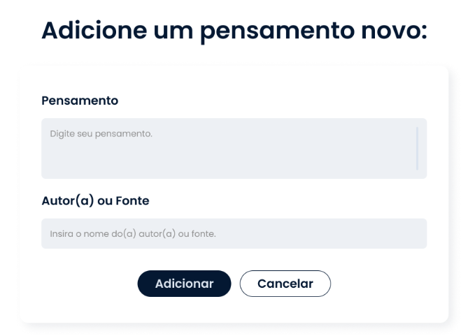

# Curso Alura - JavaScript: Implementando CRUD com requisições HTTP

## Aula 1 - Primeira Requisição

### Aula 1 - Apresentação - Vídeo 1

Transcrição  
Olá! Que tal aprender a implementar um CRUD com JavaScript? Meu nome é Nayanne Batista e te dou as boas-vindas a este curso.

Audiodescrição: Nayanne se autodeclara como uma pessoa de pele morena. Ela tem tem olhos castanho-escuros e cabelos lisos, compridos, também castanho-escuros. Ela veste uma camiseta laranja. Ao fundo, um ambiente de iluminação azulada, com uma estante de livros e uma janela com a persiana fechada.

O que aprenderemos?  
Neste curso, vamos trabalhar na Memoteca, projeto para colecionar memórias e pensamentos.

Por meio deste projeto, você entenderá como funciona a comunicação entre cliente e servidor e como ocorrem as requisições entre o front-end e o back-end. Para fazer isso, vamos entender e utilizar métodos HTTP como POST, PUT, DELETE e GET.

Além disso, vamos utilizar uma API fake com a ferramenta JSON Server, para simular uma API e conseguirmos fazer essa conexão e obter os dados desejados.

Com essas operações CRUD, poderemos buscar pensamentos já cadastrados, cadastrar um novo pensamento utilizando o formulário, além de editar e também excluir.

Pré-requisitos  
Para fazer este curso, é necessário ter conhecimentos de HTML, CSS e também alguns conhecimentos de JavaScript, como código assíncrono, promises e try-catch.

Vamos começar?!

### Aula 1 - Preparando o ambiente: download do projeto Memoteca

Olá, dev!
Boas-vindas a mais um curso de JavaScript!

Antes de prosseguir, é preciso ajustar o seu ambiente, conforme as instruções a seguir.

1. Código do projeto-base
Para este curso, utilizaremos o projeto Memoteca, que servirá de base para a implementação do CRUD em JavaScript.

Acesse o código do projeto por meio do [repositório no GitHub](https://github.com/alura-cursos/3781-javascript/tree/projeto-base) ou [faça download](https://github.com/alura-cursos/3781-javascript/archive/refs/heads/projeto-base.zip).

2. Layout no Figma
Caso tenha interesse no layout do projeto, acesse o Figma e explore os elementos da aplicação “Memoteca”.

> Se tiver alguma dúvida durante este curso, não hesite em interagir com a gente pelo Discord da Alura e pelo fórum. Estamos aqui para apoiar o seu aprendizado. Mesmo que não tenha dúvidas agora, ficaríamos felizes em ver você por lá (e o seu avanço).

Vamos lá!

### Aula 1 - Conhecendo a função fetch do JavaScript - Vídeo 2

Transcrição  
No vídeo anterior, conhecemos a aplicação Memoteca, repleta de pensamentos, como ficará ao final do curso. Mas, na verdade, até agora o mural da nossa aplicação ainda está vazio.

Queremos que a nossa aplicação tenha o mural repleto de pensamentos. Mas como vamos buscar esses pensamentos? Você já parou para se perguntar como acontece essa comunicação? Como uma aplicação front-end consegue buscar dados da internet?

Vamos entender como isso acontece no console do navegador.

Transferindo dados com o JSON
A instrutora tem um back-end rodando localmente na máquina, com o navegador exibindo a URL localhost:3000/pensamentos.

Nessa aplicação, temos diversos dados num formato parecido com o de objetos JavaScript, no modelo chave e valor, dando a estrutura dos pensamentos que vamos armazenar, com as propriedades id, conteudo e autoria.

```JSON
[
    {
        "id": "2",
        "conteudo": "Vc faz TI? Conserta meu celular!",
        "autoria": "Grupo da família"
    },
    {
        "id": "4",
        "conteudo": "Da vida reclama, mas sem ela não vive!",
        "autoria": "Mestre Yoda"
    }
...
]
```

Na verdade, esses dados não são objetos do JavaScript, mas um formato que chamamos de JSON (JavaScript Object Notation). Trata-se de um formato leve, muito utilizado na internet para a troca e armazenamento de dados. Cada trecho de código entre chaves é um dado único.

Vamos imaginar que os dados que queremos mostrar na aplicação são esses acima. Como faríamos isso? Faremos isso ao longo do curso, mas vamos entender como buscá-los primeiro.

**Buscando dados com fetch()**  
Vamos clicar com o botão direito nessa tela de dados no navegador e selecionar a opção "Inspecionar". Nessa aba de inspeção, vamos clicar em "Mais guias > Console". Na guia do Console, vamos clicar em "Limpar console" no menu superior de ferramentas.

Na nossa aplicação front-end, queremos buscar dados de algum lugar. Sendo assim, vamos criar uma função para buscar os pensamentos, definindo-a no console com function buscarPensamentos() {}. Dentro dessa função, precisamos fazer uma solicitação para obter esses dados.

Quando pedimos um favor para alguma amiga ou amigo, geralmente, usamos algumas palavras mágicas para aumentar as chances de conseguir, como "por favor" e "obrigada". Há palavras mágicas para solicitações para o JavaScript também. Especificamente para a solicitação de busca de dados, temos a palavra fetch() (cuja tradução pode ser, justamente, algo como "buscar").

Precisamos passar um endereço como parâmetro dessa função. Por exemplo, supondo que pedimos para uma amiga buscar um livro para nós em uma biblioteca, precisamos dar o endereço dessa biblioteca para ela, certo? A lógica é a mesma para o fetch.

O endereço dessas informações é o da nossa aplicação back-end. Portanto, vamos copiar a URL dessa aplicação (localhost:3000/pensamentos) e passar para dentro dos parênteses do fetch, entre aspas simples.

Esse fetch vai nos retornar uma promise (promessa), assim como a nossa amiga pode responder ao nosso pedido dizendo "ok, eu vou buscar o seu livro na biblioteca", prometendo essa ação.

Como o fetch retorna uma promessa, precisamos utilizar as palavras reservadas async e await. Antes do function, vamos digitar async, para definir essa função como assíncrona. Antes do fetch, vamos digitar await, para definir que esperamos essa resposta. Isso é necessário para lidar com esse tipo de solicitação no JavaScript.

Esse fetch() basta para buscarmos os pensamentos. Que tal também pedir um console.log() para verificar o que for retornado? Vamos chamá-lo abaixo do fetch. Mas o que vamos exibir nesse retorno, exatamente?

Para que a resposta que estamos esperando não se perca, precisamos atribuir essa resposta a uma constante. Então, antes do await fetch, vamos criar uma constante (com a palavra const) que chamaremos de response. Ou seja, com isso, vamos dar um console.log() nessa response, passando-a como parâmetro.

Por fim, após o fechamento das chaves, vamos chamar a função buscarPensamentos().

```JavaScript
async function buscarPensamentos() {
  const response = await fetch('http://localhost:3000/pensamentos')
  console.log(response)
}
buscarPensamentos()
```

Ao executar o código acima no console do navegador pressionando "Enter", nos é retornada uma response.

Essa response tem uma estrutura mais robusta e complexa do que os objetos da nossa aplicação back-end, com várias informações com as quais não precisamos nos preocupar nesse momento.

Os dados que buscamos em si estão contidos nessa response, mas não estão tão acessíveis para nós ainda. É como se a nossa amiga tivesse voltado da biblioteca com o nosso livro, mas ele estivesse em outro idioma.

Para conseguirmos acessar esses dados, de fato, precisamos fazer uma conversão de formato.

Convertendo JSON para objeto JavaScript com json()
Vamos limpar o terminal novamente e pressionar a seta para cima no teclado, para retornar ao código que tínhamos digitado anteriormente, antes da execução.

O fetch() vai retornar os dados que buscamos num formato JSON, mas precisamos converter para um formato possível de manipular na aplicação front-end. Pode ser, por exemplo, o formato de objeto JavaScript.

Para fazer isso, vamos criar outra constante, que vamos chamar de dados, logo abaixo do console.log() da nossa função. A essa constante, vamos atribuir o valor de response e aplicar nela a função json(), responsável por fazer a conversão da resposta para um formato JavaScript.

Para confirmar se essa conversão ocorreu, vamos dar um console.log() nos dados. Vamos comentar o primeiro console.log(), para não repetir o retorno, deixando apenas o segundo.

Por fim, precisamos utilizar o await antes do response.json(), porque esse método também vai nos retornar uma promessa.

```JavaScript
async function buscarPensamentos() {
  const response = await fetch('http://localhost:3000/pensamentos')
  //console.log(response)
  const dados = await response.json()
  console.log(dados)
}
buscarPensamentos()
```

Ao executar esse código, recebemos como resposta um array de 15 objetos, cada um deles representando um pensamento (ou seja, um dado):

Retorno

```JavaScript
[
  { id: '2', conteudo: 'Vc faz TI? Conserta meu celular!' autoria: 'Grupo da Família' },
  { id: '4', conteudo: 'Da vida reclama, mas sem ela não vive!' ...},
  { id: '5', conteudo: 'Na minha máquina funciona!', autoria: ...},
  { id: '6', conteudo: 'Esse é de laranja que parece de limão, mas é de uva.'...}
  ...
]
```

Este formato é de objeto JavaScript, porque fizemos a conversão, e ele tem algumas diferenças em relação ao JSON. Por exemplo, a chave não fica entre aspas, mas apenas o valor.

Ou seja, por meio de uma conversão de formato, conseguimos obter os dados desejados!

Próximos passos  
Começamos a entender como funciona a comunicação entre o front-end e o back-end na prática. No próximo vídeo, vamos abordar essa comunicação na teoria.

### Aula 1 - Para saber mais: arquivo JSON

**O que é JSON?**  
JSON (JavaScript Object Notation) é um formato leve de intercâmbio de dados que é fácil de ler e escrever para humanos e simples de analisar e gerar para máquinas. É amplamente utilizado para transmitir dados entre um servidor e um cliente web, bem como para armazenamento de configurações e dados estruturados em diversos sistemas.

Se você precisa escrever um documento, utiliza um arquivo no formato .docx; se precisa montar uma apresentação de slides, um arquivo PPT. Se precisa receber ou enviar dados na internet, o formato JSON é uma excelente escolha!

Quais são as características do JSON?  

- Formato simples: JSON é baseado em texto e usa uma notação de chave-valor que é fácil de entender e manipular;
- Linguagem agnóstica: Embora derivado do JavaScript, JSON é independente de linguagem, com suporte em praticamente todas as linguagens de programação modernas. Esse característica quase “universal” de funcionar em diversas linguagens é o que significa “linguagem agnóstica”;
- Estrutura hierárquica: Suporta estruturas de dados complexas através de objetos (coleções de pares chave-valor) e arrays (listas ordenadas de valores).

Quais são as vantagens do JSON?

- Leve e compacto: o que o torna ideal para transferência de dados em redes;
- Fácil de ler e escrever: a sintaxe é minimalista e intuitiva.;
- Interoperabilidade: suporte nativo em muitas linguagens de programação e plataformas, facilitando a troca de dados entre sistemas diferentes.

JSON é uma ferramenta poderosa e versátil para troca de dados, com uma sintaxe simples e que funciona em conjunto com diversos ambientes e
linguagens. Compreender o JSON é essencial para toda pessoa que trabalha com web, APIs ou qualquer forma de intercâmbio de dados estruturados.

### Aula 1 - Conhecendo como funciona a comunicação cliente-servidor - Vídeo 3

Transcrição  
No console do navegador, aprendemos como fazer um fetch() para buscar dados na prática. Agora, vamos entender teoricamente como se dá esse processo de comunicação entre cliente (quem busca os dados) e servidor (quem fornece os dados).

Como ocorre a comunicação servidor-cliente?  
Vamos comparar a situação com um restaurante. Normalmente, não temos acesso direto à cozinha dos restaurantes que frequentamos. Se queremos, por exemplo, um copo de água, não vamos até a cozinha buscá-lo. Existe uma pessoa (o garçom ou garçonete) a quem fazemos esse pedido, e essa pessoa é quem vai até a cozinha para buscar o que solicitamos e trazer à nossa mesa.

Na web, essas solicitações funcionam de forma parecida. O cliente, que no caso da web é a aplicação front-end, não tem contato direto com o servidor, ou back-end. Essa é a parte da aplicação que a pessoa usuária não vê funcionando, mas é importantíssima porque lida com toda a lógica de negócio e armazenamento de dados, e a nossa aplicação precisa se conectar a ela.

Assim como no restaurante temos a pessoa do garçom ou garçonete para intermediar essa comunicação entre nós e a cozinha, na internet nós precisamos de uma API.

A sigla API significa Application Programming Interface (Interface de Programação de Aplicações). Ela é a responsável por intermediar a comunicação entre o front-end e o back-end - assim como fizemos o fetch() no navegador para buscar os dados desejados e obter a resposta.

Quando precisa de informações que não tem disponíveis imediatamente, a aplicação front-end faz uma requisição (termo utilizado para "solicitação" nesse contexto, também chamada de "request") para a API, e o fetch() (a função de busca do JS) retorna uma promise, como o garçom que se compromete a ir buscar a sua água.

Feito isso, a API envia essa requisição para o back-end, ou servidor. O servidor, por sua vez, retorna a resposta (ou "response") com os dados solicitados em JSON (ou com um erro!).

Como sabemos, é necessário fazer uma conversão dessa resposta em JSON para um objeto JavaScript. No navegador, utilizamos a função .json() para fazer essa conversão.

Próximos passos  
Agora que entendemos como funciona a comunicação cliente-servidor e sabemos que precisamos de uma API, surge a dúvida:

— Nós ainda não temos uma API, mas apenas um projeto base de aplicação front-end. Como vamos nos conectar com o back-end? Além disso, essa API é desenvolvida com uma linguagem back-end, como Java ou Python. Será que vamos precisar aprender uma linguagem dessas para desenvolver uma API?

A boa notícia é que não!

Esse cenário é bastate comum no mercado de trabalho, em que existe um time front-end e um time back-end que trabalham em paralelo, e a API não fica pronta antes que o time de front-end precise fazer seus testes para finalizar o projeto.

Sendo assim, existem algumas ferramentas que podem nos auxiliar nesses casos. Neste curso, vamos utilizar a biblioteca JSON Server para nos auxiliar a criar uma API falsa, com a qual vamos conseguir simular todas as requisições a uma API real.

Então, vamos construir essa API falsa?!

### Aula 1 - Preparando o ambiente: Node.js e JSON server

Para prosseguir com o curso, você precisa instalar o Node.js.

1. Node.js
No próximo vídeo, iremos instalar a ferramenta JSON-Server. Para fazer isso, precisaremos do Node.js instalado na nossa máquina.

Caso não tenha o Node.js instalado, você pode fazer o download nesse site. Após o download, selecione o checkbox para aceitar os termos, clique em “Next” (“próximo”) algumas vezes para prosseguir e, por fim, clique em “Install" (“instalar”) para concluir a instalação.

2. JSON-Server
A instalação do JSON-Server será feita no próximo vídeo. O código que será colado no arquivo db.json está disponibilizado abaixo:

```JSON
{
    "pensamentos": [
      {
        "id": "2a56",
        "conteudo": "Vc faz TI? Conserta meu celular!",
        "autoria": "Grupo da família"
      },
      {
        "id": "4c7d",
        "conteudo": "Da vida reclama, mas sem ela não vive!",
        "autoria": "Mestre Yoda"
      },
      {
        "id": "5b8a",
        "conteudo": "Na minha máquina funciona!",
        "autoria": "Dev"
      },
      {
        "id": "68uy",
        "conteudo": "Esse é de laranja que parece de limão, mas tem gosto de tamarindo!",
        "autoria": "Chaves"
      },
      {
        "id": "b807",
        "conteudo": "Melhor professor, o fracasso é!",
        "autoria": "Mestre Yoda"
      },
      {
        "id": "9f3c",
        "conteudo": "Você não é todo mundo!",
        "autoria": "Mãe"
      },
      {
        "id": "6a2b",
        "conteudo": "Foi sem querer querendo!",
        "autoria": "Chaves"
      },
      {
        "id": "7e2a",
        "conteudo": "Que a força esteja com você!",
        "autoria": "Mestre Yoda"
      },
      {
        "id": "5c8f",
        "conteudo": "Resolver o bug não consegue? Esfriar a cabeça vc deve.",
        "autoria": "Mestre Yoda"
      },
      {
        "id": "2d6e",
        "conteudo": "Não faça drama, faça café! :)",
        "autoria": "Dev"
      },
      {
        "id": "3f1a",
        "conteudo": "Conserta minha impressora?",
        "autoria": "Grupo da família"
      },
      {
        "id": "8b4c",
        "conteudo": "A vingança nunca é plena... mata a alma e a envenena...",
        "autoria": "Seu Madruga"
      },
      {
        "id": "4d2e",
        "conteudo": "Se eu for aí e achar, eu esfrego na sua cara!",
        "autoria": "Mãe"
      }
    ]
  }
```

Esse código JSON contém os dados dos pensamentos que vamos exibir no projeto Memoteca.

Com o Node.js instalado, você pode prosseguir no curso!

### Aula 1 - Instalando o JSON Server para configurar uma API fake - Vídeo 4

Transcrição  
No VS Code, vamos acessar o projeto base disponibilizado nas atividades desta aula. Vamos instalar o JSON Server, acessando o terminal do VS Code com o atalho "Ctrl + J".

Pré-requisito: NodeJS  
Antes de tudo, podemos executar o comando clear para limpar o terminal e melhorar a visualização.

Para instalar o JSON Server, é necessário ter o Node instalado na nossa máquina. Isso porque o JSON Server é um pacote NPM (Node Package Manager, ou "Gerenciador de Pacotes do Node").

Podemos descobrir se temos o Node instalado executando o seguinte comando no terminal:

> node -v

No caso da instrutora, que tem o Node instalado, o retorno desse comando foi a versão do Node configurada na máquina (20.12.2). Caso você receba algum erro dizendo que este não é um comando reconhecido ou algo do gênero, pode ser que você não tenha o Node instalado.

Para resolver isso, basta acessar o site do NodeJS e clicar em "Descarregar Node.js" no centro da tela. Quando o download for finalizado, é só clicar no arquivo e seguir os passos para fazer a instalação (basicamente, clicar em "Next" até o fim e depois em "Finish").

Instalando o JSON Server  
Com o Node instalado, então, nós podemos agora usar o Gerenciador de Pacotes do Node para instalar o JSON Server. No terminal vamos executar o seguinte comando:

> npm i -g json-server

npm é o nome do gerenciador de pacotes, i é a abreviação de "install" (instalar), -g é a flag que indica que estamos realizando essa operação de maneira global, e json-server é a ferramenta que queremos instalar.

Normalmente essa instalação é rápida, mas isso pode depender da sua internet.

Configurando o back-end  
Quando a instalação for finalizada, vamos acessar o menu lateral esquerdo do VS Code, também chamado de "Explorador" de arquivos.

Nosso projeto tem as pastas "assets", "css" e o arquivo index.html do nosso projeto base. Agora, vamos criar uma nova pasta que vai representar o nosso back-end.

Normalmente, trabalhamos no front-end em uma máquina enquanto o back-end está hospedado em outra máquina, no servidor, etc. Mas, como estamos utilizando a abordagem de uma API fake, tanto o front-end quanto o back-end vão rodar localmente na nossa máquina.

Vamos clicar no botão "New Folder" (nova pasta) no topo desse menu. Podemos chamá-la de "backend".

Em seguida, vamos limpar o terminal novamente com o comando cleare entrar nessa nova pasta com o seguinte comando:

> cd backend

Dentro da pasta "backend", vamos executar o seguinte comando:

> npm init -y

Esse comando vai criar um novo arquivo na nossa pasta "backend", package.json, como podemos conferir na nossa estrutura de pastas na aba do explorador. Esse é o arquivo de configurações do nosso back-end, e contém algumas informações como nome, versão, descrição e alguns scripts, que analisaremos com mais detalhes adiante.

package.json

```JavaScript
  "name": "backend",
  "version": "1.0.0",
  "description": "",
  "main": "index.js",
  "scripts": {
    "test": "echo \"Error: no test specified\" && exit 1"
  },
  "keywords": [],
  "author": "",
  "license": "ISC"
}
```

Criando um banco de dados  
Agora, dentro do "backend", vamos criar um arquivo que vai conter os dados que vamos buscar. Esses dados vão ser criados de forma dinâmica posteriormente, mas, por enquanto, vamos criar um arquivo para disponibilizar esses dados fixos, servindo como um banco de dados fake.

Dentro da pasta "backend", vamos criar um novo arquivo clicando no botão "New File", e vamos chamá-lo de db.json. Dentro dele, vamos colar os dados que conferimos no primeiro vídeo:

db.json

```JavaScript
{
  "pensamentos": [
    {
      "id": "2a56",
      "conteudo": "Vc faz TI? Conserta meu celular!",
      "autoria": "Grupo da família"
    },
    {
      "id": "4c7d",
      "conteudo": "Da vida reclama, mas sem ela não vive!",
      "autoria": "Mestre Yoda"
    },
    {
      "id": "5b8a",
      "conteudo": "Na minha máquina funciona!",
      "autoria": "Dev"
    },
    {
      "id": "68uy",
      "conteudo": "Esse é de laranja que parece de limão, mas tem gosto de tamarindo!",
      "autoria": "Chaves"
    },
    {
      "id": "b807",
      "conteudo": "Melhor professor, o fracasso é!",
      "autoria": "Mestre Yoda"
    },
    {
      "id": "9f3c",
      "conteudo": "Você não é todo mundo!",
      "autoria": "Mãe"
    },
    {
      "id": "6a2b",
      "conteudo": "Foi sem querer querendo!",
      "autoria": "Chaves"
    },
    {
      "id": "7e2a",
      "conteudo": "Que a força esteja com você!",
      "autoria": "Mestre Yoda"
    },
    {
      "id": "5c8f",
      "conteudo": "Resolver o bug não consegue? Esfriar a cabeça vc deve.",
      "autoria": "Mestre Yoda"
    },
    {
      "id": "2d6e",
      "conteudo": "Não faça drama, faça café! :)",
      "autoria": "Dev"
    },
    {
      "id": "3f1a",
      "conteudo": "Conserta minha impressora?",
      "autoria": "Grupo da família"
    },
    {
      "id": "8b4c",
      "conteudo": "A vingança nunca é plena... mata a alma e a envenena...",
      "autoria": "Seu Madruga"
    },
    {
      "id": "4d2e",
      "conteudo": "Se eu for aí e achar, eu esfrego na sua cara!",
      "autoria": "Mãe"
    }
  ]
}
```

Os dados são objetos JSON compostos pelas propriedades id, conteudo e autoria, estruturando os pensamentos que queremos registrar na nossa aplicação e tentar mostrar na interface de usuário.

Executando o servidor  
Com o nosso banco de dados fake, vamos acessar o arquivo package.json e mudar um de seus scripts. Atualmente, temos nele apenas um script de teste, mas não vamos trabalhar com testes nessa aplicação. Então, vamos mudar o nome do script de test para start, porque queremos adicionar nele um comando para rodar a nossa aplicação back-end.

Esse comando será o json-server --watch db.json --port 3000. Com esse comando, estamos dizendo que a biblioteca que instalamos, o JSON Server, vai ficar assistindo (watch) às modificações que vão acontecer no arquivo db.json, onde estão contidos os nossos dados. Além disso, dissemos que essa API vai rodar na porta 3000.

Com esse comando configurado no back-end, só vamos precisar digitar no terminal o comando npm start para subir o back-end. Senão, precisaríamos toda vez digitar todo esse comando, que é muito grande.

package.json

```JavaScript
"scripts": {
    "start": "json-server --watch db.json --port 3000"
}
```

Agora, vamos acessar o terminal com o atalho "Ctrl + J" para verificar se deu tudo certo e se estamos conseguindo servir o back-end, ou seja, rodar a nossa aplicação.

Verifique se você está na pasta "backend" no terminal. Dentro dela, vamos rodar:

> npm start

Sucesso! Ao executar o comando acima para rodar a aplicação, recebemos como retorno uma mensagem com o comando que está sendo executado por baixo dos panos, um emoji feliz denotando que a operação foi bem-sucedida, a URL base (localhost:3000) e os endpoints, que, na verdade, é apenas o endereço onde vamos buscar esses pensamentos (localhost:3000/pensamentos).

Considerando novamente a analogia da pessoa que foi buscar o livro na biblioteca, a URL base é como o endereço da biblioteca, e o endpoint é a seção específica dessa biblioteca em que se encontra o livro que queremos, como a de ficção científica, por exemplo.

Como a nossa aplicação é bem simples, temos apenas um endpoint, o /pensamentos, mas poderíamos ter vários!

Ao clicar no link do endpoint retornado no terminal com "Ctrl" pressionado, abrimos uma página no navegador que contém todos os dados da nossa aplicação, ou seja, os pensamentos, em formato JSON.

Observação: precisaremos sempre executar o back-end ao longo do curso para conseguir fazer requisições ao back-end. Do contrário, teremos um erro se o servidor não estiver em execução.

Próximos passos  
Agora nós já temos uma aplicação front-end e uma API. Nos próximos vídeos, vamos preparar a aplicação para fazer a nossa primeira requisição.

### Aula 1 - Escrevendo a primeira requisição no projeto - Vídeo 5

Transcrição  
Agora, além da aplicação front-end, temos a nossa API falsa com o JSON Server. Mas como vamos obter, efetivamente, as informações de lá? Precisamos adicionar comportamento à nossa aplicação.

Se acessarmos o menu lateral esquerdo, o explorador de arquivos do VS Code, observaremos que temos apenas o "backend", os "assets", o index.html e o "css". No entanto, para adicionar dinamismo na aplicação, precisamos do JavaScript. É isso que vamos fazer agora.

Fazendo nossa primeira requisição à API  
Vamos criar uma nova pasta no nosso projeto, que chamaremos de "js". Dentro dela, vamos adicionar os arquivos JavaScript. O primeiro deles será o arquivo api.js, que será responsável por conter as nossas requisições à API.

Dentro dele, primeiramente, vamos criar uma constante (const) chamada api. Ela será um objeto com as várias funções do nosso código, que serão as requisições.

Vamos configurar a primeira, a de buscar pensamentos. Para isso, vamos criar uma função com o async, que chamaremos de buscarPensamentos().

Dentro dessa função, vamos utilizar o try/catch, porque, se ocorrer algum erro nessa requisição, já conseguiremos captá-lo e mostrar alguma mensagem amigável na interface informando sobre ela.

Para isso, podemos adicionar um alert() no catch, sinalizando o erro para a pessoa usuária com a mensagem 'Erro ao buscar pensamentos', por exemplo. Também precisamos lançar esse erro com throw error.

No try, vamos fazer algo bem parecido com o que fizemos no console do navegador. Então, vamos criar uma constante que também chamaremos de response, que vai receber um fetch(). Já aprendemos que precisamos usar o await antes do fetch(), porque esse método vai nos retornar uma promise.

Passamos o endereço dessa busca para o fetch() entre aspas simples. Esse endereço é o link para o endpoint /pensamentos, que conseguimos no vídeo anterior: http://localhost:3000/pensamentos.

Em seguida, adicionamos o que queremos que seja retornado, com a palavra return. Nesse caso, queremos retornar a response com o método json() aplicado para fazer a conversão do formato JSON para o objeto JavaScript e podermos manipular esses dados. Também precisamos adicionar um await antes do response, porque o método retorna uma promise.

Inclusive, vamos exportar essa constante, adicionando a linha de código export default api ao final do arquivo, para conseguir utilizar essa constante em outros arquivos JavaScript, como veremos mais adiante.

Com isso, nosso arquivo ficará assim:  

api.js

```JavaScript
const api = {
  async buscarPensamentos() {
    try {
      const response = await fetch('http://localhost:3000/pensamentos')
      return await response.json()
    }
    catch {
      alert('Erro ao buscar pensamentos')
      throw error
    }
  }
}
export default api
```

Próximos passos  
Agora temos a nossa primeira requisição, em que usamos o fetch() para buscar os pensamentos!

Para verificar o resultado, vamos clicar no botão "Extensions" do menu lateral esquerdo no VS Code, pesquisar por "live server" no campo de busca e instalar e habilitar a primeira extensão da página de resultados.

Feito isso, quando clicamos em "Go Live" no canto inferior direito da tela de código no VS Code, conseguimos visualizar a aplicação em outra janela.

Temos a aplicação Memoteca funcionando! Criamos o arquivo api.json e fizemos a requisição fetch(), mas os dados ainda não estão disponíveis na aplicação, porque precisamos pegar essa resposta e manipular o DOM para mostrá-la na interface da pessoa usuária.

É isso que faremos no próximo vídeo. Até lá!

### Aula 1 - Avaliando a implementação de requisições

Você decidiu aplicar seus conhecimentos em um projeto pessoal chamado "Gatito Petshop", um site para adoção de pets.

Você já configurou a API para listar os pets disponíveis para adoção e agora precisa implementar a função que fará a requisição para buscar esses pets do servidor.

Como você pode escrever o código dessa função de busca?

Alternativa correta

```JavaScript
  async function buscarPets() {
    try {
      const response = await fetch('http://localhost:3000/pets’)
      return await response.json()
    }
    catch (error){
      alert('Erro ao buscar dados’)
      throw error
    }
  }
```

Esta implementação segue as boas práticas ao utilizar a função fetch() para fazer a requisição e ler o JSON, e lançar um erro caso a requisição falhe, o que facilita o tratamento de erros.

### Aula 1 - Mostrando os dados na interface do projeto - Vídeo 6

Transcrição  
No vídeo anterior, criamos uma pasta chamada "js" para conter os arquivos JavaScript, e o primeiro deles foi responsável pelas solicitações à API, que chamamos de api.js.

Nesse momento do vídeo, a instrutora realiza correções no arquivo api.js. Elas foram adicionadas na transcrição do vídeo anterior.

Observamos na aplicação que os pensamentos ainda não estão aparecendo, e precisamos de um arquivo JavaScript para lidar com essa manipulação do DOM e outro para lidar com a interface.

Vamos por partes.

Renderizando os pensamentos  
Dentro da pasta "js", vamos criar um novo arquivo chamado ui.js. O ui vem de User Interface (Interface do Usuário).

Nesse arquivo, vamos criar uma função para renderizar os pensamentos na tela. Para isso, vamos declarar uma constante chamada ui, que vai receber um bloco de chaves. Dentro dela, vamos criar a função assíncrona chamada renderizarPensamentos().

Precisaremos ter acesso à lista de pensamentos nessa função. Se acessarmos o arquivo index.html no explorador de arquivos, podemos observar a renderização de lista ul de pensamentos dentro da section da linha 63, cujo id é lista-pensamentos:

index.html

```HTML
<section id="lista-pensamentos-container">
    <h3>Meu Mural</h3>
    <ul id="lista-pensamentos"></ul>
</section>
```

Ou seja, vamos acessar esse elemento na função de renderizar pensamentos para conseguir criar os itens dessa lista de forma dinâmica.

Então, no ui.js, vamos criar uma constante chamada listaPensamentos dentro da função que estamos criando, e atribuir a ela o document.getElementById(), passando por parâmetro o ID da ul que conferimos agora, lista-pensamentos.

Em seguida, vamos utilizar o try/catch novamente. No catch, vamos lançar um alert() com a mensagem Erro ao renderizar pensamentos. Dentro do try, queremos fazer uma chamada à API. Afinal, para renderizar esses pensamentos, precisamos buscá-los primeiro.

Essa função de buscar os pensamentos foi criada no arquivo api.js, mas podemos acessá-la no ui.js, porque expostamos a constante api antes. Então, vamos importá-la no topo do arquivo:

ui.js

> import api from "./api.js"

Você pode estar se perguntando: por que estamos criando vários arquivos JavaScript? Por que não fazemos tudo num arquivo só?

Criar diferentes arquivos é importante para conseguirmos separar as responsabilidades. Quando criamos um arquivo específico para lidar com as requisições, outro para lidar com a interface de usuário e outro para lidar com a manipulação do DOM, facilitamos a legibilidade e manutenção do código, sendo uma boa prática de programação.

Por exemplo, vamos imaginar que houve um erro em alguma requisição. Nesse caso, não precisamos procurá-lo em um arquivo grande com tudo dentro, o que seria difícil. Quando temos um arquivo específico para cada tarefa, fica mais fácil achar o erro, debugar e corrigir o código.

Dentro do try, vamos acessar a API. Para isso, vamos criar uma constante chamada pensamentos, para a qual vamos atribuir a chamada da API. Começamos com await, porque ela vai nos retornar uma promise, e depois chamamos api.buscarPensamentos().

Após buscarmos esses pensamentos, precisamos criar os itens da lista de forma dinâmica. Para isso, vamos acessar os pensamentos e fazer um forEach() neles, resultando em pensamentos.forEach().

Dentro desse método, para cada pensamento, vamos criar uma arrow function e mudar o conteúdo da listaPensamentos, com listaPensamentos.innerHTML += para fazer uma concatenação desse conteúdo.

No card de cada pensamento, temos as aspas, o conteúdo e a autoria, então vamos precisar criar essa estrutura aqui também. Vamos utilizar uma template string com a sintaxe das crases e, dentro delas, colar um código HTML que vamos entender mais adiante.

Com isso, nossa função ficará assim:

```JavaScript
const ui = {
  async renderizarPensamentos() {
    const listaPensamentos = document.getElementById("lista-pensamentos")
    try {
      const pensamentos = await api.buscarPensamentos()
      pensamentos.forEach(pensamento => {
        listaPensamentos.innerHTML += `
          <li class="li-pensamento" data-id="${pensamento.id}">
          
          <div class="pensamento-conteudo">${pensamento.conteudo}</div>
          <div class="pensamento-autoria">${pensamento.autoria}</div>
          </li>
        `
      })
    }
    catch {
      alert('Erro ao renderizar pensamentos')
    }
  }
}
```

No código HTML que passamos para o innerHTML, criamos dinamicamente cada li (item) da lista. Começamos com a tag li, em que adicionamos algumas classes que já estão disponíveis no CSS, como li-pensamento.

Adicionamos também um atributo de dados chamado data-id. Esse atributo de dados é do HTML e podemos utilizá-lo para salvar uma informação dentro desse elemento. Ou seja, ele não vai modificar a aparência do elemento, mas a informação vai ficar salva dentro desse atributo. Passamos para ele o pensamento.id, porque é o que queremos armazenar. Lembrando que o nosso pensamento tem três propriedades: id, conteúdo e autoria.

Logo abaixo, criamos a imagem com a tag img. Passamos o caminho da imagem, um alt e uma classe também, chamada icone-aspas.

Depois, criamos duas divs com suas classes respectivas, pensamento-conteudo e pensamento-autoria, e também concatenamos o seu conteúdo.

Com isso, estamos criando os lis, ou itens da lista, de forma dinâmica!

Para finalizar, vamos exportar essa função ao final do arquivo ui.js:

> export default ui

**Lógica principal da aplicação**  
Por fim, precisamos de mais um arquivo JavaScript. Dentro da pasta "js", vamos criar um novo arquivo chamado main.js. Esse arquivo será responsável pela lógica principal do carregamento da aplicação, ou seja, da manipulação do formulário, da submissão desses dados e do próprio carregamento da página.

Nesse arquivo, vamos precisar chamar a função que acabamos de criar no arquivo ui.js, chamada renderizarPensamentos().

Vamos chamar essa função quando o HTML for carregado. Então, podemos digitar document.addEventListener() para adicionar um ouvinte de eventos e identificar quando a página for carregada. Então, entre os parênteses, vamos adicionar o DOMContentLoaded, que significa justamente que o HTML terminou de ser carregado.

Após uma vírgula, vamos criar uma arrow function como segundo parâmetro e chamar nela a função do ui.

main.js

```JavaScript
document.addEventListener("DOMContentLoaded", () => {
  ui.renderizarPensamentos()
})
```

Precisamos importar a função do ui no topo do arquivo para a chamada funcionar:

> import ui from "./ui.js"

Pronto! Agora já temos três arquivos com sua respectiva responsabilidade bem definida.

Chamando os scripts no HTML  
Para finalizar, vamos adicionar esses três scripts JS no index.html, para podermos testar se tudo está funcionando.

Abaixo de footer, vamos adicionar a tag script do tipo module, porque estamos utilizando a estrutura de import e export. No src dessa tag. vamos indicar o caminho js/api.js. Isso resulta na linha <script type="module" src="js/api.js"></script>.

Deixando o cursor parado ao final da linha e pressionando o atalho "Alt + Shift + Seta para baixo", duplicamos essa linha. Vamos fazer isso duas vezes e apenas substituir o nome dos arquivos para ui.js e main.js.

index.html

```HTML
<script type="module" src="js/api.js"></script>
<script type="module" src="js/main.js"></script>
<script type="module" src="js/ui.js"></script>
```

Podemos testar. Nossa aplicação já está em execução, então vamos acessar a porta para ela no navegador e recarregar a página, os pensamentos aparecerão no mural!


A imagem mostra um conjunto de seis quadros azuis com bordas azul-escuro, organizados em duas colunas e três linhas, com um fundo claro e manchas azuis claras nas extremidades superiores. Cada quadro contém uma citação em aspas, seguida pelo nome da pessoa ou personagem que teria dito a frase. No topo da imagem, centralizado, lê-se 'Meu Mural' em letras maiúsculas. As citações e seus respectivos autores de cima para baixo, da esquerda para a direita, são: 'Vc faz TI?? Conserta meu celular!' - Grupo da família; 'Da vida reclama, mas sem ela não vive!' - Mestre Yoda; 'Na minha máquina funciona!' - Dev; 'Esse é de laranja que parece de limão, mas tem gosto de tamarindo!' - Chaves; 'Melhor professor, o fracasso é!' - Mestre Yoda; 'Você não é todo mundo!' - Mãe. Cada quadro possui um ícone de aspas grandes no canto superior esquerdo e o texto é alinhado à esquerda. A tipografia utilizada para os nomes dos autores é menor do que a usada para as citações.

Próximos passos  
Conseguimos realizar a nossa primeira requisição à API e mostrar os pensamentos na tela! Mas isso é só o começo. Na próxima aula, vamos aprender a adicionar um novo pensamento no mural.

### Aula 1 - Faça como eu fiz: realize a primeira requisição no Memoteca

Nesta aula, aprendemos importantes conceitos para fazer a primeira requisição e mostrar os dados do pensamento no mural do projeto Memoteca.

É importante que você coloque em prática o conhecimento adquirido em aula para que o seu aprendizado seja eficaz!

Para implementar o que foi visto na aula, clique abaixo em “ver opinião da instrutora” para seguir o passo a passo.

**Opinião do instrutor**  

Nesta aula, foram adicionados novos pensamentos ao arquivo "db.json" e configurado o arquivo "package.json" para iniciar o servidor JSON com os novos dados.

No arquivo "db.json", foram inseridos novos pensamentos com seus respectivos IDs, conteúdos e autorias. Já no arquivo "package.json", foi adicionado um script de inicialização do servidor JSON.

Para ver mais detalhes do código implementado, acesse o [repositório no GitHub](https://github.com/alura-cursos/3781-javascript/tree/aula-1).

Abaixo, veja instruções mais detalhadas do que fizemos nesta aula:

Arquivo “backend/db.json”:

- Abra o arquivo "db.json";
- Adicione um novo objeto com as informações de um pensamento, incluindo ID, conteúdo e autoria;
- Repita o passo anterior para adicionar todos os novos pensamentos ao arquivo;
- Salve as alterações feitas no arquivo.

Arquivo “backend/package.json”:

- Abra o arquivo "package.json";
- Adicione um novo script chamado "start" com o comando para iniciar o servidor JSON;
- Salve as alterações feitas no arquivo; Também criamos um arquivo chamado "api.js" que contém um objeto chamado "api" com um método assíncrono chamado buscarPensamentos. Esse método faz uma requisição para a URL 'http://localhost:3000/pensamentos' utilizando o método fetch, e retorna os dados em formato JSON. Caso ocorra algum erro na requisição, é exibido um alerta com a mensagem 'Erro ao buscar pensamentos' e o erro é lançado.

Arquivo "api.js":

- Crie um arquivo chamado "api.js";
- Declare uma constante chamada api que seja um objeto;
- Adicione um método assíncrono chamado buscarPensamentos dentro do objeto api;
- Dentro do método buscarPensamentos, faça uma requisição utilizando o método fetch para a URL 'http://localhost:3000/pensamentos';
- Retorne os dados da resposta da requisição em formato JSON utilizando o método response.json();
- Caso ocorra algum erro na requisição, exiba um alerta com a mensagem 'Erro ao buscar pensamentos';
- Lance o erro utilizando a palavra-chave throw;
- Exporte o objeto "api" como padrão no final do arquivo.

Além disso, realizamos algumas alterações em três arquivos: "index.html", "js/api.js", "js/main.js" e "js/ui.js".

No arquivo "index.html", adicionamos três novos scripts para importar os arquivos "api.js", "main.js" e "ui.js".

Em "js/api.js", removemos a variável error do bloco catch.

Já em "js/main.js", importamos o arquivo "ui.js" e adicionamos um evento para chamar a função renderizarPensamentos ao carregar a página.

Por fim, no arquivo "js/ui.js", criamos a função "renderizarPensamentos" que busca os pensamentos da API e os exibe na página.

Arquivo “index.html”:

Adicione os seguintes scripts no final do body:

```HTML
<script type="module" src="js/api.js"></script>
<script type="module" src="js/main.js"></script>
<script type="module" src="js/ui.js"></script>
```

Arquivo “js/api.js”:

Remova a variável "error" do bloco catch.

Arquivo “js/main.js”:

Importe o arquivo "ui.js";

Adicione um evento para chamar a função renderizarPensamentos ao carregar a página.

Arquivo “js/ui.js”:

- Crie a função assíncrona renderizarPensamentos;
- Obtenha o elemento com o id lista-pensamentos;
- Tente buscar os pensamentos da API e, para cada pensamento, adicione o HTML correspondente à lista de pensamentos;
- Em caso de erro, exiba um alerta.

Se sobrarem dúvidas, chame a gente no forum ou discord!

### Aula 1 - Lista de exercícios

Vamos praticar?

O que é:  
Boas-vindas à nossa lista de exercícios - um caminho prático para aprender e aprimorar suas habilidades em tecnologia. Nossos exercícios colocam você no centro do processo de aprendizado, permitindo que você construa, experimente e explore conceitos de programação e tecnologia.

Para que serve:  
Esta lista serve para aprender, reforçar, praticar e aprimorar habilidades em programação e desenvolvimento web. Desafie-se! A lista prepara você não apenas para entender a tecnologia, mas para utilizá-la de maneira eficaz e criativa em seus próprios projetos ou no trabalho.

Como fazer:  
Leia cada exercício com atenção: comece entendendo o cenário proposto e o que se espera como resultado.
Escreva o código: utilize o ambiente de codificação de sua escolha para escrever e testar o seu código. Não se preocupe em acertar de primeira, a prática leva à perfeição.
Verifique o gabarito: após tentar resolver o exercício, compare seu código com o gabarito fornecido em “Opinião do instrutor”. Isso ajudará a identificar áreas de melhoria e consolidar o aprendizado.
Repita: a repetição é chave para o aprendizado. Tente fazer os exercícios mais de uma vez, aplicando melhorias e variantes.
Lembre-se, cada desafio é uma chance de crescer. Não se desanime com os erros; eles são degraus no caminho do aprendizado. Sobretudo, divirta-se! O aprendizado mais eficaz acontece quando nos engajamos e nos interessamos pelo que estamos fazendo.

Não se esqueça que estamos no Fórum e no Discord para ajudar você!

Bons estudos!

1) Simulando uma API com JSON Server
Você está desenvolvendo a aplicação web ADOPET, um site para adoção de animais, e precisa buscar dados de um servidor com as informações dos pets. No entanto, você ainda não tem um back-end pronto. Para contornar isso, você pode utilizar o JSON Server para simular uma API.

Logo, abra seu editor de código, crie um novo projeto e faça a configuração do JSON-Server para simular um back-end que retorna os dados de animais para adoção.

Utilize os dados fictícios a seguir:

```JSON
{
  "pets": [
    {
      "id": "1a2b",
      "especie": "felina",
      "nome": "Mimi",
      "raca": "Siamês"
    },
    {
      "id": "2b3c",
      "especie": "canina",
      "nome": "Rex",
      "raca": "Labrador"
    },
    {
      "id": "3c4d",
      "especie": "felina",
      "nome": "Luna",
      "raca": "Persa"
    },
    {
      "id": "4d5e",
      "especie": "canina",
      "nome": "Max",
      "raca": "Beagle"
    },
    {
      "id": "5e6f",
      "especie": "felina",
      "nome": "Simba",
      "raca": "Maine Coon"
    },
    {
      "id": "6f7g",
      "especie": "canina",
      "nome": "Bella",
      "raca": "Bulldog"
    },
    {
      "id": "7g8h",
      "especie": "felina",
      "nome": "Oscar",
      "raca": "Bengal"
    },
    {
      "id": "8h9i",
      "especie": "canina",
      "nome": "Lola",
      "raca": "Poodle"
    },
    {
      "id": "9i0j",
      "especie": "felina",
      "nome": "Nina",
      "raca": "Sphynx"
    },
    {
      "id": "0j1k",
      "especie": "canina",
      "nome": "Charlie",
      "raca": "Golden Retriever"
    }
  ]
}
```

2) Buscando dados da API  
Agora que você tem uma API simulada rodando, você precisa buscar os dados dessa API. Faça uma requisição para buscar os dados dos pets.

3) Exibindo dados no Front-end  
Você já configurou uma API simulada com JSON Server e fez a requisição para buscar os dados dos pets. Agora, é hora de exibir esses dados na interface da aplicação web.

Crie uma função em JavaScript que renderize os dados dos pets no frontend, exibindo-os em uma lista.

Lembre-se que o projeto não estará estilizado, então, caso queira, crie um arquivo ".css" e adicione estilo para as classes dos elementos.

Vamos lá?

Opinião do instrutor

Agora que você concluiu os exercícios, é hora de ver o "gabarito" com as respostas!

Lembre-se de que seu código pode variar um pouco. O importante é que ele funcione e siga boas práticas de programação!

1) Simulando uma API com JSON Server

Para configurar o JSON Server:

- Crie um novo projeto no seu editor de código;
- Crie uma pasta chamada ”backend” e rode o comando npm init -y;
- Instale o JSON Server com npm i json-server;
- Crie um arquivo db.json com os dados dos animais;
- Adicione o comando abaixo para inicialização no package.json:
"scripts": {
  "start": "json-server --watch db.json --port 3000"
}

Inicie o servidor com npm start e acesse http://localhost:3000/pets.

2) Buscando dados da API  
Para buscar os dados da API, crie uma pasta chamada js no seu projeto e, dentro dela, um arquivo chamado api.js.

Adicione o seguinte código no arquivo api.js para buscar os dados da API:

```JavaScript
const api = {
  async buscarInformacoesPets() {
    try {
      const response = await fetch('http://localhost:3000/pets’);
      return await response.json();
    } catch (error) {
      alert(‘Erro ao buscar dados’);
      throw error;
    }
  }
};
export default api;
```

3) Exibindo dados no Front-end  
Para exibir uma lista com os dados dos pets, siga os passos a seguir:

Crie um arquivo chamado ui.js na pasta js do seu projeto;
Adicione uma função renderizarPets que buscará os dados dos pets da API e exibirá esses dados em uma lista HTML.

// js/ui.js

```JavaScript
import api from "./api.js"
const ui = {
  async renderizarPets() {
    const listaPets = document.getElementById("lista-pets");
    try {
      const pets = await api.buscarInformacoesPets();
      pets.forEach(pet => {
        listaPets.innerHTML += `
          <li class="li-pet" data-id="${pet.id}">
            <div class="pet-especie">Espécie: ${pet.especie}</div>
            <div class="pet-nome">Nome: ${pet.nome}</div>
            <div class="pet-raca">Raça: ${pet.raca}</div>
          </li>
        `;
      });
    } catch (error) {
      console.error("Erro ao obter pets:", error);
      alert("Erro ao obter pets. Tente novamente mais tarde.");
    }
  }
};
export default ui;
```

Crie um arquivo main.js para gerenciar o carregamento da página e a chamada da função renderizarPets:

//js/main.js

```JavaScript
import ui from "./ui.js"
document.addEventListener("DOMContentLoaded", () => {
  ui.renderizarPets();
});
```

Crie um arquivo HTML básico com um elemento <ul> com o id lista-pets, onde os dados serão inseridos e adicione o código JavaScript para carregar e executar a função renderizarPets quando a página for carregada.

//index.html

```HTML
<!DOCTYPE html>
<html lang="pt-br">
<head>
  <meta charset="UTF-8">
  <meta name="viewport" content="width=device-width, initial-scale=1.0">
  <title>ADOPET</title>
</head>
<body>
  <ul id="lista-pets"></ul>
  <script type="module" src="js/api.js"></script>
  <script type="module" src="js/ui.js"></script>
  <script type="module" src="js/main.js"></script>
</body>
</html>
```

Teste sua aplicação e verifique se os dados dos pets são exibidos corretamente na lista.

Parabéns por concluir essa lista!

### Aula 1 - O que aprendemos?

Nesta aula, você aprendeu a:

- Comunicar-se com o servidor: utilizamos o projeto base e o projeto final para explorar como obter dados de um servidor;
- Configurar um servidor JSON com JSON-Server: Utilizamos o JSON-Server para simular um back-end, criando um arquivo “db.json” e configurando o “package.json” para iniciar a API;
- Fazer uma requisição com Fetch: Criamos um arquivo “api.js” e implementamos o método buscarPensamentos() para fazer uma requisição à API e obter os dados dos pensamentos;
- Renderizar dados na interface: implementamos o arquivo “ui.js” com o método renderizarPensamentos() para atualizar dinamicamente a interface com os pensamentos obtidos da API.

Espero você na próxima aula!

## Aula 2 - Requisições GET e POST

### Aula 2 - Adicionando dados com o POST - Vídeo 1

Transcrição  
Conseguimos buscar os pensamentos da API e renderizá-los na tela. Agora, vamos continuar adicionando mais funcionalidades na aplicação.

O que queremos fazer agora é cadastrar um novo pensamento. Portanto, além de buscar, queremos preencher na aplicação o pensamento e a autoria, e enviar esses dados para a API. Vamos começar a fazer isso.

Enviando um pensamento à API
Com o VS Code aberto no arquivo api.js, dentro da pasta "js", podemos começar pela lógica da API.

Entre as chaves de const api, após a chave que encerra o bloco buscarPensamentos(), adicionaremos uma vírgula, pularemos uma linha e criaremos uma nova requisição. Como a estrutura é parecida, copiaremos o bloco buscarPensamentos(), que ocupa dez linhas.

Para duplicar esse código, basta selecionar todo o bloco e teclar "Alt + Shift + Seta para baixo". Em seguida, realizaremos as modificações necessárias.

Ao invés de buscar pensamentos, queremos salvar um pensamento. Portanto, mudaremos o nome buscarPensamentos() para salvarPensamento(), apagando o "s".

Na função de buscar pensamentos, estamos apenas recolhendo informações. Contudo, na função de salvamento, precisamos enviar uma informação. Por isso, entre os parênteses, informaremos um pensamento como parâmetro dessa função.

Também faremos um try-catch, criando essa responsabilidade e fazendo um fetch para a API. Portanto, manteremos esse trecho copiado.

api.js:

```JavaScript
const api = {
    async buscarPensamentos() {
        try {
            const response = await fetch('http://localhost:3000/pensamentos')
            return await response.json()
        }
        catch {
            alert('Erro ao buscar pensamentos')
            throw error
        }
    },
    
    async salvarPensamento(pensamento) {
        try {
            const response = await fetch('http://localhost:3000/pensamentos')
            return await response.json()
        }
        catch {
            alert('Erro ao buscar pensamentos')
            throw error
        }
    }
}
```

Notaremos que a estrutura de ambas as funções são muito parecidas. Como a API entenderá que queremos buscar dados na função antiga e cadastrar um pensamento na função nova? Será que isso acontece de forma automática internamente?

A resposta é não. Precisaremos enviar mais algumas informações para essa requisição, explicitando para a API o que queremos fazer.

Dentro da função salvarPensamento(), na linha const response = await fetch('http://localhost:3000/pensamentos'), adicionaremos, dentro dos parênteses e depois da URL, uma vírgula e um bloco de chaves.

Entre elas, adicionaremos algumas informações. A primeira se chama method (método) - ou seja, a ação que queremos fazer com essa requisição.

Escreveremos method, dois pontos, e passaremos, entre aspas duplas, o nome POST.

```JavaScript
async salvarPensamento(pensamento) {
    try {
        const response = await fetch('http://localhost:3000/pensamentos', {
            method: "POST"
        })
        return await response.json()
    }
    catch {
        alert('Erro ao buscar pensamentos')
        throw error
    }
}
```

O POST significa que queremos enviar uma informação. Não especificamos nenhum método ao buscar pensamentos, porque o fetch realiza um GET por padrão, que é a informação de buscar.

Como se trata do padrão, não precisamos explicitar. Já para cadastrar uma informação, precisamos usar o método POST.

Além do método que representa a ação, que outras informações precisamos passar Digitaremos uma vírgula após o POST, desceremos uma linha e adicionaremos a propriedade headers, com dois pontos, e um bloco de chaves.

Entre as chavesm, para essa propriedade, informaremos um Content-Type entre aspas duplas. Fora das aspas, adicionaremos dois pontos e um application/json entre aspas duplas.

```JavaScript
async salvarPensamento(pensamento) {
    try {
        const response = await fetch('http://localhost:3000/pensamentos', {
            method: "POST",
            headers: {
                "Content-Type": "application/json"
            },
        })
        return await response.json()
    }
    catch {
        alert('Erro ao buscar pensamentos')
        throw error
    }
}
```

O Content-Type, com iniciais maiúsculas, informa o tipo de conteúdo que estamos enviando nessa requisição. Nesse caso, informamos que será um conteúdo em JSON.

Lembrando que queremos criar um pensamento como um objeto JavaScript, mas estamos informando nesse bloco que ele será um JSON. Portanto, precisaremos fazer essa conversão na hora do envio.

Após a chave que encerra o bloco headers, digitaremos uma vírgula e, na linha seguinte, adicionaremos mais uma propriedade: o body (corpo) da requisição, seguido de dois pontos.

Para o corpo da requisição, precisamos fazer a conversão do pensamento. Para isso, utilizaremos a função JSON.stringify(), passando como parâmetro o pensamento entre parênteses.

Essa função do JSON converterá o pensamento, que era um objeto JavaScript, para o formato de string JSON (formato que a API entende).

```JavaScript
async salvarPensamento(pensamento) {
    try {
        const response = await fetch('http://localhost:3000/pensamentos', {
            method: "POST",
            headers: {
                "Content-Type": "application/json"
            },
            body: JSON.stringify(pensamento)
        })
        return await response.json()
    }
    catch {
        alert('Erro ao buscar pensamentos')
        throw error
    }
}
```

Vamos imaginar que estamos enviando um e-mail para uma pessoa colega de trabalho. Esse e-mail possui diversas informações.

Esse e-mail é como a nossa requisição e possui diversas informações. O cabeçalho da requisição, no bloco headers que comentamos, representaria o cabeçalho do e-mail, no qual podemos adicionar informações como o assunto, destinatários e pessoas em cópia.

Nós passamos a mesma estrutura no tipo de conteúdo, onde usamos o "Content-Type": "application/json".

Já o body (corpo) da requisição equivale ao conteúdo enviado no e-mail - ou seja, a mensagem em si. No código, essa etapa ocorre quando passamos o pensamento em um objeto JavaScript e o convertemos para JSON, o formato que a API entende.

Próximos passos  
Esperamos que essa analogia tenha tornado claro o que fizemos nessa nova requisição. Ela é o primeiro passo para conseguir enviar essas informações para a API.

A seguir, continuaremos trabalhando nessa tarefa.

### Aula 2 - Implementando a lógica na interface - Vídeo 2

Transcrição  
Criamos a requisição API com o método POST para enviar um pensamento para a API. Agora, precisamos fazer isso de forma dinâmica, criando cada um dos cartões que representam um item da lista. Assim, quando clicamos no botão de adicionar do formulário, esse novo pensamento é adicionado no mural.

Vamos voltar no VS Code para fazer isso.

**Adicionando pensamentos na lista**  
Dentro da pasta "js", acessaremos o arquivo ui.js, que tem a responsabilidade de lidar com a interface da pessoa usuária. Em seu interior, no bloco da função de renderizarPensamentos(), estamos criando de forma dinâmica os itens da lista diretamente.

No entanto, também é interessante dividir essas responsabilidades das funções, tendo uma função específica para a criação desse pensamento. Afinal, precisaremos criar a imagem das aspas, conteúdo, autoria e futuramente os ícones de edição e exclusão.

Neste vídeo, vamos fazer essa separação. Passaremos a lógica que está dentro da função de renderizar os pensamentos para a função de adicionar um pensamento na lista.

Vamos digitar uma vírgula após a chave que encerra o bloco da função renderizarPensamentos(), por volta da linha 22, e pular uma linha para criar uma nova função. Vamos chamá-la de adicionarPensamentoNaLista(), porque é exatamente o que ela vai fazer.

ui.js:

```JavaScript
const ui = {
    async renderizarPensamentos() {
        const listaPensamentos = document.getElementById("lista-pensamentos")
        
        try {
            const pensamentos = await api.buscarPensamentos()
            pensamentos.forEach(pensamento => {
                listaPensamentos.innerHTML += `
                    <li class="li-pensamento" data-id="${pensamento.id}">
                    
                    <div class="pensamento-conteudo">${pensamento.conteudo}</div>
                    <div class="pensamento-autoria">${pensamento.autoria}</div>
                    </li>
                `
            })
        }
        catch {
            alert('Erro ao renderizar pensamentos')
        }
    },
    adicionarPensamentoNaLista() {
    }
}
```

Entre suas chaves, criaremos uma constante para representar a lista de pensamentos. Já fizemos isso na linha const listaPensamentos = document.getElementById("lista-pensamentos").

Precisamos ter acesso a essa lista, portanto, vamos copiar e colar esse conteúdo.

```JavaScript
adicionarPensamentoNaLista() {
    const listaPensamentos = document.getElementById("lista-pensamentos")
}
```

Na linha seguinte, criaremos um elemento que vai representar o item da lista. Para tornar o item da lista mais evidente, esse elemento será uma constante chamada li.

Criaremos essa constante com document.createElement(), passando entre aspas duplas um li, elemento que queremos criar.

```JavaScript
adicionarPensamentoNaLista() {
    const listaPensamentos = document.getElementById("lista-pensamentos")
    const li = document.createElement("li")
}
```

Na próxima linha, precisamos fazer a atribuição do id.

Anteriormente, usamos um atributo de dados para adicionar o id na linha `<li class="li-pensamento" data-id="${pensamento.id}">`. Podemos fazer isso também.

Para isso, digitaremos li.setAttribute(). Entre os parênteses, informaremos o nome do atributo, que é data-id, entre aspas duplas. Já o segundo parâmetro é a informação, ou seja, pensamento.id.

Descendo uma linha, adicionaremos dinamicamente uma classe nesse item da lista, responsável pela estilização. Para isso, escreveremos li.classList.add(), adicoinando entre os parênteses o nome da classe, li-pensamento, entre aspas duplas.

```JavaScript
adicionarPensamentoNaLista() {
    const listaPensamentos = document.getElementById("lista-pensamentos")
    const li = document.createElement("li")
    li.setAttribute("data-id", pensamento.id)
    li.classList.add("li-pensamento")
}
```

Assim, estamos criando o item da lista. Esse passo já foi feito e podemos continuar.

Após criar o item da lista, precisamos criar o ícone das aspas. Pulando uma linha, criaremos uma constante que vai representar o ícone, chamada iconeAspas. Atribuiremos a ela o document.createElement(), criando, desta vez, uma tag img para uma imagem.

Na próxima linha, acessaremos o iconeAspas para passar o src por meio de um .src. Ele receberá, entre aspas duplas, o caminho da imagem: assets/imagens/aspas-azuis.png.

O próximo atributo a criar é o iconeAspas.alt, que receberá entre aspas duplas Aspas azuis. Por fim, adicionaremos uma classe com iconeAspas.classList.add(). Entre parênteses, o nome da classe vai ser icone-aspas.

```JavaScript
adicionarPensamentoNaLista() {
    const listaPensamentos = document.getElementById("lista-pensamentos")
    const li = document.createElement("li")
    li.setAttribute("data-id", pensamento.id)
    li.classList.add("li-pensamento")
    
    const iconeAspas = document.createElement("img")
    iconeAspas.src = "assets/imagens/aspas-azuis.png"
    iconeAspas.alt = "Aspas azuis"
    iconeAspas.classList.add("icone-aspas")
}
```

Criamos o segundo elemento e vamos continuar. Voltando à chamada de adicionarPensamentoNaLista(), estamos adicionando o pensamento na lista. Portanto, dentro dos parênteses, precisamos passar o pensamento como parâmetro.

```JavaScript
adicionarPensamentoNaLista(pensamento) {
    const listaPensamentos = document.getElementById("lista-pensamentos")
    const li = document.createElement("li")
    li.setAttribute("data-id", pensamento.id)
    li.classList.add("li-pensamento")
    
    const iconeAspas = document.createElement("img")
    iconeAspas.src = "assets/imagens/aspas-azuis.png"
    iconeAspas.alt = "Aspas azuis"
    iconeAspas.classList.add("icone-aspas")
}
```

Abaixo da criação do ícone das aspas, pularemos uma linha e criaremos duas divs: uma que conterá o conteúdo do pensamento, e outra que conterá a autoria. Para isso, adicionaremos outra constante, chamada pensamentoConteudo, que receberá um document.createElement() contendo o elemento que vamos criar, que será uma div.

Na linha seguinte, atribuiremos um texto ao pensamentoConteudo, adicionando a ele um .textContent, que será igual ao pensamento.conteudo.

Em outra linha, atribuiremos também uma classe, com pensamentoConteudo.classList.add(). Essa classe será pensamento-conteudo.

```JavaScript
adicionarPensamentoNaLista(pensamento) {
    const listaPensamentos = document.getElementById("lista-pensamentos")
    const li = document.createElement("li")
    li.setAttribute("data-id", pensamento.id)
    li.classList.add("li-pensamento")
    
    const iconeAspas = document.createElement("img")
    iconeAspas.src = "assets/imagens/aspas-azuis.png"
    iconeAspas.alt = "Aspas azuis"
    iconeAspas.classList.add("icone-aspas")
    
    const pensamentoConteudo = document.createElement("div")
    pensamentoConteudo.textContent = pensamento.conteudo
    pensamentoConteudo.classList.add("pensamento-conteudo")
}
```

O próximo bloco será a autoria. Como este é bem parecido com o bloco de conteúdo, vamos duplicá-lo, selecionando as três últimas linhas que escrevemos e pressionando "Alt + Shift + Seta para baixo". Por fim, separaremos os blocos com uma linha vazia entre eles.

Nas linhas copiadas, faremos as alterações necessárias. Ao invés de pensamentoConteudo, será pensamentoAutoria. Para alterar simultaneamente vários trechos de código, podemos selecionar uma ocorrência do código que queremos modificar e pressionar "Ctrl + D" para selecionar as outras ocorrências dessa palavra.

Após modificar tudo de uma vez, corrigiremos a inicial "A" de pensamento.autoria para ser minúscula. Já a classe entre os parênteses de classList.add() será pensamento-autoria.

```JavaScript
adicionarPensamentoNaLista(pensamento) {
    const listaPensamentos = document.getElementById("lista-pensamentos")
    const li = document.createElement("li")
    li.setAttribute("data-id", pensamento.id)
    li.classList.add("li-pensamento")
    
    const iconeAspas = document.createElement("img")
    iconeAspas.src = "assets/imagens/aspas-azuis.png"
    iconeAspas.alt = "Aspas azuis"
    iconeAspas.classList.add("icone-aspas")
    
    const pensamentoConteudo = document.createElement("div")
    pensamentoConteudo.textContent = pensamento.conteudo
    pensamentoConteudo.classList.add("pensamento-conteudo")
    
    const pensamentoAutoria = document.createElement("div")
    pensamentoAutoria.textContent = pensamento.autoria
    pensamentoAutoria.classList.add("pensamento-autoria")
}
```

Após criar todos os elementos que vão compor o cartão, faremos o append, adicionando esses elementos ao item da lista. Para isso, pularemos uma linha e digitaremos li.appendChild(), informando entre parênteses o nome da constante, iconeAspas.

Com o cursor parado no final dessa linha, pressionaremos "Alt + Shift + Seta para baixo" duas vezes para duplicar essa linha duas vezes. Nas linhas copiadas, faremos append do pensamentoConteudo e do pensamentoAutoria.

Com o item da lista completo, faremos o append dele. Para isso, na linha seguinte, acessaremos a listaPensamentos.appendChild(), passando a li.

```JavaScript
adicionarPensamentoNaLista(pensamento) {
    const listaPensamentos = document.getElementById("lista-pensamentos")
    const li = document.createElement("li")
    li.setAttribute("data-id", pensamento.id)
    li.classList.add("li-pensamento")
    
    const iconeAspas = document.createElement("img")
    iconeAspas.src = "assets/imagens/aspas-azuis.png"
    iconeAspas.alt = "Aspas azuis"
    iconeAspas.classList.add("icone-aspas")
    
    const pensamentoConteudo = document.createElement("div")
    pensamentoConteudo.textContent = pensamento.conteudo
    pensamentoConteudo.classList.add("pensamento-conteudo")
    
    const pensamentoAutoria = document.createElement("div")
    pensamentoAutoria.textContent = pensamento.autoria
    pensamentoAutoria.classList.add("pensamento-autoria")
    
    li.appendChild(iconeAspas)
    li.appendChild(pensamentoConteudo)
    li.appendChild(pensamentoAutoria
    listaPensamentos.appendChild(li)
}
```

Após completar a função, podemos modificar seu conteúdo anterior. Subindo o código, apagaremos o bloco listaPensamentos.innerHTML += e todo o conteúdo entre suas crases.

Dentro do forEach() que continha o bloco apagado, removeremos também a estrutura da arrow function para chamar a função nova em seu lugar. Para isso, digitaremos ui.adicionarPensamentoNaLista.

Abaixo, temos a função completa.

```JavaScript
const ui = {
    async renderizarPensamentos() {
        const listaPensamentos = document.getElementById("lista-pensamentos")
        try {
            const pensamentos = await api.buscarPensamentos()
            pensamentos.forEach(ui.adicionarPensamentoNaLista)
        }
        catch {
            alert('Erro ao renderizar pensamentos')
        }
    },
    
    adicionarPensamentoNaLista(pensamento) {
        const listaPensamentos = document.getElementById("lista-pensamentos")
        const li = document.createElement("li")
        li.setAttribute("data-id", pensamento.id)
        li.classList.add("li-pensamento")

        const iconeAspas = document.createElement("img")
        iconeAspas.src = "assets/imagens/aspas-azuis.png"
        iconeAspas.alt = "Aspas azuis"
        iconeAspas.classList.add("icone-aspas")

        const pensamentoConteudo = document.createElement("div")
        pensamentoConteudo.textContent = pensamento.conteudo
        pensamentoConteudo.classList.add("pensamento-conteudo")

        const pensamentoAutoria = document.createElement("div")
        pensamentoAutoria.textContent = pensamento.autoria
        pensamentoAutoria.classList.add("pensamento-autoria")

        li.appendChild(iconeAspas)
        li.appendChild(pensamentoConteudo)
        li.appendChild(pensamentoAutoria)
        listaPensamentos.appendChild(li)
    }
}
```

Assim, a função renderizarPensamentos() passou a se responsabilizar por renderizar os pensamentos. Ela chama a função adicionarPensamentoNaLista(), explicitada logo abaixo, em seu interior.

Próximos passos  
Estamos cada vez mais perto de conseguir cadastrar um novo pensamento e exibi-lo na interface. No próximo vídeo, completaremos essa funcionalidade.

### Aula 2 - Submetendo o formulário para criar um novo dado - Vídeo 3

Transcrição  
No vídeo anterior, criamos no arquivo ui.js toda a lógica na interface para conseguir criar um novo cartão de pensamentos. O que falta para cadastrar um novo pensamento?

Acessando o VS Code, já atualizamos os arquivos da API e da interface. Agora, precisamos ajustar o arquivo que lida com a lógica principal da aplicação, o main.js.

Configurando o formulário  
Se acessarmos o index.html, temos um formulário com o id pensamento-form, por volta da linha 31. Também temos os campos para digitar o conteúdo e a autoria, cujos ids são pensamento-conteudo e pensamento-autoria.

Além disso, temos a informação do id desse pensamento em um input localizado por volta da linha 32. Ele não está visível, mas serve para guardar essa informação.

Então, precisaremos acessar esses elementos no main.js para conseguir enviar essas informações.

Acessando o main.js, entre as chaves do primeiro EventListener (ouvinte de evento) e duas linhas abaixo da ui.renderizarPensamentos(), criaremos uma constante const formularioPensamento que representará o formulário. Atribuiremos a ela um document.getElementById() passando o ID do formulário, que é pensamento-form, entre aspas duplas.

Na linha seguinte, adicionaremos um evento de submissão de formulário a essa constante. Acessaremos o formularioPensamento.addEventListener(), adicionando o evento de submit (envio) do formulário, entre aspas duplas.

Precisaremos criar uma função que contém a lógica da submissão do formulário. Ela não será criada dentro desses parênteses, mas precisamos passar o seu nome.

Para isso, adicionaremos uma vírgula após "submit" e passaremos o nome manipularSubmissaoFormulario, pois é o que essa função fará.

main.js:

```JavaScript
document.addEventListener("DOMContentLoaded", () => {
    ui.renderizarPensamentos()
    const formularioPensamento = document.getElementById("pensamento-form")
    formularioPensamento.addEventListener("submit", manipularSubmissaoFormulario)
})
```

Abaixo das chaves que encerram o EventListener, criaremos essa função de manipular a submissão do formulário. Adicionaremos a nova função com async function e o nome da função, que copiaremos para não errar.

Abriremos e fecharemos parênteses, e entre eles, informaremos o event como parâmetro, que é o evento de submissão do formulário. Também abriremos e fecharemos as chaves.

Toda vez que submetemos o formulário, o comportamento padrão do navegador é recarregar a página ou redirecionar. Contudo, não queremos que isso aconteça.

Para prevenir esse comportamento padrão do navegador, vamos adicionar o event.preventDefault() entre as chaves da função atual.

```JavaScript
document.addEventListener("DOMContentLoaded", () => {
    ui.renderizarPensamentos()
    
    const formularioPensamento = document.getElementById("pensamento-form")
    formularioPensamento.addEventListener("submit", manipularSubmissaoFormulario)
}

async function manipularSubmissaoFormulario(event) {
    event.preventDefault()
}
```

Na linha seguinte, precisaremos acessar aquelas três propriedades: o ID, o conteúdo e a autoria. Para isso, criaremos três constantes.

A primeira será o id, que vamos acessar com document.getElementById() informando o id que é pensamento-id. Caso haja dúvida no nome das propriedades, basta acessar o arquivo index.html.

Acessar o value (valor) desse id, portanto, adicionaremos um .value após os parênteses.

```JavaScript
document.addEventListener("DOMContentLoaded", () => {
    ui.renderizarPensamentos()
    
    const formularioPensamento = document.getElementById("pensamento-form")
    formularioPensamento.addEventListener("submit", manipularSubmissaoFormulario)
}

async function manipularSubmissaoFormulario(event) {
    event.preventDefault()
    const id = document.getElementById("pensamento-id").value
}
```

Vamos deixar o cursor parado no final da linha e pressionar "Alt + Shift + Seta para baixo" duas vezes para duplicá-la e agilizar a escrita dos outros elementos.

Acessaremos o conteúdo e a autoria, da mesma forma. Portanto, na segunda linha, adicionaremos a const conteudo, mudando o valor de getElementById() de pensamento-id para pensamento-conteudo. Já na linha seguinte, adicionaremos a const autoria, alterando o valor pensamento-id para pensamento-autoria.

```JavaScript
document.addEventListener("DOMContentLoaded", () => {
    ui.renderizarPensamentos()
    
    const formularioPensamento = document.getElementById("pensamento-form")
    formularioPensamento.addEventListener("submit", manipularSubmissaoFormulario)
}
async function manipularSubmissaoFormulario(event) {
    event.preventDefault()
    const id = document.getElementById("pensamento-id").value
    const conteudo = document.getElementById("pensamento-conteudo").value
    const autoria = document.getElementById("pensamento-autoria").value
}
```

Assim, temos acesso a esses três elementos do HTML. A seguir, precisamos enviar essa informação.

No arquivo de API, temos a função para salvar o pensamento. Por isso, vamos acessá-la dentro do arquivo main.

Para isso, precisamos importar a API. Abaixo da outra importação, digitaremos import API from './api.js'.

> import api from "./api.js"

Voltando ao interior das chaves de manipularSubmissaoFormulario(), pularemos uma linha a partir do último conteúdo e adicionaremos a estrutura do try, catch, digitando try, um bloco de chaves, abaixo dele o catch para pegar algum erro, se houver, com outro bloco de chaves.

Entre as chaves do try, digitaremos o await api.salvarPensamento(), passando entre os parênteses o que queremos salvar. Nesse caso, passaremos um par de chaves e entre elas, o conteúdo e a autoria, separados por vírgula.

Não adicionaremos o ID pois não somos nós que o informamos. O JSON Server ficará encarregado de criar automaticamente um ID aleatório.

```JavaScript
document.addEventListener("DOMContentLoaded", () => {
    ui.renderizarPensamentos()
    
    const formularioPensamento = document.getElementById("pensamento-form")
    formularioPensamento.addEventListener("submit", manipularSubmissaoFormulario)
}
async function manipularSubmissaoFormulario(event) {
    event.preventDefault()
    const id = document.getElementById("pensamento-id").value
    const conteudo = document.getElementById("pensamento-conteudo").value
    const autoria = document.getElementById("pensamento-autoria").value
    
    try{
        await api.salvarPensamento({ conteudo, autoria })
    }
    catch {
    
    }
}
```

Após salvar esse pensamento, queremos que ele seja incluído no mural, a lista seja atualizada, e possamos ver automaticamente essa atualização. Para isso, escreveremos ui.renderizarPensamentos() para chamar a função de renderizar pensamentos novamente, que criamos no arquivo de UI.

Dentro do catch, adicionaremos um alert() para avisar a pessoa que ocorreu algum erro ao salvar os pensamentos. A mensagem desse alert() será "Erro ao salvar pensamento".

```JavaScript
document.addEventListener("DOMContentLoaded", () => {
    ui.renderizarPensamentos()
    
    const formularioPensamento = document.getElementById("pensamento-form")
    formularioPensamento.addEventListener("submit", manipularSubmissaoFormulario)
}
async function manipularSubmissaoFormulario(event) {
    event.preventDefault()
    const id = document.getElementById("pensamento-id").value
    const conteudo = document.getElementById("pensamento-conteudo").value
    const autoria = document.getElementById("pensamento-autoria").value
    
    try{
        await api.salvarPensamento({ conteudo, autoria })
        ui.renderizarPensamentos()
    }
    catch {
        alert("Erro ao salvar pensamento")
    }
}
```

Após salvar esse código, podemos testar para ver se está funcionando.

Testando o formulário  
Acessaremos a aplicação pelo navegador, na qual temos alguns pensamentos cadastrados. No topo da página, acessaremos o formulário para adicionar mais um.

No campo "Pensamento", adicionaremos uma frase comum a pessoas desenvolvedoras:

> Na minha máquina funciona!

No campo "Autoria ou Fonte", escreveremos a seguinte autoria:

> Dev

Em seguida, clicaremos no botão "Adicionar".

Após a adição, desceremos a página até o mural e veremos um novo cartão no mural, com o novo pensamento.

Conclusão  
Com isso, conseguimos fazer mais uma requisição - dessa vez, a requisição POST, enviando um pensamento para a API e conseguindo que ele seja renderizado no mural.

### Aula 2 - Requisições HTTP em aplicações web

Você está desenvolvendo um recurso para um aplicativo chamado Cookin'UP, que permite às pessoas compartilharem suas receitas favoritas.

No momento, é necessário implementar uma função que envie os dados de uma nova receita para o servidor. Analise o código abaixo:

```JavaScript
async salvarReceita(receita) {
  try {
    const response = await fetch('http://localhost:3000/receitas', {
      // Implementação a ser avaliada
    });
    return await response.json();
  } catch (error) {
    alert(`Erro: ${error.message}`);
    throw error;
  }
}
```

Como você pode escrever o código da função ‘salvarReceita’?

Alternativa correta:

```JavaScript
method: "POST",
headers: {
  "Content-Type": "application/json",
},
body: JSON.stringify(receita),
```

> Esta implementação está correta, porque utiliza o método POST para enviar dados ao servidor, especifica o cabeçalho Content-Type como application/json, indicando que o corpo da requisição está em formato JSON, e usa JSON.stringify(receita) para enviar os dados da receita no corpo da requisição.

### Aula 2 - Conhecendo o protocolo HTTP - Vídeo 4

Transcrição  
No vídeo anterior, conseguimos cadastrar novos pensamentos na aplicação. Portanto, já conseguimos buscar pensamentos e cadastrar novas informações. Que tal recapitular tudo o que vimos até agora?

**O que é HTTP?**  
Compreendemos como funciona a comunicação entre cliente e servidor quando mostramos a analogia do restaurante, no qual éramos a clientela, o garçom se comportava como a API, e a cozinha do restaurante, que fornecia os dados, era o servidor.

Na aplicação, já conseguimos fazer duas requisições:

- GET, para buscar os dados
- POST, para enviar esses dados ao servidor

Essas requisições são chamadas requisições HTTP. O que será que isso significa?

A sigla HTTP significa HyperText Transfer Protocol (Protocolo de Transferência de Hipertexto). Essa é a maneira com a qual a web funciona, ou seja, é a base da comunicação na internet.

Quando digitamos uma URL para acessar um site, se prestarmos atenção, veremos o http:// no início. Esse protocolo é um conjunto de diretrizes que norteiam a comunicação na web.

Basicamente, o HTTP é um protocolo de comunicação na internet muito famoso. Existem vários outros, mas o HTTP é um dos mais usados. Sua função é transferir os dados entre cliente e servidor.

Estamos utilizando esse protocolo para conseguir fazer as requisições, GET e POST.

Mas, será que existem outros tipos de requisições, que podem ser chamadas de métodos ou até verbos HTTP? Sim, existem mais verbos HTTP, além do GET e do POST, e vamos vê-los ao longo do curso.

Antes disso, teremos um desafio a vencer.

Desafio  
Estamos acessando a aplicação Memoteca, e já conseguimos cadastrar um pensamento. Contudo, notaremos um detalhe: se digitarmos algum dado aleatório nos campos de pensamento e de autoria, e clicarmos no botão "Cancelar", nada acontece.

Isso porque ainda não implementamos a funcionalidade do botão de cancelar. Essa tarefa será delegada a você para fins de prática!

Portanto, você manipulará os arquivos da interface, do main, e adicionará essa funcionalidade para "resetar" (reiniciar) esses dados do formulário e tornar os campos vazios quando clicarmos no botão de cancelar.

Não forneceremos muitas dicas, porque esse desafio é de sua responsabilidade. Mas não se preocupe! Se tiver alguma dúvida, disponibilizaremos o gabarito em uma atividade posterior.

Após implementar essa funcionalidade e realizar essa prática, nos encontraremos na próxima aula para descobrir mais verbos HTTP e conseguir editar os pensamentos.

### Aula 2 - Mão na massa: implementando a funcionalidade de cancelar

Agora é sua vez de praticar, adicionando funcionalidade ao botão "Cancelar".



Um formulário de interface de usuário que permite adicionar um novo pensamento, incluindo campos para digitar o pensamento e o autor ou a fonte. Há também dois botões na parte inferior: um para adicionar o pensamento e outro para cancelar a ação.

No momento, o comportamento atual é inexistente. Se você clicar nele, nada ocorre.

Portanto, o resultado e comportamento esperado é: ao clicar no botão, os campos do formulário devem ser limpos.

Consulte o [layout no Figma](https://www.figma.com/design/Sz1gmmemxqcB3amInL4Ndp/Rebrand-Memoteca-%7C-Curso-CRUD?node-id=148-26&t=hXUn5KaAoClRRZMr-0), se necessário.

Vamos lá?

Opinião do instrutor

Para adicionar a funcionalidade de limpar o formulário ao clicar no botão de cancelar, podemos criar uma função limparFormulario, no arquivo "js/ui.js". A função, então, reseta o formulário e um event listener para o botão no main.js.

Vejamos o passo a passo:

Arquivo “js/main.js”:

Adicione um event listener para o botão cancelar que chama a função manipularCancelamento ao clicar.

```JavaScript
import ui from "./ui.js"
import api from "./api.js"
document.addEventListener("DOMContentLoaded", () => {
  ui.renderizarPensamentos()

  const formularioPensamento = document.getElementById("pensamento-form")
  **const botaoCancelar = document.getElementById("botao-cancelar")**

  formularioPensamento.addEventListener("submit", manipularSubmissaoFormulario)
  **botaoCancelar.addEventListener("click", manipularCancelamento)**
})

//código omitido

**function manipularCancelamento() {
  ui.limparFormulario();
}**
```

No arquivo “js/ui.js”:

Crie a função limparFormulario que reseta o formulário com o id "pensamento-form".

```JavaScript
import api from "./api.js"
const ui = {
  **limparFormulario() {
    document.getElementById("pensamento-form").reset();
  },**

  //restante do código omitido
```

Acesse as alterações feitas no [commit](https://github.com/alura-cursos/3781-javascript/commit/037eb0352877f5c8f47e0b6975e798c979969523).

### Aula 2 - Para saber mais: função fetch e comunicação entre front-end e back-end

1. O que é a função fetch?  
A função fetch é um recurso atual do JavaScript usado para fazer requisições HTTP assíncronas, permitindo a comunicação entre o cliente (front-end) e o servidor (back-end). É especialmente útil para interações com APIs, quando você precisa enviar ou receber dados.

Geralmente, dentro da função fetch inserimos um método que especifica qual a operação deve ser feita: ler ou enviar dados.

2. Quais são os métodos HTTP?  

Até agora, exploramos dois métodos:

- 2.1.GET: Usado para solicitar dados do servidor. Ideal para recuperar informações, como listar pensamentos armazenados em um banco de dados;
- 2.2. POST: Usado para enviar dados ao servidor. Ideal para criar novos recursos, como adicionar um novo pensamento.

3. O que é a comunicação entre front-end e back-end?  
A comunicação entre o front-end e o back-end é fundamental para o funcionamento de aplicações web. O HTTP (HyperText Transfer Protocol) é o protocolo padrão para essa comunicação, funcionando no modelo cliente-servidor.

4. O que é o modelo cliente-servidor?  
É a relação que temos entre um cliente e um servidor, na qual há troca de dados.

- Cliente: O navegador ou aplicativo que faz a requisição de dados ou recursos. No contexto de uma aplicação web, o cliente é o código JavaScript executado no navegador;
- Servidor: O sistema que armazena os dados ou recursos e responde às requisições do cliente, como uma API que manipula dados e lógica de negócio.

5. Como é a estrutura de uma requisição HTTP?  
Via de regra, uma requisição HTTP possui as partes a seguir:

- 5.1. URL: O endpoint (pense que o endpoint é uma espécie de “endereço) do servidor para onde a requisição será enviada;
- 5.2. Headers: Informações adicionais enviadas junto com a requisição, como o tipo de conteúdo (Content-Type). No caso do nosso app, o tipo de conteúdo é um arquivo no formato JSON;
- 5.3. Body: O corpo da requisição, onde os dados são enviados (principalmente usado em requisições POST).

> Qualquer pessoa que aspira a trabalhar no desenvolvimento de páginas web com JavaScript precisa compreender tais conceitos. A função fetch é indispensável! E, também, a base para a comunicação entre front-end e back-end (essas palavras ficaram claras a você?).

### Aula 2 - Faça como eu fiz: cadastre dados no projeto

Nesta aula, avançamos com o projeto Memoteca. Descobrimos como fazer uma requisição POST para salvar dados em uma API-fake, simulando o contexto real de trabalho.

Agora é sua vez!

Caso ainda não tenha implementado, coloque em prática o conhecimento adquirido durante a aula. Assim, seu aprendizado será eficaz.

O resultado final esperado é que, ao testar a aplicação, você consiga cadastrar novos pensamentos no projeto Memoteca.

Vamos lá?

**Opinião do instrutor**  

Para ver detalhes do código implementado, acesse o repositório no GitHub.

Para implementar o que foi visto na aula, siga este passo a passo:

Nesta aula, foi adicionado um novo método assíncrono chamado salvarPensamento na classe api, que realiza uma requisição POST para salvar um pensamento no servidor. O método trata possíveis erros na requisição e retorna os dados salvos em formato JSON.

**Arquivo “api.js”:**

- Adicione um novo método assíncrono chamado salvarPensamento na classe api;
- Utilize a palavra-chave async antes da declaração do método;
- Realize uma requisição POST para a URL 'http://localhost:3000/pensamentos', utilizando o método fetch;
- Defina o método da requisição como "POST";
- Adicione um objeto de cabeçalho com a chave Content-Type e o valor application/json;
- Converta o objeto pensamento em formato JSON utilizando JSON.stringify e envie como corpo da requisição;
- Retorne os dados da resposta da requisição utilizando response.json();
- Adicione um bloco catch para tratar possíveis erros na requisição;
- Exiba um alerta com a mensagem 'Erro ao buscar pensamentos' em caso de erro;
- Lance o erro novamente com throw error para propagar o erro.

Também foi feita uma refatoração no código para adicionar um novo pensamento na lista de pensamentos de forma mais organizada. No arquivo "index.html", foi feita uma simplificação no campo de texto do formulário. Já no arquivo "js/ui.js", foi criada uma nova função chamada "adicionarPensamentoNaLista" para adicionar um pensamento na lista de forma mais estruturada.

**No arquivo “index.html”:**

Simplifique o campo de texto do formulário, removendo quebras de linha e espaços desnecessários.

**No arquivo “js/ui.js”:**

- Crie a função adicionarPensamentoNaLista para adicionar um novo pensamento na lista de pensamentos de forma estruturada;
- Dentro da função, crie elementos HTML para representar o novo pensamento, como um <li>, , <div> para o conteúdo e <div> para a autoria;
- Adicione as classes e atributos necessários para cada elemento criado;
- Por fim, adicione os elementos criados à lista de pensamentos.

Além disso, foi feita uma atualização no arquivo “backend/db.json”, removendo um pensamento e adicionando outro.

No arquivo “index.html”, foi feita uma pequena alteração na formatação do código.

E no arquivo “js/main.js”, foi adicionada uma função para lidar com a submissão do formulário de pensamento, salvando os dados no backend e atualizando a interface.

No arquivo “backend/db.json”:

Remova o pensamento com o id "5b8a";

Adicione um novo pensamento com o id "584a", conteúdo "Na minha máquina funciona!" e autoria "Dev".

No arquivo “index.html”:

Ajuste a formatação do código para manter a consistência.

No arquivo “js/main.js”:

- Crie uma função chamada manipularSubmissaoFormulario que será acionada ao submeter o formulário;
- Capture os valores dos campos de conteúdo e autoria do pensamento;
- Utilize a função api.salvarPensamento para salvar o novo pensamento no back-end;
- Chame a função ui.renderizarPensamentos() para atualizar a interface após salvar o pensamento;
- Adicione um bloco try...catch para lidar com possíveis erros ao salvar o pensamento e exibir um alerta em caso de falha.

### Aula 2 - Lista de exercícios

Vamos praticar o conteúdo que vimos nesta aula com alguns exercícios?

A ideia é que você continue trabalhando com o arquivo JSON fornecido na aula 1 — aquele com a lista de pets! Utilize o seu editor de código para fazer os exercícios.

Em todos os exercícios a ideia é que você implemente os códigos de verdade, sem preocupar-se com o layout.

1) Implementando a função de cadastrar um novo pet

Agora, sua tarefa é implementar uma função para possibilitar o cadastro de um novo pet. Esta função será responsável por enviar novos pets à API e lidar com a resposta do servidor.

Escreva o código desta função no seu editor de código.

Vamos lá?

2) Criando um formulário para cadastro de novos animais

Apenas com a requisição não é possível efetuar o cadastro de um pet, precisamos de um formulário na interface.

Logo, seu objetivo é: desenvolva, no seu editor de código, um formulário HTML no arquivo principal (index.html) para permitir a entrada de dados de novos pets. Lembre-se de integrá-lo com a função de cadastro que você implementou.

3) Renderizando novos pets na interface

Agora é preciso atualizar a interface e sua tarefa é: implemente a função de cadastro de pet no arquivo ui.js para renderizar os pets cadastrados na interface da aplicação.

Opinião do instrutor

Agora que você concluiu os exercícios, é hora de ver o "gabarito" com as respostas!

Lembre-se de que seu código pode variar um pouco. O importante é que ele funcione e siga boas práticas de programação!

1) Implementando a função de cadastrar um novo Pet
Veja a solução do exercício abaixo:

Abra o arquivo api.js;

- Adicione uma vírgula no fim da função anterior de buscar informações dos pets;
- Implemente a função de cadastro de pet (aqui chamamos ela de salvarPet(pet), mas o nome fica ao seu critério) para enviar os dados do novo pet para a API utilizando o método POST, conforme mostrado abaixo:

```JavaScript
async salvarPet(pet) {
  try {
    const response = await fetch('http://localhost:3000/pets', {
      method: "POST",
      headers: {
        "Content-Type": "application/json",
      },
      body: JSON.stringify(pet),
    });
    return await response.json();
  } catch (error) {
    alert(`Erro: ${error.message}`);
    throw error;
  }
}
```

2) Criando um formulário para cadastro de novos animais

No arquivo HTML principal (index.html), adicione o seguinte formulário:

```JavaScript
<form id="pet-form">
    <input type="hidden" id="pet-id" />
    <input type="text" id="pet-nome" placeholder="Nome do Pet">
    <input type="text" id="pet-especie" placeholder="Espécie do Pet">
    <input type="text" id="pet-raca" placeholder="Raça do Pet">
    <button type="submit">Salvar</button>
  </form>
```

No arquivo main.js, adicione o import do arquivo api.js e a lógica para manipular a submissão do formulário:

```JavaScript
//arquivo completo atualizado
import ui from "./ui.js"
import api from "./api.js"

document.addEventListener("DOMContentLoaded", () => {
  ui.renderizarPets();

  const formularioPet = document.getElementById("pet-form");
  formularioPet.addEventListener("submit", manipularSubmissaoFormulario);
});

async function manipularSubmissaoFormulario(event) {
  event.preventDefault();
  const nome = document.getElementById("pet-nome").value;
  const especie = document.getElementById("pet-especie").value;
  const raca = document.getElementById("pet-raca").value;

  try {
    await api.salvarPet({ nome, especie, raca });
    ui.renderizarPets();
  } catch (error) {
    console.error("Erro ao salvar pet:", error);
    alert("Erro ao salvar pet. Tente novamente mais tarde.");
  }
}
```

3) Renderizando novos pets na interface

No arquivo ui.js, adicione a função adicionarPetNaLista para renderizar os pets na interface:

```JavaScript
//arquivo completo atualizado
import api from "./api.js"

const ui = {
  async renderizarPets() {
    const listaPets = document.getElementById("lista-pets");
    listaPets.innerHTML = "";

    try {
      const pets = await api.buscarInformacoesPets();
        pets.forEach(ui.adicionarPetNaLista);
    } catch (error) {
      console.error("Erro ao obter pets:", error);
      alert("Erro ao obter pets. Tente novamente mais tarde.");
    }
  },

  adicionarPetNaLista(pet) {
    const listaPets = document.getElementById("lista-pets");
    const li = document.createElement("li");
    li.setAttribute("data-id", pet.id);
    li.classList.add("li-pet");

    const nomePet = document.createElement("div");
    nomePet.textContent = `Nome: ${pet.nome}`;
    nomePet.classList.add("pet-nome");

    const especiePet = document.createElement("div");
    especiePet.textContent = `Especie: ${pet.especie}`;
    especiePet.classList.add("pet-especie");

    const racaPet = document.createElement("div");
    racaPet.textContent = `Raça: ${pet.raca}`;
    racaPet.classList.add("pet-raca");

    li.appendChild(nomePet);
    li.appendChild(especiePet);
    li.appendChild(racaPet);
    listaPets.appendChild(li);
  },
};
export default ui;
```

Teste a adição de novos pets e verifique se eles são renderizados corretamente na interface após serem salvos na API. Certifique-se de que a lista de pets está atualizada e exibindo os dados mais recentes do servidor.

Parabéns por concluir essa lista!

### Aula 2 - O que aprendemos?

Nesta aula, você aprendeu a:

- Enviar dados para o servidor usando uma requisição HTTP POST;
- Configurar o método da requisição como POST, definir o cabeçalho Content-Type como application/json e enviar os dados no corpo da requisição em formato JSON;
- Atualizar a interface dinamicamente para exibir dados (os pensamentos no mural);
- Manipular eventos de formulário, adicionando event listeners para tratar a submissão do formulário e o cancelamento da operação;
- Implementar a função para limpar os campos do formulário após a submissão ou cancelamento, preparando-o para novas entradas.

Espero você na próxima aula!

## Aula 3 - Requisição PUT

### Aula 3 - Alterando dados com o PUT - Vídeo 1

Transcrição  
Colocamos a mão na massa e implementamos o botão "cancelar", que está funcionando como esperado, podemos prosseguir!

Digitamos dados aleatórios no pensamento e na autoria, clicamos em cancelar e os dados foram resetados, aparecendo apenas o placeholder. Parabéns para você que conseguiu fazer. Se ainda não fez, volte e tente novamente!

Próximo passo  
Já conseguimos buscar e cadastrar pensamentos, mas imagine que você cadastre um novo pensamento e, na pressa, digite algo errado, percebendo o erro apenas depois de salvar.

Seria interessante ter uma forma de editar essas informações. É isso que vamos começar a fazer neste vídeo!

Vamos buscar esse pensamento, alterar as informações e enviá-las de volta para o servidor para atualizar esse pensamento.

Para fazer isso, vamos utilizar mais um método HTTP: PUT.

Verificando a estrutura do card no Figma, temos as aspas, conteúdo, autoria, que já implementamos, e temos também um ícone no formato de lápis para editar e um ícone no formato de lixeira para excluir, que faremos mais para frente.

Precisamos adicionar o ícone de edição no card para clicarmos nele e conseguirmos alterar as informações.

Outra coisa que precisamos considerar é a alteração dessas informações. Será que é interessante digitar tudo novamente? Digitar o pensamento correto, a autoria correta e enviar. Será que não existe uma forma mais prática de fazer isso?

No nosso formulário temos apenas dois campos, mas imagine um formulário de cadastro onde você colocou seu endereço, telefone, informações de cartão de crédito. Imagine ter que preencher tudo isso novamente para corrigir apenas um campo que você errou. Não é prático, nem uma experiência agradável.

O ideal é que, quando clicamos no botão "Editar", esse formulário já seja preenchido automaticamente com as informações do card. Assim, alteramos o que precisa ser alterado e enviamos novamente para o servidor. Vamos lá. Depois desse raciocínio lógico, vamos para o código para começar a implementar isso.

Implementando o botão de editar
Vamos acessar o VS Code. Já estamos com o arquivo api.js aberto porque podemos começar pelas requisições.

Para conseguirmos alterar um pensamento, precisamos ter esse pensamento. Só conseguimos alterar algo que já buscamos, algo que já temos. Por conta disso, vamos precisar de duas requisições.

Queremos buscar um pensamento específico para conseguir alterá-lo. Então, por conta disso, essa função vai ser também um GET. Quando usamos o fetch para fazer um GET, ele já faz por padrão, não precisamos especificar.

Vamos copiar da linha 2 até a linha 11, e utilizar essa função de base. Colaremos na linha 30. Adicionaremos uma vírgula na linha 28 para corrigir o erro. Pronto. Vamos mudar o nome da função. Agora, precisamos buscar um pensamento, mas não no plural. É apenas um. E como vamos conseguir buscar esse pensamento? No db.json, temos id, conteúdo e autoria. Podemos criar um pensamento que tenha o mesmo conteúdo, exatamente o mesmo conteúdo e exatamente a mesma autoria. Então, essas duas propriedades não servirão para identificar um pensamento.

O que pode servir para ser um identificador único? O id. O id é o identificador único. Esse id é criado aleatoriamente pelo jsonServer e ele não se repete. Então, podemos utilizar essa informação para buscar, de forma específica, um pensamento.

Vamos fechar o db.json e podemos até adicionar no nome da função, buscarPensamentoPorId, porque assim fica bem específico o que estamos fazendo.

Para buscar um pensamento por id, vamos ter que enviar esse id para o servidor nos retornar esse pensamento específico. Então, vamos passar como parâmetro dessa função o id.

O restante da estrutura vai ficar igual. O try/catch, a response, vamos fazer um fetch para essa url base. Mas precisamos passar, se passarmos essa url da forma como está, o servidor vai nos trazer todos os pensamentos. Precisamos adicionar o id nessa url, para que a API consiga nos retornar.

```JavaScript
  async buscarPensamentoPorId(id) {
    try {
      const response = await fetch(`http://localhost:3000/pensamentos/${id}`)
      return await response.json()
    }
    catch {
      alert('Erro ao buscar pensamento')
      throw error
    }
  },

  async editarPensamento(pensamento) {
    try {
      const response = await fetch(`http://localhost:3000/pensamentos/${pensamento.id}`, {
        method: "PUT",
        headers: {
          "Content-Type": "application/json"
        },
        body: JSON.stringify(pensamento)
      })
      return await response.json()
    }
    catch {
      alert('Erro ao editar pensamento')
      throw error
    }
  },
}
```

Com relação à API, as duas requisições estão prontas. Precisamos fazer a primeira requisição, um GET para buscar o pensamento específico e, depois, com esse pensamento retornado, fazer a edição. Mas, se formos na aplicação, ainda não conseguiremos editar esse pensamento, porque ainda não ajustamos a interface.

Precisamos adicionar o ícone do lápis para conseguir clicar, fazer a manipulação desse clique e é isso que vamos ver como fazer nos próximos vídeos!

### Aula 3 - Ajustando a interface para realizar a edição dos pensamentos - Vídeo 2

Transcrição  
Criamos as requisições na API para editar o pensamento. O próximo passo é adicionar o ícone de edição e o botão no card de pensamento. Quando clicarmos nesse botão, o formulário será preenchido automaticamente com os dados específicos desse pensamento.

Entenderemos como fazer isso agora.

Acessamos o VSCode e abrimos o arquivo ui.js para criar a interatividade. Na linha 5, criamos uma função para preencher o formulário digitando async preencherFormulario().

Para preencher o formulário com as informações específicas, passamos o parâmetro pensamentoId, que é o identificador do pensamento. Abrimos o bloco de código com as chaves:

ui.js

```JavaScript
// código omitido
async preencherFormulario(pensamentoId) {

}
// código omitido
```

Precisamos acessar a requisição da API que busca um pensamento por id. Criamos uma constante chamada pensamento para armazenar o resultado dessa chamada à API. Em seguida, utilizamos await antes da chamada à api. O VSCode facilita a visualização dos métodos e funções disponíveis.

Desejamos buscar o pensamento por id (buscarPensamentoPorId), passando o parâmetro pensamentoId. Para resolver um aviso do VSCode, adicionamos uma vírgula na linha 7.

```JavaScript
// código omitido
async preencherFormulario(pensamentoId) {
    const pensamento = await api.buscarPensamentoPorId(pensamentoId)
},
// código omitido
```

Agora, a constante pensamento contém o resultado do pensamento específico que foi selecionado ao clicar no botão de editar.

Precisamos acessar três propriedades no HTML. No menu lateral esquerdo, no arquivo index.html, localizamos um input que armazena o id do pensamento. Também encontramos um textarea para o pensamento-conteudo e um input para o pensamento-autoria.

index.html

```HTML
<!-- código omitido -->
<section id="form-container">
    <form id="pensamento-form">
        <input type="hidden" id="pensamento-id" />
        <label for="pensamento-conteudo">Pensamento</label>
        <textarea id="pensamento-conteudo" placeholder="Digite seu pensamento" required></textarea>
        <label for="pensamento-autoria">Autoria ou Fonte</label>
        <input >

<!-- código omitido -->
```

Precisamos acessar esses três elementos e atribuir os dados recebidos do pensamento a eles.

No arquivo ui.js, utilizamos document.getElementById() para isso. Passamos, entre parênteses e aspas duplas, o id do elemento, por exemplo, pensamento-id. Em seguida, usamos .value para definir o valor do elemento com a propriedade pensamento.id.

ui.js

```JavaScript
// código omitido
async preencherFormulario(pensamentoId) {
    const pensamento = await api.buscarPensamentoPorId(pensamentoId)
    document.getElementById("pensamento-id").value = pensamento.id
},
// código omitido
```

Faremos o mesmo para os outros elementos. Colocamos o cursor no final da linha, usamos "Alt + Shift" e pressionamos a seta para baixo duas vezes. Depois, modificamos o id do elemento conforme necessário.

Na linha 8, selecionamos id e usamos "Ctrl + D" para selecionar todas as ocorrências de id e substituímos por conteudo. Na linha 9, fazemos o mesmo para a próxima ocorrência de id, substituindo por autoria.

```JavaScript
// código omitido
async preencherFormulario(pensamentoId) {
    const pensamento = await api.buscarPensamentoPorId(pensamentoId)
    document.getElementById("pensamento-id").value = pensamento.id
    document.getElementById("pensamento-conteudo").value = pensamento.conteudo
    document.getElementById("pensamento-autoria").value = pensamento.autoria
},
// código omitido
```

Com essas alterações, a função estará pronta. Com isso, conseguiremos preencher o formulário, buscar um pensamento e atribuir as propriedades do pensamento aos elementos.

**Adicionando o ícone de lápis**  

Precisamos adicionar um ícone de lápis ao card para permitir a edição. Para isso, vamos rolar o código para baixo. Estamos criando o card de forma dinâmica e já incluímos o conteúdo e a autoria. Abaixo da autoria, começaremos a adicionar o botão de editar (após o pensamentoAutoria.classList.add("pensamento-autoria")).

Para isso, copiamos as linhas 43 a 45 usando "Ctrl + C" e colamos com "Ctrl + V".

Linhas copiadas:

```JavaScript
const pensamentoAutoria = document.createElement("div")
pensamentoAutoria.textContent = pensamento.autoria
pensamentoAutoria.classList.add("pensamento-autoria")
```

Apagamos a parte do textContent que não será utilizada. A nova constante a ser criada se chamará botaoEditar. Criamos um elemento do tipo button e o atribuímos à constante botaoEditar. Em seguida, adicionamos uma classe chamada botao-editar na linha 48.

ui.js

```JavaScript
// código omitido
const botaoEditar = document.createElement("button")
botaoEditar.classList.add("botao-editar")
// código omitido
```

Após criar o botão, é necessário adicionar comportamento a ele. Na linha 49, pegamos o botaoEditar e adicionamos um evento onclick. Quando clicamos no botão, o formulário deve ser preenchido com os dados do pensamento. Para isso, criamos uma função de seta (arrow function) e chamamos a função ui.preencherFormulario(), passando pensamento.id como parâmetro.

```JavaScript
// código omitido
const botaoEditar = document.createElement("button")
botaoEditar.classList.add("botao-editar")
botaoEditar.onclick = () => ui.preencherFormulario(pensamento.id)
// código omitido
```

Após criar o botão, adicionamos o ícone com a imagem.

Adicionando o ícone com a imagem  
Criamos uma constante na linha 51 chamada iconeEditar e utilizamos document.createElement("") para criar um elemento de imagem ("img"). Para esse ícone, definimos os atributos src e alt. Na linha 52, configuramos iconeEditar.src com o caminho da imagem, que é assets/imagens/icone-editar.png. Definimos o atributo alt do iconeEditar como "Editar".

Todas essas classes já estão criadas no arquivo CSS.

Agora, com o src e o alt definidos, anexamos o ícone ao botão. Usamos botaoEditar.appendChild() para adicionar o iconeEditar ao botão. Neste caso, não precisamos de aspas adicionais.

```JavaScript
// código omitido
const iconeEditar = document.createElement("img")
iconeEditar.src = "assets/imagens/icone-editar.png"
iconeEditar.alt = "Editar"
botaoEditar.appendChild(iconeEditar)
// código omitido
```

Criamos o botão, adicionamos o ícone ao botão e, agora, vamos criar uma div para conter tanto o botão de editar quanto o botão de excluir, que será criado mais adiante.

Criamos uma constante chamada icones usando document.createElement(""), desta vez para criar uma div. Adicionamos a classe icones com icones.classList.add(""), passando icones. Logo após, anexamos o botão de editar à div.

Utilizamos icones.appendChild() para adicionar o botaoEditar à div. Na lista, anexamos o ícone, o conteúdo e a autoria. Além disso, na linha 63, usamos appendChild para adicionar a div chamada icones, que contém os botões, à lista.

```JavaScript
// código omitido
     const icones = document.createElement("div")
     icones.classList.add("icones")
     icones.appendChild(botaoEditar)

    li.appendChild(iconeAspas)
    li.appendChild(pensamentoConteudo)
    li.appendChild(pensamentoAutoria)
    li.appendChild(icones)
    listaPensamentos.appendChild(li)
  }
}
```

Com isso, finalizamos. Vamos verificar a aplicação! O ícone de editar já está visível na parte inferior direita do card.

Próximo passo  
No próximo vídeo, verificaremos o que acontece ao clicar nele, se o formulário é preenchido corretamente e como editar efetivamente um pensamento. Até mais!

### Aula 3 - Ajustando o arquivo main.js - Vídeo 3

Transcrição  
No vídeo anterior, criamos o botão de edição e a função para preencher o formulário, mas não realizamos testes.

Agora, com a aplicação Memoteca aberta no endereço 127.0.0.1:5500, testaremos o clique e a edição do pensamento para verificar se tudo está funcionando corretamente.

Atualmente, o formulário "Adicione um pensamento novo" está vazio e os cards têm um botão de edição. Escolheremos um card para editar, especificamente o pensamento "Você não é todo mundo!", de autoria da mãe.

Ao clicar no botão de edição no ícone de lápis na parte inferior direita, o pensamento e a autoria serão preenchidos corretamente nos campos do formulário, confirmando que a função está operando como esperado.

Adicione um pensamento novo

Pensamento: Você não é todo mundo!
Autoria ou Fonte: Mãe
Agora, alteramos o pensamento, mantendo a mesma autoria:

Adicione um pensamento novo

Pensamento: Na volta a gente compra!
Autoria ou Fonte: Mãe
Ao clicar em "Adicionar" na parte inferior para salvar, notamos que o card escolhido para edição, com o pensamento "Você não é todo mundo", ainda está no mural, o que parece estranho.

Abaixo, vemos que o último pensamento criado foi o que adicionamos durante a edição, "Na volta a gente compra". Isso indica que, em vez de editar o card, um novo pensamento é criado com as informações fornecidas.

Vamos analisar o código para entender o que está acontecendo.

No arquivo index.html, alteraremos o texto do botão de "Adicionar" para "Salvar" na linha 45.

index.html

```HTML
<!-- código omitido -->
<div class="form-botoes">
    <button 
        type="submit" 
        id="botao-salvar">
        Salvar
    </button>
    
<!-- código omitido -->
```

Em seguida, abriremos o main.js para verificar o que ocorre quando o formulário é submetido.

main.js

```JavaScript
// código omitido
  try{ 
    await api.salvarPensamento({ conteudo, autoria })
    ui.renderizarPensamentos()
  }
  catch {
    alert("Erro ao salvar pensamento")
  }
}
//código omitido
```

Na linha 20, temos um try catch que chama a função salvarPensamento quando o formulário é submetido. Essa função, localizada no api.js, realiza uma requisição POST para criar um novo pensamento.

api.js

```JavaScript
// código omitido
  async salvarPensamento(pensamento) {
    try {
      const response = await fetch('http://localhost:3000/pensamentos', {
        method: "POST",
        headers: {
          "Content-Type": "application/json"
        },
        body: JSON.stringify(pensamento)
      })
      return await response.json()
    }
    catch {
      alert('Erro ao buscar pensamentos')
      throw error
    }
  },

// código omitido

  async editarPensamento(pensamento) {
    try {
      const response = await fetch(`http://localhost:3000/pensamentos/${pensamento.id}`, {
        method: "PUT",
        headers: {
          "Content-Type": "application/json"
        },
        body: JSON.stringify(pensamento)
      })
      return await response.json()
    }
    catch {
      alert('Erro ao editar pensamento')
      throw error
    }
  },
  
}
export default api
```

No entanto, para edição, deveríamos usar o método PUT, que já foi definido, mas não está sendo chamado. Precisamos ajustar o código para utilizar o método PUT para edições.

Voltamos ao main.js.

Não é necessário criar uma função separada apenas para edição. Podemos utilizar a mesma função, adicionando uma condicional.

Dentro do try, na linha 21, inseriremos um if() que verifica a existência de um id. Se o id estiver presente, isso indica que o pensamento já foi criado e deve ser editado. Caso o id não exista, significa que estamos criando um novo pensamento.

Se houver um id, chamaremos await api.editarPensamento(), passando o id, o conteudo e a autoria. O id não é passado para salvarPensamento porque o JSON Server cria esse id automaticamente de forma aleatória, então não precisamos fornecê-lo. Assim, se houver um id desejamos alterar o pensamento.

Se não houver um id, adicionaremos um else na linha 23 e moveremos a chamada para salvarPensamento para cima com "Alt + Seta para cima". Após editar ou salvar, renderizaremos os pensamentos atualizados.

main.js

```JavaScript
// código omitido
  try { 
    if(id) {
      await api.editarPensamento({ id, conteudo, autoria })
    } else {
      await api.salvarPensamento({ conteudo, autoria })
    }
    ui.renderizarPensamentos()
  }
  catch {
    alert("Erro ao salvar pensamento")
  }
}
//código omitido
```

Com essa alteração, tudo deve funcionar corretamente.

Testando a edição do card  
Vamos testar a edição novamente para verificar se conseguimos modificar o pensamento que acabamos de criar, "Na volta a gente compra!".

Ao clicar no ícone de edição, as informações devem ser preenchidas corretamente. Vamos alterar o pensamento para "Na volta a gente compra! Mas não comprou!" e salvar.

Adicione um pensamento novo

Pensamento: Na volta a gente compra! Mas não comprou!  
Autoria ou Fonte: Mãe

Agora, o pensamento foi atualizado corretamente. Ao descermos a página, o card com o novo pensamento foi adicionado.

Próximo passo  
Adicionamos esse comportamento e implementamos mais uma funcionalidade do CRUD. Nos próximos passos, vamos adicionar o botão para excluir o pensamento e realizar melhorias no código!

### Aula 3 - Atualizando dados via API

Você continua trabalhando para o Serenatto - Café & Bistrô, que decidiu inovar ao criar um mural digital de pensamentos compartilhados pelos clientes.

Utilizando JavaScript e requisições HTTP, você já implementou as funcionalidades de listar (GET) e cadastrar novos pensamentos (POST). Um desafio surgiu! Agora, você precisa permitir que as pessoas editem seus pensamentos após publicá-los, caso queiram corrigir um erro ou simplesmente mudar o que foi dito.

Para criar essa funcionalidade, você quer enviar dados para API com um método chamado editarPensamento.

Como você pode escrever o código desse método?

Alternativa correta:

```JavaScript
async editarPensamento(pensamento) {
  try {
    const response = await fetch(`${URL_BASE}/pensamentos/${pensamento.id}`, {
      method: "PUT",
      headers: {
        "Content-Type": "application/json",
      },
      body: JSON.stringify(pensamento),
    });
    return await response.json();
  } catch (error) {
    alert(`Erro: ${error.message}`);
    throw error;
  }
},
```

> Este código está correto porque utiliza o método "PUT" para atualizar um pensamento existente. Ele envia os dados atualizados do pensamento no corpo da requisição, no formato JSON, e define o cabeçalho "Content-Type" como "application/json", conforme necessário para a comunicação com a API.

### Aula 3 - Faça como eu fiz: obtendo dados para a edição

Nesta aula, fizemos uma requisição PUT para editar os pensamentos no mural do Memoteca.

Agora é sua vez!

Caso ainda não tenha implementado, coloque em prática o conhecimento adquirido durante a aula. Assim, seu aprendizado será eficaz.

O resultado final esperado é que, ao testar a aplicação, você consiga editar os pensamentos já existentes no projeto Memoteca.

Vamos lá?

Opinião do instrutor

Para ver detalhes do código implementado, acesse o repositório no GitHub.

Para implementar o que foi visto na aula, siga este passo a passo:

Nesta aula, foram adicionados novos métodos à classe api para buscar um pensamento por ID e editar um pensamento existente. Além disso, foram implementadas mensagens de alerta em caso de erro ao buscar, salvar ou editar um pensamento.

No arquivo “js/api.js”:

- Adicione um novo método assíncrono chamado buscarPensamentoPorId(id) que recebe um parâmetro id;
- Implemente o bloco try dentro do método para fazer uma requisição fetch para buscar um pensamento pelo ID fornecido;
- Retorne o resultado da requisição convertido para JSON;
- No bloco catch, exiba um alerta com a mensagem 'Erro ao buscar pensamento' e lance o erro.
- Adicione um novo método assíncrono chamado editarPensamento(pensamento) que recebe um objeto pensamento;
- Implemente o bloco try dentro do método para fazer uma requisição fetch com o método "PUT" para atualizar o pensamento com o ID fornecido;
- Defina os cabeçalhos da requisição com o tipo de conteúdo "application/json" e o corpo da requisição como o objeto pensamento convertido para JSON;
- Retorne o resultado da requisição convertido para JSON;
- No bloco catch, exiba um alerta com a mensagem 'Erro ao editar pensamento' e lance o erro.
- Também foi adicionado um novo método chamado preencherFormulario no objeto ui, que preenche um formulário com os dados de um pensamento.

Além disso, foi criado um botão de edição dentro de cada item da lista de pensamentos, que ao ser clicado, preenche o formulário com os dados do pensamento correspondente.

No arquivo “js/ui.js”:

- Crie um novo método chamado preencherFormulario no objeto ui;
- Dentro desse método, utilize document.getElementById para selecionar os campos do formulário e atribuir a eles os valores do pensamento recebido como parâmetro;
- Adicione um botão de edição dentro do método adicionarPensamentoNaLista que chama o método preencherFormulario ao ser clicado;
- Utilize document.createElement para criar o botão de edição e a imagem do ícone de edição;
- Atribua classes e atributos necessários aos elementos criados;
- Adicione o botão de edição dentro de um container e insira esse container no item da lista de pensamentos.

Além disso, foi feita uma alteração no botão de adicionar pensamento para exibir a palavra "Salvar" em vez de "Adicionar" e também foram adicionadas funções para manipular o clique no botão de editar um pensamento.

No arquivo "index.html":

Altere o texto do botão de adicionar para "Salvar".
No arquivo "js/ui.js":

- Altere a propriedade onClick para onclick no botão de edição;
- Crie um botão de edição com a classe "botao-editar";
- Adicione um ícone de edição ao botão de edição.

Por fim, foi feita uma alteração no arquivo "backend/db.json" para adicionar um novo pensamento com autoria da "Mãe".

No arquivo “backend/db.json”:

Adicione um novo pensamento com o conteúdo "Na volta a gente compra! Mas nunca compra" e autoria "Mãe".
No arquivo “js/main.js”:

- Verifique se há um ID do pensamento ao clicar no botão de edição;
- Se houver um ID, chame a função api.editarPensamento com os parâmetros id, conteudo e autoria;
- Caso contrário, chame a função api.salvarPensamento com os parâmetros conteudo e autoria;
- Renderize os pensamentos novamente após a edição ou salvamento.

Ufa! Com esses passos feitos, o Memoteca será capaz de receber as edições de dados.

### Aula 3 - Lista de exercícios

Vamos para mais uma rodada de exercícios?

Continue com o projeto Adopet, escrevendo no editor de código da sua preferência.

1) Implementando uma função para buscar um pet específico  
Imagine que alguém queira editar algum dado de um pet. Ainda não temos essa funcionalidade no Adopet.

Nesse caso, temos uma lógica mais completa.

Logo, sua primeira missão é: escreva o código de uma função (cujo nome poderia ser buscarPetPorId(id)) que fará uma requisição para obter os dados de um pet específico. Faça essa implementação no arquivo api.js, combinado?

2) Implementando função para editar um pet  
Continuando o exercício anterior, queremos imagine que queremos criar uma funcionalidade em que um usuário pode editar os dados de um pet.

Depois de obter os dados do pet, precisamos ser capazes de enviar as atualizações para a API. Isso permitirá que possamos modificar as informações de um pet já existente.

Agora a sua tarefa é: implemente o código da função editarPet(pet) no arquivo api.js, que fará uma requisição para enviar os dados atualizados de um pet.

3) Integrando o formulário de edição na interface  
Para que possamos editar um pet, precisamos ajustar a interface para permitir que a pessoa usuária selecione um pet para edição e que o formulário seja preenchido com os dados já existentes do pet.

Sua tarefa é ajustar a interface para preencher o formulário com os dados do pet selecionado para edição.

Faça uma implementação simples; a ideia não é preocupar-se com o layout, pois o objetivo é exercitar as requisições HTTP.

Vamos lá?

Opinião do instrutor

Agora que você concluiu os exercícios, é hora de ver o "gabarito" com as respostas!

Lembre-se de que seu código pode variar um pouco. O importante é que ele funcione e siga boas práticas de programação!

1) Implementando uma função para buscar um pet específico
Vamos à solução?

Abra o arquivo api.js;

Adicione a função buscarPetPorId(id) (ou o nome que você tiver escolhido) conforme mostrado abaixo:

```JavaScript
  async buscarPetPorId(id) {
    try {
      const response = await fetch(`http://localhost:3000/pets/${id}`);
      return await response.json();
    } catch (error) {
      alert(`Erro: ${error.message}`);
      throw error;
    }
  }
```

E aí, você chegou no mesmo resultado?

Este código define uma função assíncrona chamada buscarPetPorId, que recebe um parâmetro id.

Dentro da função, há um bloco try que tenta executar a operação de busca. A expressão await fetch(http://localhost:3000/pets/${id}`)` envia uma requisição GET para a URL especificada, onde id é interpolado na string, formando a URL completa para buscar os dados do pet específico no servidor local rodando na porta 3000. A função await pausa a execução até que a fetch complete a operação e retorne uma resposta.

Após receber a resposta da fetch, a linha return await response.json() converte a resposta em formato JSON para um objeto JavaScript e o retorna. Isso também utiliza await para garantir que a conversão só seja feita após a resposta completa ser recebida.

Caso ocorra algum erro durante a execução da requisição ou a conversão do JSON, o bloco catch captura a exceção. Dentro deste bloco, há um alerta exibindo a mensagem de erro ao usuário, utilizando alert(Erro: ${error.message}). Em seguida, a função lança novamente o erro com throw error, permitindo que o erro seja tratado em outro lugar no código que chamou a função buscarPetPorId.

Portanto, a função buscarPetPorId faz uma requisição assíncrona para buscar informações de um pet específico a partir de um servidor, manipula a resposta em formato JSON, e trata possíveis erros, alertando o usuário em caso de falha.

2) Implementando função para editar um pet  
No arquivo api.js, adicione a função editarPet(pet) (não tem problema se você escolheu outro nome; o importante é entender a lógica do código) conforme mostrado abaixo:

```JavaScript
async editarPet(pet) {
    try {
      const response = await fetch(`http://localhost:3000/pets/${pet.id}`, {
        method: "PUT",
        headers: {
          "Content-Type": "application/json",
        },
        body: JSON.stringify(pet),
      });
      return await response.json();
    } catch (error) {
      alert(`Erro: ${error.message}`);
      throw error;
    }
  }
```

Este código define uma função assíncrona chamada editarPet, que recebe um objeto pet como parâmetro. A função tem o propósito de atualizar as informações de um pet específico no servidor. Para isso, ela utiliza a fetch API, que permite fazer requisições HTTP.

Dentro da função, há um bloco try que tenta executar a operação de atualização. A expressão `await fetch(http://localhost:3000/pets/${pet.id}, { ... })` envia uma requisição HTTP PUT para a URL especificada, ondepet.idé interpolado na string, formando a URL completa para editar os dados do pet específico no servidor local rodando na porta 3000. O segundo argumento defetché um objeto de configuração que define o método HTTP como "PUT", configura os cabeçalhos da requisição para indicar que o corpo da requisição está em formato JSON, e converte o objetopetem uma string JSON comJSON.stringify(pet)` para enviar no corpo da requisição.

Após receber a resposta da fetch, a linha return await response.json() converte a resposta em formato JSON para um objeto JavaScript e o retorna. Isso também utiliza await para garantir que a conversão só seja feita após a resposta completa ser recebida.

Caso ocorra algum erro durante a execução da requisição ou a conversão do JSON, o bloco catch captura a exceção. Dentro deste bloco, há um alerta exibindo a mensagem de erro ao usuário, utilizando alert(Erro: ${error.message}). Em seguida, a função lança novamente o erro com throw error, permitindo que o erro seja tratado em outro lugar no código que chamou a função editarPet.

Logo, a função editarPet faz uma requisição assíncrona para atualizar as informações de um pet específico no servidor, configurando corretamente o método HTTP, os cabeçalhos e o corpo da requisição, manipula a resposta em formato JSON, e trata possíveis erros, alertando o usuário em caso de falha.

3) Integrando o formulário de edição na interface  
No arquivo ui.js, adicione a função preencherFormulario para preencher o formulário com os dados do pet e adicione também o botão para editar um pet:

```JavaScript
import api from "./api.js"
const ui = {
async preencherFormulario(petId) {
    const pet = await api.buscarPetPorId(petId)
    document.getElementById("pet-id").value = pet.id;
    document.getElementById("pet-nome").value = pet.nome;
    document.getElementById("pet-especie").value = pet.especie;
    document.getElementById("pet-raca").value = pet.raca;
  },

async renderizarPets() {
// código omitido
}
adicionarPetNaLista(pet) {
//código omitido
const botaoEditar = document.createElement("button");
botaoEditar.classList.add("botao-editar");
botaoEditar.textContent = "Editar";
botaoEditar.onclick = () => ui.preencherFormulario(pet.id);

li.appendChild(nomePet);
 li.appendChild(especiePet);
 li.appendChild(racaPet);
 li.appendChild(botaoEditar);
 listaPets.appendChild(li);
    },
};
export default ui;
```

No arquivo main.js, adicione a lógica para manipular a submissão do formulário e o clique no botão de edição.

Como usamos um único botão para cadastrar e editar um pet, precisamos utilizar um if antes de realizar a submissão. Essa condicional verifica se o campo ID está preenchido. Se estiver, chama a função editarPet para atualizar os dados do pet existente. Se não estiver, chama a função salvarPet do módulo “api” para criar um novo pet com os dados fornecidos.

```JavaScript
//arquivo main.js completo atualizado
import ui from "./ui.js"
import api from "./api.js"

document.addEventListener("DOMContentLoaded", () => {
  ui.renderizarPets();

  const formularioPet = document.getElementById("pet-form");
  formularioPet.addEventListener("submit", manipularSubmissaoFormulario);
});

async function manipularSubmissaoFormulario(event) {
  event.preventDefault();
  const id = document.getElementById("pet-id").value;
  const nome = document.getElementById("pet-nome").value;
  const especie = document.getElementById("pet-especie").value;
  const raca = document.getElementById("pet-raca").value;

  try {
    if (id) {
      await api.editarPet({ id, nome, especie, raca });
    } else {
      await api.salvarPet({ nome, especie, raca });
    }
    ui.renderizarPets();
  } catch (error) {
    console.error("Erro ao salvar pet:", error);
    alert("Erro ao salvar pet. Tente novamente mais tarde.");
  }
}
```

O código no main.js integra a lógica da aplicação para editar os dados dos pets. Ele configura event listeners para manipular a submissão do formulário e cliques nos botões de edição. A função manipularSubmissaoFormulario gerencia tanto a criação quanto a edição de pets, enquanto a função preencherFormulario preenche o formulário com os dados do pet quando o botão de edição é clicado, preparando a interface para a edição dos dados.

Agora, teste o fluxo completo de edição: selecione um pet para edição, modifique seus dados no formulário e envie a atualização. Verifique se os dados do pet foram atualizados corretamente na API e na interface.

Parabéns por concluir essa lista!

### Aula 3 - O que aprendemos?

Nesta aula, você aprendeu a:

- Utilizar o método HTTP PUT para alterar dados no servidor;
- Buscar um pensamento específico por ID utilizando uma requisição HTTP GET;
- Preencher o formulário de edição com dados existentes para facilitar a atualização;
- Adicionar dinamicamente botões de edição à interface para cada item da lista de pensamentos;
- Integrar as funções de busca e edição de pensamentos no código principal da aplicação;
- Manipular evento de submissão do formulário para atualizar dados na API;
- Tratar erros nas requisições HTTP para melhorar a experiência de uso da aplicação.

Vejo você na próxima aula!

## Aula 4 - 

### Aula 4 -  - Vídeo 1
### Aula 4 -  - Vídeo 2
### Aula 4 -  - Vídeo 3
### Aula 4 -  - Vídeo 4
### Aula 4 -  - Vídeo 5
### Aula 4 -  - Vídeo 6
### Aula 4 -  - Vídeo 7
### Aula 4 -  - Vídeo 8
