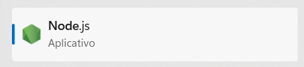
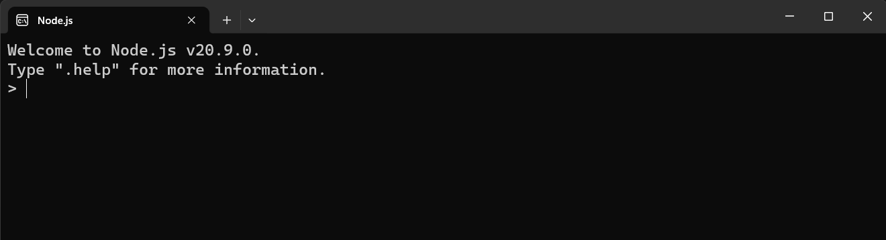
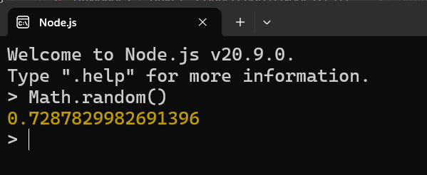

# Curso Alura: Node.js e terminal dominando o ambiente de desenvolvimento front-end


## Aula 1 - Conhecendo o Node.js e o Terminal

### Aula 1 - Apresentação - Vídeo 1

Transcrição  
Você quer iniciar seus estudos em um framework, uma biblioteca do front-end, como React, Angular ou Vue, mas ainda tem dúvida de como o Node funciona? Se sim, esse curso é para você!

Boas-vindas! Meu nome é Antonio Evaldo e serei o seu instrutor nesse curso de Node.

Audiodescrição: Antonio se autodeclara como um homem branco. Ele tem cabelos cacheados, pretos, na altura do ombro. Uso óculos, tem bigode e cavanhaque, e olhos castanho-escuros. Está de camiseta preta. Ao fundo, uma parede iluminada por um gradiente do rosa ao azul, com um quadro de guitarra à direita.

O que vamos aprender?  
Neste curso, vamos aprender tudo que é necessário saber em relação ao Node.js, para você poder trabalhar de forma muito mais tranquila com o framework front-end que escolher.

Então, você vai descobrir o que é o Node.js e por que utilizá-lo, além de como utilizá-lo no terminal (linha de comando). Também aprenderá o que é o NPM e os pacotes do Node, e como automatizar tarefas utilizando os scripts do NPM.

Nós também vamos explorar ferramentas front-end muito comuns que você pode utilizar em qualquer projeto, e nem precisa ser um framework. São elas: ESLint, o Prettier, o JSON Server.

Você também vai aprender a diferença entre dependências de desenvolvimento e dependências de produção.

Por fim, faremos o deploy de um projeto que utilizaremos como exemplo, servindo de base para as nossas práticas ao longo do curso: o VidFlow, uma plataforma para publicar e assistir vídeos, clone do YouTube.

E após estudar tudo isso, você terá todos os conhecimentos necessários para começar a estudar um framework front-end, seja ele React, Angular ou Vue, porque praticamente todos eles utilizam o Node. Com essa base já construída e sólida, você terá uma transição muito mais suave.

Pré-requisitos  
É importante que você tenha familiaridade com HTML, CSS e JavaScript para fazer esse curso. Mais especificamente em JavaScript, é interessante que você tenha conhecimento pelo menos até requisições HTTP.

Para estudar bem!  
Se tiver qualquer dificuldade no andamento deste curso, consulte o fórum. Nós tentaremos responder o mais rápido possível.

Além disso, acesse o Discord da Alura e comunique-se por este canal para tirar suas dúvidas e trocar ideias com outros alunos e alunas.

Vamos estudar!

### Aula 1 - Por que utilizar o Node.js? - Vídeo 2

Transcrição  
Quando escolhemos um framework ou biblioteca front-end para trabalhar, não importa qual seja, praticamente todas pedem para executarmos alguns comandos.

Para trazer alguns exemplos, vamos abrir a documentação do React na seção "Start a New React Project" (iniciar um novo projeto). Temos nela uma nota dizendo que precisamos instalar o Node.js para desenvolvimento local. Se descermos um pouco a tela, encontramos algumas opções de blocos de código que pedem para executarmos alguns comandos. Um deles é o npx create-next-app@latest.

Podemos conferir que isso não é muito diferente na documentação do Angular. Para começar a desenvolver com Angular, temos o comando npm install -g @angular/cli, ligeiramente parecido com o de criar projeto com o React.

Ao conferir na documentação do Vue, mais uma vez encontramos esses comandos e eles também pedem para ter o Node.js instalado. O comando do Vue é npm create vue@latest.

Observação: Dependendo da data que você estiver acompanhando este curso, esses comandos podem variar um pouco.

Mas, afinal, o que são esses comandos? Por que precisamos do Node.js para instalá-los?

Node.js: Ambiente de execução do JavaScript  
Para explicar melhor por que precisamos do Node.js, precisamos entender como o JavaScript funciona no ambiente ao qual estamos acostumados, que são os navegadores (ou browsers).

Chamamos esses navegadores de (alguns dos) ambientes de execução do JavaScript. Como sabemos, ele serve para manipular, ler o HTML e CSS, fazer algumas lógicas de programação. Os navegadores que conhecemos até agora, por exemplo, são Chrome, Mozilla Firefox, Opera e Microsoft Edge.

Mas onde entra o Node.js nisso? Ele surge como um novo ambiente de execução do JavaScript. Então, podemos chamá-lo de JavaScript Runtime, uma expressão bastante comum para esse contexto.

Mas, qual a diferença do Node.js para os navegadores?

A diferença é que ele consegue executar operações locais em nossos computadores, como a criação de servidores e APIs — propósito original do Node.js. Sendo o Node.js um ambiente de execução do JavaScript, isso significa que podemos utilizar essa linguagem, com que já temos familiaridade, para criar APIs, por exemplo; o que não era possível antes da criação do Node.js.

Além disso, o Node.js também consegue fazer leitura e escrita de arquivos, compilação de código e automatização de processos. E essas são apenas algumas das suas capacidades.

Se o Node.js foi criado inicialmente voltado para o ambiente do back-end, como ele ajuda no front-end? Justamente devido a essas operações citadas acima, que são muito úteis para nós do lado do front-end.

Fazendo uma analogia com o contexto de videogames, podemos imaginar que os arquivos JavaScript são como se fossem arquivos de jogos, e os navegadores como se fossem os consoles, como o Playstation ou o Xbox.

Um arquivo de jogo sozinho não consegue ser executado. Precisamos de um ambiente de execução, e os navegadores atuam nesse papel. Assim, combinando os navegadores com o JavaScript, conseguimos executá-lo do lado do front-end.

Já o Node.js também é um ambiente de execução, mas ele está mais para um "computador gamer", porque ele consegue fazer algumas operações a mais, que os navegadores não conseguem.

Inclusive, da mesma forma que existem jogos apenas para Xbox ou Playstation, existem jogos apenas para computadores. Isso significa que existem arquivos JavaScript que podem ser executados apenas nos navegadores, e existem arquivos JavaScript que podem ser executados apenas no Node.js. Temos funções específicas do Node e funções específicas do front-end.

É bom manter isso em mente e saber que existem, sim, diferenças entre o front-end e o back-end, mesmo utilizando a mesma linguagem de programação.

Node.js no desenvolvimento front-end  
Para entender como o Node pode ajudar no ambiente de desenvolvimento front-end — seja usando React, Angular ou Vue —, vamos conferir um exemplo.

Há um conceito muito comum na programação chamado "componentes". O código abaixo tem uma tag section, e dentro dela tem um componente chamado Banner, com um 'B' maiúsculo:

```html
<section>
    <Banner />
</section>
```

O que o Node pode fazer, no caso, é ler esse código e manipular o arquivo, transformando-o em código HTML que os navegadores conseguem entender. Por exemplo:

```html
<section>
    <header class="banner">
        
        <p class="..."></p>
    </header>
</section>
```

Nesse caso, ele transformou o Banner em uma tag header, com uma imagem e um parágrafo dentro.

Essa é apenas uma das muitas coisas que o Node consegue fazer para auxiliar no nosso desenvolvimento. Muitas vezes, ele faz isso de forma bem automática e rápida. Vamos conferir muitos desses benefícios ao longo deste curso.

Agora que você sabe a importância de se utilizar o Node e por que precisamos dele, vamos instalá-lo.

Nos encontramos no próximo vídeo!

### Aula 1 - Preparando o ambiente: ferramentas do curso

Visual Studio Code e Live Server  
Recomendamos o uso do [Visual Studio Code](https://code.visualstudio.com/) para que você usufrua dos mesmos recursos que a pessoa instrutora ao longo do curso.

Além disso, utilizamos a [extensão Live Server](https://marketplace.visualstudio.com/items?itemName=ritwickdey.LiveServer) para visualizar o projeto no navegador.

Node.js

Se você utiliza o Windows, pode pular o restante dessa atividade, pois o próximo vídeo ensinará o passo a passo de instalação do Node.js.

Mas, se você utiliza Linux ou MacOS, você pode seguir os passos abaixo para conferir se ele já está instalado:

1. Abra uma janela do terminal em seu computador. Isso pode ser feito da seguinte forma:

- Linux (Ubuntu): acesse o terminal disponível no menu de Programas/Aplicações. Caso não localize, pode estar dentro da pasta “Utilitários”.
- MacOS: acesse o terminal disponível no menu de “Aplicações”, dentro da pasta de “Utilitários”.

2. No terminal, digite node --version ou node -v e pressione Enter. Caso retorne um número de versão, como por exemplo v16.17.0, significa que o Node.js já está instalado.

> Se você não tem o Node.js instalado, você pode seguir o passo a passo do [artigo Como instalar o Node.js no Windows, Linux e macOS](https://www.alura.com.br/artigos/como-instalar-node-js-windows-linux-macos).

Atenção:  
Por questões de compatibilidade com as ferramentas desse curso, é importante que a sua versão do Node cumpra o seguintes requisitos:

- Ser igual ou maior que a 16, por exemplo: 16.17.0, 18.10.1, 20.0.0;
- Ser uma versão LTS (Long Term Support), ou seja, o primeiro número da versão deve ser um número par, por exemplo: 16, 18, 20.
- Caso você tenha o Node instalado, mas em uma versão que não cumpra esses requisitos, recomendamos que você o desinstale e instale uma nova versão.

### Aula 1 - Instalando o Node.js - Vídeo 2

Transcrição  
Agora que sabemos que precisamos do Node para qualquer framework de front-end, vamos instalá-lo.

Talvez você já tenha instalado no seu computador, então vamos fazer primeiro essa verificação. Você pode abrir o terminal do seu computador (se for Windows, o programa PowerShell) e, para verificar se o Node já está instalado, rodar o seguinte comando:

> node --version

No caso do instrutor, que não tem o Node instalado ainda, aparece a seguinte resposta:

O termo 'node' não é reconhecido como nome de cmdlet, função, arquivo de script ou programa operável.

Basicamente, quando aparece esse erro no Windows, quer dizer que o Node realmente não está instalado.

Se, por outro lado, apareceu uma versão do Node que seja menor do que 16, por exemplo, 14 ou inferior, então recomendamos que você a desinstale, porque ela já está um pouco desatualizada. Além disso, se for uma versão maior do que 16, mas ímpar, também recomendamos que desinstale. Depois de desinstalar, você volta para esse vídeo para instalar uma versão mais recente.

Vamos fechar o PowerShell e acessar o site http://nodejs.org. Há dois grandes botões verdes na tela; do lado esquerdo está a versão mais recente no momento da gravação deste vídeo: 20.9.0 LTS. Para você, pode estar aparecendo uma versão mais recente, mas será sempre LTS, que significa Long Term Support (Suporte a Longo Prazo), e uma versão par nesse lado esquerdo.

Versão par ou ímpar remete ao número antes do primeiro ponto: 20.9.0 é par, enquanto 21.1.0 é ímpar.

A versão do botão da direita, a Current (Atual) — no momento, 21.1.0 —, sempre vai ser ímpar. Mas não recomendamos que baixe a versão Current, porque por mais que seja mais recente, ela pode conter alguns bugs (erros). A versão LTS é sempre a mais estável.

Vamos clicar no botão da versão 20 e, ao fazer isso, o navegador vai baixar o arquivo executável automaticamente. Ao terminar de baixar, vamos abri-lo.

Após abrir o arquivo, surge uma janela do Windows para instalar o Node no nosso computador. Primeiro, clicamos no botão "Next" nessa janela. Seguindo para o termo de contrato, devemos aceitar marcando a checkbox e depois clicando em "Next" novamente.

Depois temos a janela para selecionar o local de instalação do Node, mas não precisamos nos preocupar com isso. Clicamos em "Next". Seguimos para mais configurações com as quais não precisamos nos preocupar, então clicamos em "Next" mais uma vez. Clicamos uma última vez na janela de configurações e, por fim, clicamos no botão "Install".

Note que ele exige que você tenha privilégio de administrador, então clicamos em "Sim" no pop-up sobreposto, pois essa é uma operação importante. Então, apenas esperamos ele instalar o Node na nossa máquina.

Se tudo correr com sucesso, a janela exibirá a mensagem de que o Node já foi instalado, então clicamos em "Finish".

Para ter certeza, vamos abrir de novo o terminal e rodar o comando:

> node -v

A resposta a esse comando deve ser "v20.9.0", a versão do Node que instalamos.

Reforçando: Você precisa ter pelo menos uma versão LTS do Node no seu computador, que seja maior ou igual a 16, para conseguir usar as ferramentas que vamos utilizar ao longo do curso. A versão 20 é suficiente para os nossos propósitos.

### Aula 1 - Para saber mais: conteúdos extras

Se você quiser se aprofundar mais no Node.js ( e espero que sim =]), separei para você alguns conteúdos bem interessantes:

- [Node.js para Frameworks Front-end](https://www.alura.com.br/artigos/nodejs-para-frameworks-front-end): um artigo com uma introdução à mesma temática deste curso;
- [O que é Node.js?](https://www.youtube.com/watch?v=8VSTrZY8vwI): um Alura+ que se aprofunda bem sobre as motivações de criação do Node.js, seus contextos de uso e vários detalhes extras;
- [Node.JS](https://www.alura.com.br/artigos/node-js): o que é, como funciona esse ambiente de execução JavaScript e um Guia para iniciar: um artigo que atua como um guia de introdução completo sobre o Node.

### Aula 1 - Executando o primeiro script Node - Vídeo 3

Transcrição  
Já estamos com uma versão estável do Node.js; no caso, é a versão 20. Executemos o comando node -v no terminal, que é basicamente um atalho para o comando node --version, para verificar se realmente instalamos o Node.

Mas, agora que nós estamos com ele instalado, vamos praticar com um script de JavaScript bem simples.

Para conseguirmos praticar, primeiro precisamos ter algumas noções básicas de uso de terminal, ou no caso do Windows, o PowerShell. Isso porque só conseguimos executar o Node através do terminal.

Verificando o diretório de trabalho  
Seu terminal pode ser um pouco diferente, principalmente se estiver utilizando Mac ou Linux. É possível que a linha de comando comece com um cifrão $, por exemplo. Então, para saber em que parte você está localizado dentro do terminal, você pode digitar o seguinte comando:

> pwd

Esse comando significa print working directory, ou seja, imprimir diretório de trabalho. Ele serve, basicamente, para mostrar o diretório atual.

No contexto do terminal, diretório é um sinônimo de pasta.

Executando pwd, aparecerá o caminho do diretório em que você está no terminal. O terminal é como se fosse outra forma de acessar as pastas e arquivos do seu computador, e o caminho é o "endereço" para chegar até a pasta em questão. No caso do instrutor, o caminho exibido é "C:\Users\Antonio".

Também conseguimos acessar esse mesmo caminho pelo explorador de arquivos do Windows ou qualquer outro sistema operacional. No explorador, usamos o cursor e o mouse para navegar na interface gráfica, clicando em "C:", depois em "Usuários", depois em "Antonio" para chegar ao diretório desejado. No terminal, por outro lado, utilizamos comandos para navegar.

Criando e entrando em um novo diretório  
Vamos voltar ao terminal. Como já sabemos, pwd mostra a pasta atual; no caso do instrutor, a pasta "Antonio".

Para criar uma nova pasta, podemos usar o comando mkdir, que significa make directory.

Após digitar esse comando, passamos um parâmetro para ele: o nome da pasta, que será exemplo-node. Seguindo a convenção de nomes de pastas e arquivos, usamos tudo em minúsculo e separamos as palavras com hífen. Essa é uma boa prática que evita conflitos de execução de programas que leem nossos arquivos e pastas.

Então, executaremos:

> mkdir exemplo-node

Após criar a pasta, vamos entrar nela. Para isso, usamos o comando cd, que significa change directory ("mudar de diretório"), junto do nome da nossa nova pasta:

> cd exemplo-node

Após executar esse comando, o caminho do terminal muda. No caso do instrutor, muda para "C:\Users\Antonio\exemplo-node".

Podemos agora voltar para a pasta anterior ("Antonio", por exemplo) se quisermos. Para isso, rodamos o comando:

> cd ..

Com isso, o caminho do terminal retorna a "C:\Users\Antonio".

Navegar pelas pastas por meio de comandos do terminal é uma prática bacana à qual podemos tentar nos acostumar.

Lembrando: Esse curso fornecerá apenas algumas noções básicas de terminal, suficientes para conseguir executar o Node no seu computador.

Executando um arquivo JavaScript pelo Node  
Conforme o prometido, vamos utilizar o Node por meio do terminal. Para isso, primeiramente vamos entrar novamente na nossa nova pasta com o comando cd exemplo-node.

Agora, queremos abrir essa pasta no Visual Studio Code.

Se você tem a IDE Visual Studio Code instalada, pode usar o programa de linha de comando (terminal) para navegar por ela. Podemos usar o seguinte comando para abrir a pasta atual no editor:

> code .

Ao executar esse comando, o VS Code é aberto automaticamente. Já na interface do editor, vamos criar um arquivo JavaScript clicando no botão "New File..." no menu superior esquerdo. Vamos nomeá-lo como script.js.

Nesse arquivo, vamos escrever o seguinte para imprimir uma mensagem:

scrip.js

> console.log('Meu primeiro programa Node.js');

Salvamos o arquivo com "Ctrl+S".

Lembra da analogia de que o Node é como se fosse computador gamer? Ele consegue executar o nosso arquivo JavaScript, que é como se fosse nosso jogo de videogame.

Ou seja, esse arquivo sozinho não faz nada. Dessa forma, precisamos de um ambiente de execução para o nosso código JavaScript. Nesse caso, usaremos o Node para executá-lo, tal como executaríamos arquivos JavaScript no front-end. No entanto, usaremos um ambiente um pouco diferente: o terminal!

Poderíamos continuar utilizando o terminal local do computador, como o Power Shell, para executar comandos do Node. Mas, vamos conhecer um recurso que utilizaremos bastante: o terminal integrado do VS Code.

Com o VS Code aberto, podemos abrir o terminal clicando em "View > Terminal" no canto superior esquerdo da tela, ou pressionando as teclas "Ctrl + ' ".

Com isso, uma aba chamada "Terminal" se abrirá na parte inferior do VS Code. Note que ele exibe um caminho de forma muito semelhante ao terminal local, o que nos permite verificar qual diretório está aberto. No caso do instrutor: "C:\Users\Antonio\exemplo-node".

Podemos até identificar qual terminal está aberto pelo terminal integrado, observando a parte superior direita dele. Para o instrutor, o terminal exibido é "powershell".

Podemos escolher em que terminal queremos executar nossos comandos, clicando no botão de seta para baixo ao lado do nome do terminal aberto. Temos diferentes opções e cada uma possui suas especificidades, mas, no geral, todos operam de maneiras muito semelhantes. Você pode selecionar o de sua preferência.

Já estamos na pasta "exemplo-node". Para executar o arquivo script.js, vamos digitar o seguinte comando no terminal integrado:

> node script.js

Ao executar o comando, o terminal imprimirá a mensagem "Meu primeiro programa Node.js", conforme o esperado, indicando que o arquivo foi executado com sucesso!

Resumindo, o Node consegue executar arquivos JavaScript assim como os navegadores, mas com algumas capacidades adicionais que conheceremos ao longo do curso.

A partir de agora, vamos entender como o Node pode nos ajudar em um projeto front-end real, utilizando ferramentas que nos auxiliarão no dia a dia de desenvolvimento.

### Aula 1 - Para saber mais: usando o Node diretamente

Sabia que é possível executar código JavaScript diretamente no programa do Node, sem criar arquivos?

Isso pode ser muito útil para realizar operações rápidas com o JavaScript, como a geração de um número aleatório ou até mesmo executar pacotes do Node (você aprenderá mais sobre eles ao longo do curso).

Vamos testar? Existem duas formas de abrir o programa do Node:

1. Pesquise por “Node.js” no seu computador e selecione a seguinte correspondência:



Recorte de tela mostrando o resultado da pesquisa. Nele está o nome “Node.js”, abaixo dele está informando que é um aplicativo, e ao lado está o logo do Node.js.

Recorte de tela mostrando o resultado da pesquisa. Nele está o nome “Node.js”, abaixo dele está informando que é um aplicativo, e ao lado está o logo do Node.js.

2. Ou, no terminal do seu computador, apenas execute o comando node.

Em seguida, um programa de linha de comando será executado, muito semelhante ao terminal:



Captura de tela do programa do Node. É uma tela preta com letras brancas. No início, está escrito em inglês: “Boas vindas ao Node.js v20.9.0. Pressione ‘.help’ para mais informações”. Logo abaixo, há um espaço para digitação.

Captura de tela do programa do Node. É uma tela preta com letras brancas. No início, está escrito em inglês: “Boas vindas ao Node.js v20.9.0. Pressione ‘.help’ para mais informações”. Logo abaixo, há um espaço para digitação.

E nele podemos executar operações válidas do JavaScript, como criação de variáveis, console.log, entre outras. Na imagem abaixo, temos a geração de um número aleatório com a função nativa Math.random():



Foi executado o comando “Math.random()” e o Node.js retornou o valor “0.7287829982691396”.

Foi executado o comando “Math.random()” e o Node.js retornou o valor “0.7287829982691396”.

Esse programa é muito semelhante aos consoles dos navegadores, mas como você deve imaginar, podemos executar não apenas funções como Math.random(), mas também pacotes do Node e operações locais.

### Aula 1 - Revisando o uso do Node

Denize está aprendendo a utilizar o Node.js e, para praticar, criou um arquivo imprimeNome.js com o seguinte conteúdo:

const nome = 'Denize';

console.log(`Boas vindas, ${nome}!`);
Copiar código
O que a Denize deve fazer para executar esse arquivo utilizando o Node.js?

### Aula 1 -  - Vídeo 6
### Aula 1 -  - Vídeo 7
### Aula 1 -  - Vídeo 8
